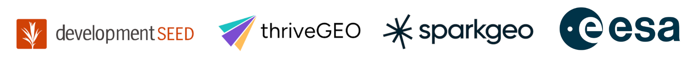
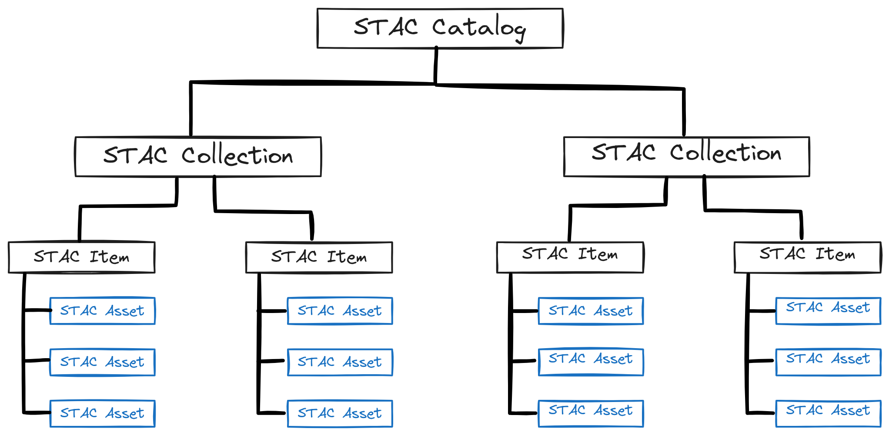

# The Sentinels EOPF Toolkit - STAC and Zarr

## Table of Contents
[Context and Motivation](#context-and-motivation) 
[Learning Goals](#learning-goals) 
[STAC](#stac) 
[STAC API](#stac-api) 
[EOPF Service](#eopf-service) 
[EOPF and STAC Extensions](#eopf-and-stac-extensions) 
[Zarr](#zarr) 

## Context and Motivation

The [Earth Observation Processor Framework](https://eopf.copernicus.eu/) (EOPF) is led by the European Space Agency (ESA) and modernizes access to the Copernicus Sentinel Missions.

EOPF prioritizes Open Standards, Interoperability, Cloud Optimization, and conversion flexibility. To those ends, EOPF focuses on SpatioTemporal Asset Catalogs (STAC) as a means to discover and use the data with as little developer friction as possible.

This tutorial will provide a basic intoduction to EOPF using pystac and pystac-client.

For further reading, please see the [eopf-101 online book](https://github.com/eopf-toolkit/eopf-101).

## Learning Goals

This tutorial is focused on new users to EOPF, Zarr, and STAC, but will provide information that experienced developers will find useful.

After this tutorial, the reader should have an understanding of how to access EOPF Zarr data. We will explore the data using pystac and pystac-client and will interact with the EOPF Sample Service STAC API.

## STAC

SpatioTemporal Asset Catalogs (STAC) are used to discover and query geospatial data using a modern, JSON based specification. STAC aligns with OGC API - Features 1.0 and has extensions that support operations like CQL filtering, custom metadata, and data specific parameters. STAC is designed to be lightweight, interoperable, and customizable.

STAC are made up of three components:

- Catalog
- Collection
- Item

All of these work together to help discover geospatial data and make it more accessible to users.

Catalogs form the top of the STAC heirarchy, they contain the links required to find the data and establish the relationships between related data. The Copernicus programme, for example, is described within a STAC catalog.

Collections embody the computer science principle of Don't Repeat Yourself (DRY). A STAC Collection exists to relate similar datasets together through space, time, and shared metadata. Each Sentinel mission and the downstream analysis-ready data are examples of STAC Collections.

Items are the building blocks for STAC. At their core, they are GeoJSON features. These features are supplemented with additional metadata to ensure that data provenance is maintained and specific data attributes are captured. A single capture from a Sentinel mission is an example of a STAC item.

Assets fall under STAC items and direct users to the actual data itself. Each asset refers to data associated with the Item that can be downloaded or streamed.

Further reading on the STAC specification can be found on the [stacspec website](https://stacspec.org/en/tutorials/intro-to-stac/).

## STAC API

A [STAC API](https://github.com/radiantearth/stac-api-spec) wraps the same catalog, collection, item, and asset concepts in a handful of predictable web paths — `/conformance, /collections, /collections/{id}, and /search`, then lets you query them on the fly. Every response is plain JSON that matches the STAC version and the optional capabilities (sorting, filtering, field selection) the server supports.

Generic clients like `pystac-client` can access any STAC API and have the resulting data described using a standardized specification. This provides the interoperabilty aspect that is a stated goal of EOPF.

## EOPF Service

The EOPF implementes STAC API to provide access to Copernicus data through a RESTful [STAC API](https://stac.core.eopf.eodc.eu) as well as a [convinient STAC browser](https://stac.browser.user.eopf.eodc.eu/). The browser allows you to search the catalog in a friendler manner than JSON, assuming you are not a computer.

## EOPF and STAC Extensions

Adding specific metadata to STAC through the use of extensions enhances it by allowing data-specific information to be communicated to the user. EOPF adds a number of extensions to STAC to better describe Copernicus data.

| **Extension**         | **Summary** |
|------------------------|-------------|
| **Electro-Optical (EO) Extension** | Standardises optical imagery metadata, providing cloud/snow cover and per-band descriptors (common name, centre wavelength, FWHM, solar illumination) so clients can immediately understand a scene’s spectral content and quality. |
| **EOPF Extension**        | A Copernicus-specific add-on that injects Sentinel identifiers like `eopf:datastrip_id`, `eopf:datatake_id`, and `eopf:instrument_mode`, so EOPF’s STAC items stay interoperable while still exposing the mission-level metadata analysts need for lineage checks and fine-grained searches. |
| **Grid Extension**        | Introduces a simple `grid:code` identifier that ties each item to a defined tiling scheme (e.g., Sentinel-2 UTM 100 km tiles), letting users group, filter, and batch-process scenes that share a common grid without relying on provider-specific naming conventions. |
| **MGRS Extension**        | Encodes an item’s Military Grid Reference System zone, latitude band, and 100 km grid square so data can be indexed and retrieved using the tiling system widely adopted by defence and Copernicus programmes. |
| **Processing Extension** | Adds provenance fields such as `processing:level`, `processing:version`, `processing:datetime`, and `processing:facility`, letting catalog users trace exactly which software chain, baseline and date produced each product and filter results by processing level or algorithm version. |
| **Product Extension**     | Describes the package rather than the observation, with keys such as `product:type`, `product:timeliness`, and `product:acquisition_type`, allowing multiple packaged variants of the same scene (e.g., Near-Real-Time vs consolidated) to live side-by-side in one item or asset list. |
| **Projection Extension**  | Supplies full coordinate-reference metadata (`proj:code`, `proj:wkt2`, `proj:projjson`, projected geometry and bounding box), ensuring items stored in non-geographic CRSs can be re-projected, mosaicked, or clipped accurately by any client. |
| **SAR Extension**         | Records radar-specific parameters such as polarisation mode, frequency band, look direction and SAR `product_type`, ensuring synthetic-aperture radar data (e.g., Sentinel-1 GRD/SLC) can be filtered and interpreted correctly alongside optical holdings. |
| **Satellite (Sat) Extension** | Supplies platform-level details—platform name, orbit number, instrument UID, relative orbit direction—essential for distinguishing acquisitions from different satellites or orbital passes. |
| **Scientific Extension**  | Enables formal citation by adding persistent identifiers (`sci:doi`) and recommended references (`sci:citation` plus publication lists), boosting reproducibility and giving credit when EOPF products underpin research. |
| **View Extension**        | Captures viewing geometry (off-nadir, incidence, sun elevation/azimuth, sensor azimuth), critical for photometric corrections or choosing scenes with specific illumination or look angles. |

## Zarr

Zarr is an open-source specification for storing chunked, compressed N-dimensional arrays in a simple key-value layout, so the data can live just as happily on an object store such as Cloud based storage or on a local file system. Because each chunk is an independent object, clients can read or write only the pieces they need, enabling true parallel I/O, lazy loading and efficient cloud-native workflows.

EOPF has adopted Zarr as its canonical storage format for re-engineered Sentinel 1, 2, and 3 products. Within the EOPF Zarr Service every original SAFE package is converted into a browsable Zarr hierarchy, hosted on an cloud storage backend.