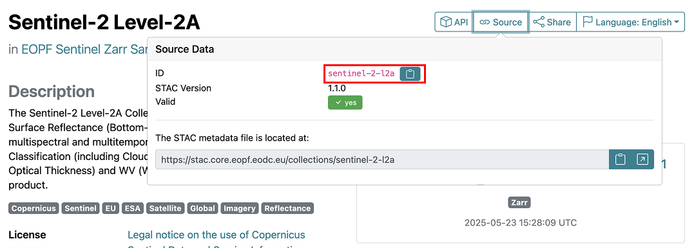
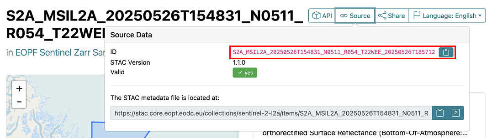

# How to for the EOPF Sample Service STAC catalog


# Table of Contents

-   [Introduction](#introduction)
-   [Prerequisites](#prerequisites)
    -   [Dependencies](#dependencies)
-   [Connect to the EOPF Sample Service STAC
    API](#connect-to-the-eopf-sample-service-stac-api)
-   [Browse collections](#browse-collections)
-   [Browse items](#browse-items)
    -   [Item properties](#item-properties)
    -   [Search for items](#search-for-items)
        -   [Search by a bounding box](#search-by-a-bounding-box)
        -   [Search by a time frame](#search-by-a-time-frame)
        -   [Search by other item
            properties](#search-by-other-item-properties)
        -   [Combine search criteria](#combine-search-criteria)
-   [Browse assets](#browse-assets)

# Introduction

This tutorial will explore how to access the [EOPF Sample Service STAC
catalog](https://stac.browser.user.eopf.eodc.eu/) programmatically using
R.

TODO - include the content in
https://github.com/eopf-toolkit/eopf-tooling-guide/blob/EOPF-47/docs/tutorials/stac_zarr.md?
Link to it?

# Prerequisites

An R environment is required to follow this tutorial, with R version \>=
4.1.0. We recommend using either
[RStudio](https://posit.co/download/rstudio-desktop/) or
[Positron](https://posit.co/products/ide/positron/) (or a cloud
computing environment) and making use of [RStudio
projects](https://support.posit.co/hc/en-us/articles/200526207-Using-RStudio-Projects)
for a self-contained coding environment.

## Dependencies

The `rstac` package is required to follow this tutorial. You can install
it directly from CRAN:

``` r
install.packages("rstac")
```

Then load the package into your environment:

``` r
library(rstac)
```

# Connect to the EOPF Sample Service STAC API

To access the EOPF Sample Service STAC catalog in R, we need to give the
URL of the STAC API source (<https://stac.core.eopf.eodc.eu/>) using the
function `stac()`.

The object `stac_source` is a query containing information used *to*
connect to the API, but it does not actually make any requests. To make
requests to the API, we will always need to use `get_request()` or
`put_request()`, as appropriate. Running `get_request()` on
`stac_source` actually retrieves the catalogue:

``` r
stac_source <- stac("https://stac.core.eopf.eodc.eu/")

stac_source |>
  get_request()
```

    ###Catalog
    - id: eopf-sample-service-stac-api
    - description: STAC catalog of the EOPF Sentinel Zarr Samples Service
    - field(s): 
    type, id, title, description, stac_version, conformsTo, links, stac_extensions

# Browse collections

A STAC *Collection* exists to relate similar data sets together through
space, time, and shared metadata. Each Sentinel mission and the
downstream analysis-ready data are examples of STAC Collections. To
browse STAC Collections, the `collections()` function is used. We can
see that there are 11 collections available in the API:

``` r
stac_collections <- stac_source |>
  collections() |>
  get_request()

stac_collections
```

    ###Collections
    - collections (11 item(s)):
      - sentinel-2-l2a
      - sentinel-3-slstr-l1-rbt
      - sentinel-3-olci-l2-lfr
      - sentinel-2-l1c
      - sentinel-3-slstr-l2-lst
      - sentinel-1-l1-slc
      - sentinel-3-olci-l1-efr
      - sentinel-3-olci-l1-err
      - sentinel-1-l2-ocn
      - sentinel-1-l1-grd
      - sentinel-3-olci-l2-lrr
    - field(s): collections, links, numberMatched, numberReturned

The default printing of the `stac_collections()` object summarises
what’s been returned, but does not give all of the information. To see
more about what’s been returned, we use `str()`.

``` r
stac_collections |>
  str(max.level = 1)
```

    List of 4
     $ collections   :List of 11
     $ links         :List of 3
      ..- attr(*, "class")= chr [1:2] "doc_links" "list"
     $ numberMatched : int 11
     $ numberReturned: int 11
     - attr(*, "class")= chr [1:3] "doc_collections" "rstac_doc" "list"

Here, we can see that there is an entry `"collections"` within
`stac_collections`, which we access to return the collections themselves
(using `head()` to only return a few). This shows additional details
about each collection, such as the collection id, title, description,
and additional fields in the collections.

``` r
stac_collections[["collections"]] |>
  head(n = 3)
```

    [[1]]
    ###Collection
    - id: sentinel-2-l2a
    - title: Sentinel-2 Level-2A
    - description: 
    The Sentinel-2 Level-2A Collection 1 product provides orthorectified Surface Reflectance (Bottom-Of-Atmosphere: BOA), with sub-pixel multispectral and multitemporal registration accuracy. Scene Classification (including Clouds and Cloud Shadows), AOT (Aerosol Optical Thickness) and WV (Water Vapour) maps are included in the product.
    - field(s): 
    id, type, links, title, assets, extent, license, keywords, providers, summaries, description, item_assets, stac_version, stac_extensions

    [[2]]
    ###Collection
    - id: sentinel-3-slstr-l1-rbt
    - title: Sentinel-3 SLSTR Level-1 RBT
    - description: 
    The Sentinel-3 SLSTR Level-1B RBT product provides radiances and brightness temperatures for each pixel in a regular image grid for each view and SLSTR channel. In addition, it also contains annotations data associated with each image pixels.
    - field(s): 
    id, type, links, title, assets, extent, license, keywords, providers, summaries, description, item_assets, stac_version, stac_extensions

    [[3]]
    ###Collection
    - id: sentinel-3-olci-l2-lfr
    - title: Sentinel-3 OLCI Level-2 LFR
    - description: 
    The Sentinel-3 OLCI L2 LFR product provides land and atmospheric geophysical parameters computed for full resolution.
    - field(s): 
    id, type, links, title, assets, extent, license, keywords, providers, summaries, description, item_assets, stac_version, stac_extensions

The Sentinel-2 Level-2A collection can be accessed by getting the first
entry in `stac_collections()[["collections"]]`

``` r
stac_collections[["collections"]][[1]]
```

    ###Collection
    - id: sentinel-2-l2a
    - title: Sentinel-2 Level-2A
    - description: 
    The Sentinel-2 Level-2A Collection 1 product provides orthorectified Surface Reflectance (Bottom-Of-Atmosphere: BOA), with sub-pixel multispectral and multitemporal registration accuracy. Scene Classification (including Clouds and Cloud Shadows), AOT (Aerosol Optical Thickness) and WV (Water Vapour) maps are included in the product.
    - field(s): 
    id, type, links, title, assets, extent, license, keywords, providers, summaries, description, item_assets, stac_version, stac_extensions

However, the best way to access a specific collection is to search for
it directly using the collection ID. The ID, “sentinel-2-l2a”, is
visible in the Collection output above. It is also accessible in the
browsable STAC catalog of the EOPF Sentinel Zarr Samples Service, on the
[page for that
collection](https://stac.browser.user.eopf.eodc.eu/collections/sentinel-2-l2a),
under “Source.”



The collection ID can be supplied directly in the `collections()`
function. If we look at the query without getting the result, we can see
that it has been formed using the `collection_id`, “sentinel-2-l2a”, as
a filter parameter.

``` r
sentinel_2_l2a_query <- stac_source |>
  collections(collection_id = "sentinel-2-l2a")

sentinel_2_l2a_query
```

    ###rstac_query
    - url: https://stac.core.eopf.eodc.eu/
    - params:
      - collection_id: sentinel-2-l2a
    - field(s): version, base_url, endpoint, params, verb, encode

And that running `get_request()` will return the collection itself:

``` r
sentinel_2_l2a_query |>
  get_request()
```

    ###Collection
    - id: sentinel-2-l2a
    - title: Sentinel-2 Level-2A
    - description: 
    The Sentinel-2 Level-2A Collection 1 product provides orthorectified Surface Reflectance (Bottom-Of-Atmosphere: BOA), with sub-pixel multispectral and multitemporal registration accuracy. Scene Classification (including Clouds and Cloud Shadows), AOT (Aerosol Optical Thickness) and WV (Water Vapour) maps are included in the product.
    - field(s): 
    id, type, links, title, assets, extent, license, keywords, providers, summaries, description, item_assets, stac_version, stac_extensions

# Browse items

Within collections, there are *items*. Items are the building blocks for
STAC. At their core, they are GeoJSON data, along with additional
metadata which ensures data provenance is maintained and specific data
attributes are captured. A single capture from a Sentinel mission is an
example of a STAC item. To get an overview of items within a collection,
the `items()` function is used.

An important thing to note with `rstac` is that you cannot continue to
build queries on top of ones that have already had their results
returned (via `get_request()`). It may make sense for a typical workflow
in R to “get” the collection, then to try to get the items from it, but
this will produce an error:

``` r
sentinel_2_l2a_collection <- stac_source |>
  collections(collection_id = "sentinel-2-l2a") |>
  get_request()

sentinel_2_l2a_collection |>
  items()
```

    Error: Invalid rstac_query value.

If you see this error — `"Invalid rstac_query value"` — ensure that you
are running `get_request()` at the very end of your query building
functions. Using `items()` this way, we can see that it returns a
summary of the collection’s items:

``` r
sentinel_2_l2a_collection_items <- stac_source |>
  collections(collection_id = "sentinel-2-l2a") |>
  items() |>
  get_request()

sentinel_2_l2a_collection_items
```

    ###Items
    - features (10 item(s)):
      - S2B_MSIL2A_20250609T101559_N0511_R065_T37WCV_20250609T123615
      - S2B_MSIL2A_20250609T101559_N0511_R065_T36WWE_20250609T123615
      - S2B_MSIL2A_20250609T101559_N0511_R065_T36WWD_20250609T123615
      - S2B_MSIL2A_20250609T101559_N0511_R065_T36WVD_20250609T123615
      - S2B_MSIL2A_20250609T101559_N0511_R065_T36WVC_20250609T123615
      - S2B_MSIL2A_20250609T101559_N0511_R065_T35WQV_20250609T123615
      - S2B_MSIL2A_20250609T101559_N0511_R065_T35WPV_20250609T123615
      - S2B_MSIL2A_20250609T101559_N0511_R065_T35WPT_20250609T123615
      - S2B_MSIL2A_20250609T101559_N0511_R065_T35WPS_20250609T123615
      - S2B_MSIL2A_20250609T101559_N0511_R065_T35WNV_20250609T123615
    - assets: 
    AOT_10m, B01_20m, B02_10m, B03_10m, B04_10m, B05_20m, B06_20m, B07_20m, B08_10m, B09_60m, B11_20m, B12_20m, B8A_20m, product, product_metadata, SCL_20m, SR_10m, SR_20m, SR_60m, TCI_10m, WVP_10m
    - item's fields: 
    assets, bbox, collection, geometry, id, links, properties, stac_extensions, stac_version, type

The first 10 items are returned. This number can be changed via the
`limit` argument in `items()`

``` r
stac_source |>
  collections(collection_id = "sentinel-2-l2a") |>
  items(limit = 20) |>
  get_request()
```

    ###Items
    - features (20 item(s)):
      - S2B_MSIL2A_20250609T101559_N0511_R065_T37WCV_20250609T123615
      - S2B_MSIL2A_20250609T101559_N0511_R065_T36WWE_20250609T123615
      - S2B_MSIL2A_20250609T101559_N0511_R065_T36WWD_20250609T123615
      - S2B_MSIL2A_20250609T101559_N0511_R065_T36WVD_20250609T123615
      - S2B_MSIL2A_20250609T101559_N0511_R065_T36WVC_20250609T123615
      - S2B_MSIL2A_20250609T101559_N0511_R065_T35WQV_20250609T123615
      - S2B_MSIL2A_20250609T101559_N0511_R065_T35WPV_20250609T123615
      - S2B_MSIL2A_20250609T101559_N0511_R065_T35WPT_20250609T123615
      - S2B_MSIL2A_20250609T101559_N0511_R065_T35WPS_20250609T123615
      - S2B_MSIL2A_20250609T101559_N0511_R065_T35WNV_20250609T123615
      - ... with 10 more feature(s).
    - assets: 
    AOT_10m, B01_20m, B02_10m, B03_10m, B04_10m, B05_20m, B06_20m, B07_20m, B08_10m, B09_60m, B11_20m, B12_20m, B8A_20m, product, product_metadata, SCL_20m, SR_10m, SR_20m, SR_60m, TCI_10m, WVP_10m
    - item's fields: 
    assets, bbox, collection, geometry, id, links, properties, stac_extensions, stac_version, type

## Item properties

We can look closer at individual items to see the metadata attached to
them. Items are stored under `"features"`:

``` r
sentinel_2_l2a_collection_items[["features"]] |>
  head(n = 2)
```

    [[1]]
    ###Item
    - id: S2B_MSIL2A_20250609T101559_N0511_R065_T37WCV_20250609T123615
    - collection: sentinel-2-l2a
    - bbox: xmin: 33.18917, ymin: 71.26907, xmax: 35.08502, ymax: 72.05406
    - datetime: 2025-06-09T10:15:59.024000Z
    - assets: 
    SR_10m, SR_20m, SR_60m, AOT_10m, B01_20m, B02_10m, B03_10m, B04_10m, B05_20m, B06_20m, B07_20m, B08_10m, B09_60m, B11_20m, B12_20m, B8A_20m, SCL_20m, TCI_10m, WVP_10m, product, product_metadata
    - item's fields: 
    assets, bbox, collection, geometry, id, links, properties, stac_extensions, stac_version, type

    [[2]]
    ###Item
    - id: S2B_MSIL2A_20250609T101559_N0511_R065_T36WWE_20250609T123615
    - collection: sentinel-2-l2a
    - bbox: xmin: 32.99942, ymin: 71.11435, xmax: 35.14735, ymax: 72.09958
    - datetime: 2025-06-09T10:15:59.024000Z
    - assets: 
    SR_10m, SR_20m, SR_60m, AOT_10m, B01_20m, B02_10m, B03_10m, B04_10m, B05_20m, B06_20m, B07_20m, B08_10m, B09_60m, B11_20m, B12_20m, B8A_20m, SCL_20m, TCI_10m, WVP_10m, product, product_metadata
    - item's fields: 
    assets, bbox, collection, geometry, id, links, properties, stac_extensions, stac_version, type

And an individual item contains a lot of information, such as its
bounding box:

``` r
sentinel_2_l2a_first_item <- sentinel_2_l2a_collection_items[["features"]][[1]]

sentinel_2_l2a_first_item[["bbox"]]
```

    [1] 33.18917 71.26907 35.08502 72.05406

And many more additional properties, with their properties under
`"properties"` in an individual item.

``` r
sentinel_2_l2a_first_item[["properties"]] |>
  names()
```

     [1] "gsd"                                  
     [2] "created"                              
     [3] "mission"                              
     [4] "sci:doi"                              
     [5] "updated"                              
     [6] "datetime"                             
     [7] "platform"                             
     [8] "grid:code"                            
     [9] "proj:bbox"                            
    [10] "proj:code"                            
    [11] "providers"                            
    [12] "published"                            
    [13] "instruments"                          
    [14] "end_datetime"                         
    [15] "product:type"                         
    [16] "constellation"                        
    [17] "eo:snow_cover"                        
    [18] "mgrs:utm_zone"                        
    [19] "proj:centroid"                        
    [20] "eo:cloud_cover"                       
    [21] "start_datetime"                       
    [22] "sat:orbit_state"                      
    [23] "eopf:datatake_id"                     
    [24] "mgrs:grid_square"                     
    [25] "processing:level"                     
    [26] "view:sun_azimuth"                     
    [27] "mgrs:latitude_band"                   
    [28] "processing:lineage"                   
    [29] "product:timeliness"                   
    [30] "sat:absolute_orbit"                   
    [31] "sat:relative_orbit"                   
    [32] "view:sun_elevation"                   
    [33] "processing:facility"                  
    [34] "processing:software"                  
    [35] "eopf:instrument_mode"                 
    [36] "product:timeliness_category"          
    [37] "sat:platform_international_designator"

The introductory tutorial [further explains the metadata
properties](https://github.com/eopf-toolkit/eopf-tooling-guide/blob/EOPF-47/docs/tutorials/stac_zarr.md#eopf-and-stac-extensions)
and their extensions.

(TODO – link on main branch once EOPF-47 is merged)

For example, the EOPF instrument mode:

``` r
sentinel_2_l2a_first_item[["properties"]][["eopf:instrument_mode"]]
```

    [1] "INS-NOBS"

For the rest of the tutorial, we will use a small helper function that
accesses a given property for the *first* item returned in a search.

``` r
get_first_item_property <- function(search_results, property) {
  search_results[["features"]][[1]][["properties"]][[property]]
}

sentinel_2_l2a_collection_items |>
  get_first_item_property("eopf:instrument_mode")
```

    [1] "INS-NOBS"

## Search for items

If the goal is to access data from a specific mission, it is best to
*search* within a collection’s items, using some of the properties
explored above. It’s possible to search based on a number of criteria,
including a bounding box, time frame, and other mission properties.

### Search by a bounding box

To narrow down items based on a bounding box or time frame, the
`stac_search()` function is used. The collection ID is provided in the
`collections()` argument, and bounding box and time frame are `bbox` and
`datetime`, respectively.

The bounding box values take the sequence of: minimum longitude, minimum
latitude, maximum longitude, and maximum latitude, and their coordinate
reference system is WGS84.

``` r
stac_source |>
  stac_search(
    collections = "sentinel-2-l2a",
    bbox = c(-47.02148, -17.35063, -42.53906, -12.98314)
  ) |>
  get_request()
```

    ###Items
    - features (10 item(s)):
      - S2A_MSIL2A_20241204T132231_N0511_R038_T23LNF_20241204T160951
      - S2A_MSIL2A_20241204T132231_N0511_R038_T23LNE_20241204T160951
      - S2A_MSIL2A_20241204T132231_N0511_R038_T23LND_20241204T160951
      - S2A_MSIL2A_20241204T132231_N0511_R038_T23LME_20241204T160951
      - S2A_MSIL2A_20241204T132231_N0511_R038_T23LMD_20241204T160951
      - S2A_MSIL2A_20241204T132231_N0511_R038_T23LMC_20241204T180059
      - S2A_MSIL2A_20241204T132231_N0511_R038_T23LMC_20241204T160951
      - S2A_MSIL2A_20241204T132231_N0511_R038_T23LLD_20241204T180059
      - S2A_MSIL2A_20241204T132231_N0511_R038_T23LLC_20241204T180059
      - S2A_MSIL2A_20241204T132231_N0511_R038_T23LLC_20241204T160951
    - assets: 
    AOT_10m, B01_20m, B02_10m, B03_10m, B04_10m, B05_20m, B06_20m, B07_20m, B08_10m, B09_60m, B11_20m, B12_20m, B8A_20m, product, product_metadata, SCL_20m, SR_10m, SR_20m, SR_60m, TCI_10m, WVP_10m
    - item's fields: 
    assets, bbox, collection, geometry, id, links, properties, stac_extensions, stac_version, type

This does – again by default – return the first 10 items, but the number
returned can be increased via the `limit` argument in `stac_search()`.

### Search by a time frame

When searching for a specific time frame, items that have a datetime
property that *intersects* with the given time frame will be returned.
It’s therefore best to search for a closed or open interval, rather than
a specific date and time (which might be difficult to match exactly to
an item’s time!). The date-time must be given in RFC 3339 format.

To search for a closed interval, separate two date-times by a “/”,
e.g. `"2024-12-01T01:00:00Z/2024-12-01T05:00:00Z"`:

``` r
matching_timeframe_items <- stac_source |>
  stac_search(
    collections = "sentinel-2-l2a",
    datetime = "2024-12-01T01:00:00Z/2024-12-01T05:00:00Z"
  ) |>
  get_request()

matching_timeframe_items
```

    ###Items
    - features (10 item(s)):
      - S2A_MSIL2A_20241201T045911_N0511_R133_T44HKD_20241201T065447
      - S2A_MSIL2A_20241201T045911_N0511_R133_T44HKC_20241201T065447
      - S2A_MSIL2A_20241201T045911_N0511_R133_T43HGU_20241201T065447
      - S2A_MSIL2A_20241201T045911_N0511_R133_T43HGT_20241201T065447
      - S2A_MSIL2A_20241201T045911_N0511_R133_T43HGS_20241201T065447
      - S2A_MSIL2A_20241201T045911_N0511_R133_T43HFU_20241201T065447
      - S2A_MSIL2A_20241201T045911_N0511_R133_T43HFT_20241201T065447
      - S2A_MSIL2A_20241201T045911_N0511_R133_T43HFS_20241201T065447
      - S2A_MSIL2A_20241201T045911_N0511_R133_T43HEV_20241201T065447
      - S2A_MSIL2A_20241201T045911_N0511_R133_T43HEU_20241201T065447
    - assets: 
    AOT_10m, B01_20m, B02_10m, B03_10m, B04_10m, B05_20m, B06_20m, B07_20m, B08_10m, B09_60m, B11_20m, B12_20m, B8A_20m, product, product_metadata, SCL_20m, SR_10m, SR_20m, SR_60m, TCI_10m, WVP_10m
    - item's fields: 
    assets, bbox, collection, geometry, id, links, properties, stac_extensions, stac_version, type

We can access the matching item’s `datetime` property to see that it
falls within the specified interval:

``` r
matching_timeframe_items |>
  get_first_item_property("datetime")
```

    [1] "2024-12-01T04:59:11.024000Z"

To search by an open interval, “..” is used to indicate the open end,
e.g. `"../2024-01-01T23:00:00Z"` representing prior to that date-time,
and `"2024-01-01T23:00:00Z/.."` representing after it:

``` r
stac_source |>
  stac_search(
    collections = "sentinel-2-l2a",
    datetime = "2025-01-01T23:00:00Z/.."
  ) |>
  get_request()
```

    ###Items
    - features (10 item(s)):
      - S2B_MSIL2A_20250609T101559_N0511_R065_T37WCV_20250609T123615
      - S2B_MSIL2A_20250609T101559_N0511_R065_T36WWE_20250609T123615
      - S2B_MSIL2A_20250609T101559_N0511_R065_T36WWD_20250609T123615
      - S2B_MSIL2A_20250609T101559_N0511_R065_T36WVD_20250609T123615
      - S2B_MSIL2A_20250609T101559_N0511_R065_T36WVC_20250609T123615
      - S2B_MSIL2A_20250609T101559_N0511_R065_T35WQV_20250609T123615
      - S2B_MSIL2A_20250609T101559_N0511_R065_T35WPV_20250609T123615
      - S2B_MSIL2A_20250609T101559_N0511_R065_T35WPT_20250609T123615
      - S2B_MSIL2A_20250609T101559_N0511_R065_T35WPS_20250609T123615
      - S2B_MSIL2A_20250609T101559_N0511_R065_T35WNV_20250609T123615
    - assets: 
    AOT_10m, B01_20m, B02_10m, B03_10m, B04_10m, B05_20m, B06_20m, B07_20m, B08_10m, B09_60m, B11_20m, B12_20m, B8A_20m, product, product_metadata, SCL_20m, SR_10m, SR_20m, SR_60m, TCI_10m, WVP_10m
    - item's fields: 
    assets, bbox, collection, geometry, id, links, properties, stac_extensions, stac_version, type

### Search by other item properties

As shown above, there are a number of other properties attached to STAC
items. We can also search using these properties. The `stac_search()`
function is limited to properties like bounding box and time frame, so
instead we use `ext_filter()`. This is a function that makes use of the
Common Query Language (CQL2) filter extension, and allows us to do more
complicated searching and querying using SQL-like language. It is also
important to note that when using `ext_filter()`, we switch to using
`post_request()` instead of `get_request()`.

For this searching, it is helpful to know the *data type* for an item
property in advance, as this will impact what operation to use within
`ext_filter()`. We create an additional helper function for this:

``` r
get_item_property_type <- function(property = NULL) {
  api_res <- rstac:::make_get_request("https://stac.core.eopf.eodc.eu/api") |>
    rstac:::content_response_json()
  item_properties_schema <- api_res[["components"]][["schemas"]][["ItemProperties"]][["properties"]]

  property_types <- lapply(item_properties_schema, function(x) {
    x[["anyOf"]][[1]][["type"]]
  })

  if (is.null(property)) {
    property_types
  } else {
    property_types[[property]]
  }
}
```

When no argument is passed to this function, it will return all of the
properties and their types:

``` r
get_item_property_type()
```

    $title
    [1] "string"

    $description
    [1] "string"

    $datetime
    [1] "string"

    $created
    [1] "string"

    $updated
    [1] "string"

    $start_datetime
    [1] "string"

    $end_datetime
    [1] "string"

    $license
    [1] "string"

    $providers
    [1] "array"

    $platform
    [1] "string"

    $instruments
    [1] "array"

    $constellation
    [1] "string"

    $mission
    [1] "string"

    $gsd
    [1] "number"

When the name of a property is passed, it will return the type of that
property. We can see, for example, that `platform` is a string, while
`instruments` is an array.

``` r
get_item_property_type("platform")
```

    [1] "string"

``` r
get_item_property_type("instruments")
```

    [1] "array"

Since `platform` is a string, we use `==` to indicate equality. For
example, to search for items whose platform is “sentinel-2b”:

``` r
sentinel_2b_platform_results <- stac_source |>
  stac_search(collections = "sentinel-2-l2a") |>
  ext_filter(platform == "sentinel-2b") |>
  post_request()

sentinel_2b_platform_results
```

    ###Items
    - features (10 item(s)):
      - S2B_MSIL2A_20250609T101559_N0511_R065_T37WCV_20250609T123615
      - S2B_MSIL2A_20250609T101559_N0511_R065_T36WWE_20250609T123615
      - S2B_MSIL2A_20250609T101559_N0511_R065_T36WWD_20250609T123615
      - S2B_MSIL2A_20250609T101559_N0511_R065_T36WVD_20250609T123615
      - S2B_MSIL2A_20250609T101559_N0511_R065_T36WVC_20250609T123615
      - S2B_MSIL2A_20250609T101559_N0511_R065_T35WQV_20250609T123615
      - S2B_MSIL2A_20250609T101559_N0511_R065_T35WPV_20250609T123615
      - S2B_MSIL2A_20250609T101559_N0511_R065_T35WPT_20250609T123615
      - S2B_MSIL2A_20250609T101559_N0511_R065_T35WPS_20250609T123615
      - S2B_MSIL2A_20250609T101559_N0511_R065_T35WNV_20250609T123615
    - assets: 
    AOT_10m, B01_20m, B02_10m, B03_10m, B04_10m, B05_20m, B06_20m, B07_20m, B08_10m, B09_60m, B11_20m, B12_20m, B8A_20m, product, product_metadata, SCL_20m, SR_10m, SR_20m, SR_60m, TCI_10m, WVP_10m
    - item's fields: 
    assets, bbox, collection, geometry, id, links, properties, stac_extensions, stac_version, type

``` r
sentinel_2b_platform_results |>
  get_first_item_property("platform")
```

    [1] "sentinel-2b"

If the search value is contained in another variable, the variable must
be escaped in the search by using double curly braces:

``` r
search_platform <- "sentinel-2b"

sentinel_2b_platform_results <- stac_source |>
  stac_search(collections = "sentinel-2-l2a") |>
  ext_filter(platform == {{ search_platform }}) |>
  post_request()

sentinel_2b_platform_results |>
  get_first_item_property("platform")
```

    [1] "sentinel-2b"

Note also that there is no `limit` argument in `ext_filter()`. To limit
the number of items returned, the limit is supplied in `stac_search()`
beforehand, since these search functions build upon one another:

``` r
stac_source |>
  stac_search(collections = "sentinel-2-l2a", limit = 1) |>
  ext_filter(platform == {{ search_platform }}) |>
  post_request()
```

    ###Items
    - features (1 item(s)):
      - S2B_MSIL2A_20250609T101559_N0511_R065_T37WCV_20250609T123615
    - assets: 
    AOT_10m, B01_20m, B02_10m, B03_10m, B04_10m, B05_20m, B06_20m, B07_20m, B08_10m, B09_60m, B11_20m, B12_20m, B8A_20m, product, product_metadata, SCL_20m, SR_10m, SR_20m, SR_60m, TCI_10m, WVP_10m
    - item's fields: 
    assets, bbox, collection, geometry, id, links, properties, stac_extensions, stac_version, type

To search for items with cloud cover of less than 40, we use `<=`:

``` r
stac_source |>
  stac_search(collections = "sentinel-2-l2a") |>
  ext_filter(`eo:cloud_cover` <= 40) |>
  post_request() |>
  get_first_item_property("eo:cloud_cover")
```

    [1] 12.99299

If we want to search for items where `instruments` is “msi”, we use the
`a_contains()` function. We need to use this instead of `==` because
`instruments` is an `array`, as seen above. This means it operates like
a list within R, and can contain multiple values – `a_contains()`
searches for the value `"msi"` within the list of values that is
`instruments`.

``` r
stac_source |>
  stac_search(collections = "sentinel-2-l2a") |>
  ext_filter(a_contains(instruments, "msi")) |>
  post_request() |>
  get_first_item_property("instruments")
```

    [1] "msi"

Note that there is currently a bug with how the `rstac` package converts
the API’s data to an R object. This bug makes it unclear that
`instruments` is a *list* that needs to be searched within (instead of a
single value). There is an [issue to fix this bug in the `rstac` github
repository](https://github.com/brazil-data-cube/rstac/issues/175). We
hope that the helper function `get_item_property_type()` will be helpful
in the meantime to determine which filtering operation to use.

The [documentation for
`ext_filter()`](https://brazil-data-cube.github.io/rstac/reference/ext_filter.html#details)
contains information on how to construct many more searches than we’ve
shown here.

### Combine search criteria

You can combine multiple filter criteria by specifying them together. We
have already seen how to combine multiple criteria (collection ID and
bounding box, for example) in `stac_search()` by using the named
arguments. We can also filter by bounding box and datetime in the same
way. Multiple criteria in `ext_filter()` are separated by `&&`:

``` r
multiple_criteria_items <- stac_source |>
  stac_search(
    collections = "sentinel-2-l2a",
    bbox = c(-47.02148, -17.35063, -42.53906, -12.98314),
    datetime = "../2025-01-01T23:00:00Z"
  ) |>
  ext_filter(
    platform == "sentinel-2a" &&
    `eo:cloud_cover` <= 40
  ) |>
  post_request()

multiple_criteria_items |>
  get_first_item_property("datetime")
```

    [1] "2024-12-03T22:19:41.024000Z"

``` r
multiple_criteria_items |>
  get_first_item_property("platform")
```

    [1] "sentinel-2a"

``` r
multiple_criteria_items |>
  get_first_item_property("eo:cloud_cover")
```

    [1] 23.39364

# Browse assets

Finally, assets fall under STAC items and direct users to the actual
data itself. Each asset refers to data associated with the Item that can
be downloaded or streamed.

We will look at the assets for a specific item from the Sentinel-2
Level-2A collection. Like collections, items can be filtered by their
IDs. Their IDs are also available through the API:

``` r
sentinel_2_l2a_collection_items[["features"]][[1]]
```

    ###Item
    - id: S2B_MSIL2A_20250609T101559_N0511_R065_T37WCV_20250609T123615
    - collection: sentinel-2-l2a
    - bbox: xmin: 33.18917, ymin: 71.26907, xmax: 35.08502, ymax: 72.05406
    - datetime: 2025-06-09T10:15:59.024000Z
    - assets: 
    SR_10m, SR_20m, SR_60m, AOT_10m, B01_20m, B02_10m, B03_10m, B04_10m, B05_20m, B06_20m, B07_20m, B08_10m, B09_60m, B11_20m, B12_20m, B8A_20m, SCL_20m, TCI_10m, WVP_10m, product, product_metadata
    - item's fields: 
    assets, bbox, collection, geometry, id, links, properties, stac_extensions, stac_version, type

Or through the STAC catalog of the EOPF Sentinel Zarr Samples Service,
on the [page for that
item](https://stac.browser.user.eopf.eodc.eu/collections/sentinel-2-l2a/items/S2A_MSIL2A_20250517T085541_N0511_R064_T35QKA_20250517T112203),
under “Source”:



To select a single item, supply its ID in the `items()` function:

``` r
example_item <- stac_source |>
  collections("sentinel-2-l2a") |>
  items("S2A_MSIL2A_20250517T085541_N0511_R064_T35QKA_20250517T112203") |>
  get_request()

example_item
```

    ###Item
    - id: S2A_MSIL2A_20250517T085541_N0511_R064_T35QKA_20250517T112203
    - collection: sentinel-2-l2a
    - bbox: xmin: 25.04240, ymin: 17.98988, xmax: 25.20347, ymax: 18.11305
    - datetime: 2025-05-17T08:55:41.024000Z
    - assets: 
    SR_10m, SR_20m, SR_60m, AOT_10m, B01_20m, B02_10m, B03_10m, B04_10m, B05_20m, B06_20m, B07_20m, B08_10m, B09_60m, B11_20m, B12_20m, B8A_20m, SCL_20m, TCI_10m, WVP_10m, product, product_metadata
    - item's fields: 
    assets, bbox, collection, geometry, id, links, properties, stac_extensions, stac_version, type

There are a number of helpful functions for working with an item’s
assets, such as `items_assets()` which lists them:

``` r
# List the assets in an item
example_item |>
  items_assets()
```

     [1] "SR_10m"           "SR_20m"           "SR_60m"           "AOT_10m"         
     [5] "B01_20m"          "B02_10m"          "B03_10m"          "B04_10m"         
     [9] "B05_20m"          "B06_20m"          "B07_20m"          "B08_10m"         
    [13] "B09_60m"          "B11_20m"          "B12_20m"          "B8A_20m"         
    [17] "SCL_20m"          "TCI_10m"          "WVP_10m"          "product"         
    [21] "product_metadata"

And `assets_select()` which allows us to select specific assets (in this
case, the “Surface Reflectance - 10m” asset):

``` r
sr_10m <- example_item |>
  assets_select(asset_names = "SR_10m")

sr_10m
```

    ###Item
    - id: S2A_MSIL2A_20250517T085541_N0511_R064_T35QKA_20250517T112203
    - collection: sentinel-2-l2a
    - bbox: xmin: 25.04240, ymin: 17.98988, xmax: 25.20347, ymax: 18.11305
    - datetime: 2025-05-17T08:55:41.024000Z
    - assets: SR_10m
    - item's fields: 
    assets, bbox, collection, geometry, id, links, properties, stac_extensions, stac_version, type

For example, the “product” asset will be useful to working with EOPF
Sample Service Zarr data, as this is the top-level Zarr hierarchy. We
can select this asset, and then use `assets_url()` to get its URL:

``` r
example_item |>
  assets_select(asset_names = "product") |>
  assets_url()
```

    [1] "https://objectstore.eodc.eu:2222/e05ab01a9d56408d82ac32d69a5aae2a:202505-s02msil2a/17/products/cpm_v256/S2A_MSIL2A_20250517T085541_N0511_R064_T35QKA_20250517T112203.zarr"

This leads into our next tutorial, where the assets will be used to
access and work with Zarr data.
