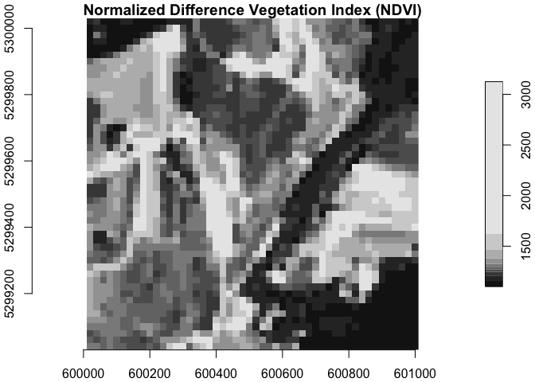
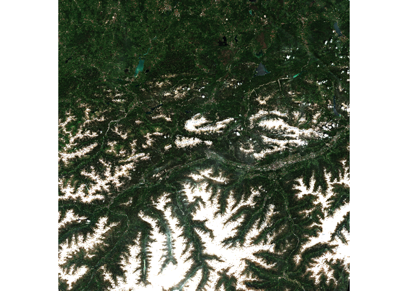
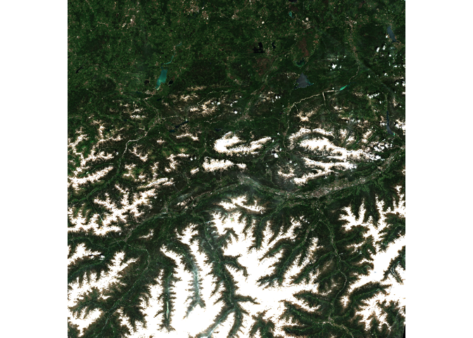

# Access and Analyze EOPF STAC Zarr Data with R


# Table of Contents

-   [Introduction](#introduction)
-   [Prerequisites](#prerequisites)
    -   [Dependencies](#dependencies)
    -   [Fixes to the Rarr package](#fixes-to-the-rarr-package)
-   [Access Zarr data from the STAC
    catalog](#access-zarr-data-from-the-stac-catalog)
-   [Read Zarr data](#read-zarr-data)
    -   [Coordinates](#coordinates)
    -   [Different resolutions](#different-resolutions)
-   [Examples](#examples)
    -   [Sentinel 2](#sentinel-2)
        -   [NDVI](#ndvi)
        -   <span id="rgb-quicklook-composite">RGB Quicklook
            Composite</span>
    -   [Sentinel 1](#sentinel-1)
    -   [Sentinel 3](#sentinel-3)

# Introduction

This tutorial will explore how to access and analyze Zarr data from the
[EOPF Sample Service STAC
catalog](https://stac.browser.user.eopf.eodc.eu/) programmatically using
R.

# Prerequisites

An R environment is required to follow this tutorial, with R version \>=
4.1.0. We recommend using either
[RStudio](https://posit.co/download/rstudio-desktop/) or
[Positron](https://posit.co/products/ide/positron/) (or a cloud
computing environment) and making use of [RStudio
projects](https://support.posit.co/hc/en-us/articles/200526207-Using-RStudio-Projects)
for a self-contained coding environment.

## Dependencies

We will use the `rstac` package (for accessing the STAC catalog), the
`tidyverse` package (for data manipulation), and the `stars` package
(for working with spatiotemporal data) in this tutorial. You can install
them directly from CRAN:

(TODO add terra)

``` r
install.packages("rstac")
install.packages("tidyverse")
install.packages("stars")
```

We will also use the `Rarr` package to read Zarr data. It must be
installed from Bioconductor, so first install the `BiocManager` package:

``` r
install.packages("BiocManager")
```

Then, use this package to install `Rarr`:

``` r
BiocManager::install("Rarr")
```

Finally, load the packages into your environment:

``` r
library(rstac)
library(tidyverse)
library(Rarr)
library(stars)
library(terra)
```

## Fixes to the `Rarr` package

We will use functions from the `Rarr` package to read and analyze Zarr
data. Unfortunately, there is currently a bug in this package, causing
it to parse the EOPF Sample Service data URLs incorrectly – there is a
[pull request](https://github.com/grimbough/Rarr/pull/21) open to fix
this. In the meantime, we will write our own version of this URL parsing
function and use it instead of the one in `Rarr`.

``` r
.url_parse_other <- function(url) {
  parsed_url <- httr::parse_url(url)
  bucket <- gsub(
    x = parsed_url$path, pattern = "^/?([[a-z0-9\\:\\.-]*)/.*",
    replacement = "\\1", ignore.case = TRUE
  )
  object <- gsub(
    x = parsed_url$path, pattern = "^/?([a-z0-9\\:\\.-]*)/(.*)",
    replacement = "\\2", ignore.case = TRUE
  )
  hostname <- paste0(parsed_url$scheme, "://", parsed_url$hostname)

  if (!is.null(parsed_url$port)) {
    hostname <- paste0(hostname, ":", parsed_url$port)
  }

  res <- list(
    bucket = bucket,
    object = object,
    region = "auto",
    hostname = hostname
  )
  return(res)
}

assignInNamespace(".url_parse_other", .url_parse_other, ns = "Rarr")
```

This function overwrites the existing one in `Rarr`, and allows us to
continue with the analysis.

If you try to run some of the examples below and receive a timeout
error, please ensure that you have run the above code block.

# Access Zarr data from the STAC Catalog

The first step of accessing Zarr data is to understand the assets within
the EOPF Sample Service STAC catalog. The [first
tutorial](./eopf_stac_access.qmd) goes into detail on this, so we
recommend reviewing it if you have not already.

For the first part of this tutorial, we will be using data from the
[Sentinel-2 Level-2A
Collection](https://stac.browser.user.eopf.eodc.eu/collections/sentinel-2-l2a).
We fetch the “product” asset under a given item, and can look at its
URL:

``` r
item <- stac("https://stac.core.eopf.eodc.eu/") %>%
  collections(collection_id = "sentinel-2-l2a") %>%
  items(feature_id = "S2B_MSIL2A_20250530T101559_N0511_R065_T32TPT_20250530T130924") %>%
  get_request()

product <- item %>%
  assets_select(asset_names = "product")

product_url <- product %>%
  assets_url()

product_url
```

    [1] "https://objects.eodc.eu:443/e05ab01a9d56408d82ac32d69a5aae2a:202505-s02msil2a/30/products/cpm_v256/S2B_MSIL2A_20250530T101559_N0511_R065_T32TPT_20250530T130924.zarr"

The product is the “top level” Zarr asset, which contains the full Zarr
product hierarchy. We can use `zarr_overview()` to get an overview of
it, setting `as_data_frame` to `TRUE` so that we can see the entries in
a data frame instead of printed directly to the console. Each entry is a
Zarr array; we remove `product_url` from the path to get a better idea
of what each array is. Since this is something we will want to do
multiple times throughout the tutorial, we create a helper function for
this.

``` r
derive_store_array <- function(store, product_url) {
  store %>%
    mutate(array = str_remove(path, product_url)) %>%
    relocate(array, .before = path)
}

zarr_store <- product_url %>%
  zarr_overview(as_data_frame = TRUE) %>%
  derive_store_array(product_url)

zarr_store
```

    # A tibble: 149 × 7
       array                      path  nchunks data_type compressor dim   chunk_dim
       <chr>                      <chr>   <dbl> <chr>     <chr>      <lis> <list>   
     1 /conditions/geometry/angle http…       1 unicode2… blosc      <int> <int [1]>
     2 /conditions/geometry/band  http…       1 unicode96 blosc      <int> <int [1]>
     3 /conditions/geometry/dete… http…       1 int64     blosc      <int> <int [1]>
     4 /conditions/geometry/mean… http…       1 float64   blosc      <int> <int [1]>
     5 /conditions/geometry/mean… http…       1 float64   blosc      <int> <int [2]>
     6 /conditions/geometry/sun_… http…       1 float64   blosc      <int> <int [3]>
     7 /conditions/geometry/view… http…       4 float64   blosc      <int> <int [5]>
     8 /conditions/geometry/x     http…       1 int64     blosc      <int> <int [1]>
     9 /conditions/geometry/y     http…       1 int64     blosc      <int> <int [1]>
    10 /conditions/mask/detector… http…      36 uint8     blosc      <int> <int [2]>
    # ℹ 139 more rows

This shows us the path to access the Zarr array, the number of chunks it
contains, the type of data, as well as its dimensions and chunking
structure.

We can also look at overviews of individual arrays. First, let’s narrow
down to measurements taken at 20-metre resolution:

``` r
r20m <- zarr_store %>%
  filter(str_starts(array, "/measurements/reflectance/r20m/"))

r20m
```

    # A tibble: 12 × 7
       array                      path  nchunks data_type compressor dim   chunk_dim
       <chr>                      <chr>   <dbl> <chr>     <chr>      <lis> <list>   
     1 /measurements/reflectance… http…      36 uint16    blosc      <int> <int [2]>
     2 /measurements/reflectance… http…      36 uint16    blosc      <int> <int [2]>
     3 /measurements/reflectance… http…      36 uint16    blosc      <int> <int [2]>
     4 /measurements/reflectance… http…      36 uint16    blosc      <int> <int [2]>
     5 /measurements/reflectance… http…      36 uint16    blosc      <int> <int [2]>
     6 /measurements/reflectance… http…      36 uint16    blosc      <int> <int [2]>
     7 /measurements/reflectance… http…      36 uint16    blosc      <int> <int [2]>
     8 /measurements/reflectance… http…      36 uint16    blosc      <int> <int [2]>
     9 /measurements/reflectance… http…      36 uint16    blosc      <int> <int [2]>
    10 /measurements/reflectance… http…      36 uint16    blosc      <int> <int [2]>
    11 /measurements/reflectance… http…       1 int64     blosc      <int> <int [1]>
    12 /measurements/reflectance… http…       1 int64     blosc      <int> <int [1]>

Then, we select the B02 array and examine its dimensions and chuning:

``` r
r20m %>%
  filter(str_ends(array, "b02")) %>%
  select(path, nchunks, dim, chunk_dim) %>%
  as.list()
```

    $path
    [1] "https://objects.eodc.eu:443/e05ab01a9d56408d82ac32d69a5aae2a:202505-s02msil2a/30/products/cpm_v256/S2B_MSIL2A_20250530T101559_N0511_R065_T32TPT_20250530T130924.zarr/measurements/reflectance/r20m/b02"

    $nchunks
    [1] 36

    $dim
    $dim[[1]]
    [1] 5490 5490


    $chunk_dim
    $chunk_dim[[1]]
    [1] 915 915

We can also see an overview of individual arrays using
`zarr_overview()`. With the default setting (where `as_data_frame` is
`FALSE`), this prints information on the array directly to the console,
in a more digestible way:

``` r
r20m_b02 <- r20m %>%
  filter(str_ends(array, "b02")) %>%
  pull(path)

r20m_b02 %>%
  zarr_overview()
```

    Type: Array
    Path: https://objects.eodc.eu:443/e05ab01a9d56408d82ac32d69a5aae2a:202505-s02msil2a/30/products/cpm_v256/S2B_MSIL2A_20250530T101559_N0511_R065_T32TPT_20250530T130924.zarr/measurements/reflectance/r20m/b02/
    Shape: 5490 x 5490
    Chunk Shape: 915 x 915
    No. of Chunks: 36 (6 x 6)
    Data Type: uint16
    Endianness: little
    Compressor: blosc

The above overview tells us that the data is two-dimensional, with
dimensions 5490 x 5490 Zarr data is split up into *chunks*, which are
smaller, independent piece of the larger array. Chunks can be accessed
individually, without loading the entire array. In this case, there are
36 chunks in total, with 6 along each of the dimensions, each of size
915 x 915.

# Read Zarr data

To read in Zarr data, we use `read_zarr_array()`, and can pass a list to
the `index` argument, describing which elements we want to extract,
along each dimension. Since this array is two-dimensional, we can think
of the dimensions as rows and columns of the data. For example, to
select the first 10 rows and the first 5 columns:

``` r
r20m_b02 %>%
  read_zarr_array(list(1:10, 1:5))
```

          [,1] [,2] [,3] [,4] [,5]
     [1,] 1156 1134 1142 1137 1141
     [2,] 1210 1178 1246 1165 1143
     [3,] 1134 1167 1195 1164 1139
     [4,] 1158 1136 1133 1130 1128
     [5,] 1141 1131 1127 1153 1143
     [6,] 1167 1141 1143 1141 1187
     [7,] 1173 1140 1126 1131 1267
     [8,] 1146 1141 1129 1187 1321
     [9,] 1138 1151 1149 1312 1340
    [10,] 1152 1157 1227 1393 1340

Or, to select rows rows 4215 to 4220 and columns 1 to 5:

``` r
r20m_b02 %>%
  read_zarr_array(list(4215:4220, 1:5))
```

         [,1] [,2] [,3] [,4] [,5]
    [1,] 8766 9702 8874 8296 8279
    [2,] 8398 9654 9225 8396 7949
    [3,] 7825 8083 8741 8653 7528
    [4,] 4534 2968 5217 8685 7193
    [5,] 1810 2078 3950 6415 6422
    [6,] 6773 3676 2430 2563 4955

## Coordinates

Similarly, we can read in the `x` and `y` coordinates corresponding to
data at 10m resolution. These `x` and `y` coordinates do not correspond
to latitude and longitude–to understand the coordinate reference system
used in each data set, we access the “`proj:espg`” property of the STAC
item. In this case, the coordinate reference system is
[EPSG:32626](https://epsg.io/32626), which represents metres from the
UTM zone’s origin.

``` r
item[["properties"]][["proj:code"]]
```

    [1] "EPSG:32632"

We can see that `x` and `y` are one dimensional:

``` r
r20m_x <- r20m %>%
  filter(str_ends(array, "x")) %>%
  pull(path)

r20m_x %>%
  zarr_overview()
```

    Type: Array
    Path: https://objects.eodc.eu:443/e05ab01a9d56408d82ac32d69a5aae2a:202505-s02msil2a/30/products/cpm_v256/S2B_MSIL2A_20250530T101559_N0511_R065_T32TPT_20250530T130924.zarr/measurements/reflectance/r20m/x/
    Shape: 5490
    Chunk Shape: 5490
    No. of Chunks: 1 (1)
    Data Type: int64
    Endianness: little
    Compressor: blosc

``` r
r20m_y <- r20m %>%
  filter(str_ends(array, "y")) %>%
  pull(path)

r20m_y %>%
  zarr_overview()
```

    Type: Array
    Path: https://objects.eodc.eu:443/e05ab01a9d56408d82ac32d69a5aae2a:202505-s02msil2a/30/products/cpm_v256/S2B_MSIL2A_20250530T101559_N0511_R065_T32TPT_20250530T130924.zarr/measurements/reflectance/r20m/y/
    Shape: 5490
    Chunk Shape: 5490
    No. of Chunks: 1 (1)
    Data Type: int64
    Endianness: little
    Compressor: blosc

Which means that, when combined, they form a grid that describes the
location of each point in the 2-dimensional measurements, such as B02.
We will go into this more in the examples below.

The `x` and `y` dimensions can be read in using the same logic: by
describing which elements we want to extract. Since there is only one
dimension, we only need to supply one entry in the indexing list:

``` r
r20m_x %>%
  read_zarr_array(list(1:5))
```

    [1] 600010 600030 600050 600070 600090

Or, we can read in the whole array and view its first few values with
`head()`. Of course, reading in the whole array, rather than a small
section of it, will take longer.

``` r
r20m_x %>%
  read_zarr_array() %>%
  head(5)
```

    [1] 600010 600030 600050 600070 600090

``` r
r20m_y %>%
  read_zarr_array() %>%
  head(5)
```

    [1] 5300030 5300010 5299990 5299970 5299950

## Different resolutions

With EOPF data, some measurements are available at multiple resolutions.
For example, we can see that the B02 spectral band is available at 10m,
20m, and 60m resolution:

``` r
b02 <- zarr_store %>%
  filter(str_starts(array, "/measurements/reflectance"), str_ends(array, "b02"))

b02
```

    # A tibble: 3 × 7
      array                       path  nchunks data_type compressor dim   chunk_dim
      <chr>                       <chr>   <dbl> <chr>     <chr>      <lis> <list>   
    1 /measurements/reflectance/… http…      36 uint16    blosc      <int> <int [2]>
    2 /measurements/reflectance/… http…      36 uint16    blosc      <int> <int [2]>
    3 /measurements/reflectance/… http…      36 uint16    blosc      <int> <int [2]>

The resolution affects the dimensions of the data; when measurements are
taken at a higher resolution, there will be more data. We can see here
that there is more data for the 10m resolution than the 20m resolution
(recall, its dimensions are 5490 x 5490), and less for the 60m
resolution:

``` r
b02 %>%
  filter(array == "/measurements/reflectance/r10m/b02") %>%
  pull(dim)
```

    [[1]]
    [1] 10980 10980

``` r
b02 %>%
  filter(array == "/measurements/reflectance/r60m/b02") %>%
  pull(dim)
```

    [[1]]
    [1] 1830 1830

# Examples

The following sections show examples from each of the Sentinel missions.

## Sentinel 1

The first example looks at [Sentinel 1 Level 2 Ocean (OCN)
data](https://stac.browser.user.eopf.eodc.eu/collections/sentinel-1-l2-ocn),
which consists of data for oceanographic study, such as monitoring sea
surface conditions, detecting oil spills, and studying ocean currents.
This example will show how to access and plot Wind Direction data.

First, select the relevant collection and item from STAC:

``` r
l2_ocn <- stac("https://stac.core.eopf.eodc.eu/") %>%
  collections(collection_id = "sentinel-1-l2-ocn") %>%
  items(feature_id = "S1A_IW_OCN__2SDV_20250604T193923_20250604T193948_059501_0762FA_C971") %>%
  get_request()

l2_ocn
```

    ###Item
    - id: S1A_IW_OCN__2SDV_20250604T193923_20250604T193948_059501_0762FA_C971
    - collection: sentinel-1-l2-ocn
    - bbox: xmin: -25.77445, ymin: 30.25712, xmax: -22.82115, ymax: 32.16941
    - datetime: 2025-06-04T19:39:23.099186Z
    - assets: osw, owi, rvl, product, product_metadata
    - item's fields: 
    assets, bbox, collection, geometry, id, links, properties, stac_extensions, stac_version, type

We can look at each of the assets’ to understand what the item contains:

``` r
l2_ocn %>%
  pluck("assets") %>%
  map("title")
```

    $osw
    [1] "Ocean Swell spectra"

    $owi
    [1] "Ocean Wind field"

    $rvl
    [1] "Surface Radial Velocity"

    $product
    [1] "EOPF Product"

    $product_metadata
    [1] "Consolidated Metadata"

We are interested in the “Ocean Wind field” data, and will hold onto the
“owi” key for now.

To access all of the `owi` data, we get the `"product"` asset and then
the full Zarr store, again using our helper function to extract array
information from the full array path:

``` r
l2_ocn_url <- l2_ocn %>%
  assets_select(asset_names = "product") %>%
  assets_url()

l2_ocn_store <- l2_ocn_url %>%
  zarr_overview(as_data_frame = TRUE) %>%
  derive_store_array(l2_ocn_url)

l2_ocn_store
```

    # A tibble: 114 × 7
       array                      path  nchunks data_type compressor dim   chunk_dim
       <chr>                      <chr>   <dbl> <chr>     <chr>      <lis> <list>   
     1 /osw/S01SIWOCN_20250604T1… http…       1 float32   blosc      <int> <int [3]>
     2 /osw/S01SIWOCN_20250604T1… http…       1 float32   blosc      <int> <int [2]>
     3 /osw/S01SIWOCN_20250604T1… http…       1 float32   blosc      <int> <int [2]>
     4 /osw/S01SIWOCN_20250604T1… http…       1 float32   blosc      <int> <int [2]>
     5 /osw/S01SIWOCN_20250604T1… http…       1 float32   blosc      <int> <int [2]>
     6 /osw/S01SIWOCN_20250604T1… http…       1 float32   blosc      <int> <int [2]>
     7 /osw/S01SIWOCN_20250604T1… http…       1 float32   blosc      <int> <int [5]>
     8 /osw/S01SIWOCN_20250604T1… http…       1 float32   blosc      <int> <int [5]>
     9 /osw/S01SIWOCN_20250604T1… http…       1 float32   blosc      <int> <int [3]>
    10 /osw/S01SIWOCN_20250604T1… http…       1 float32   blosc      <int> <int [3]>
    # ℹ 104 more rows

Next, we filter to access `owi` measurement data only:

``` r
l2_ocn_store %>%
  filter(str_starts(array, "/owi"), str_detect(array, "measurements"))
```

    # A tibble: 4 × 7
      array                       path  nchunks data_type compressor dim   chunk_dim
      <chr>                       <chr>   <dbl> <chr>     <chr>      <lis> <list>   
    1 /owi/S01SIWOCN_20250604T19… http…       1 float32   blosc      <int> <int [2]>
    2 /owi/S01SIWOCN_20250604T19… http…       1 float32   blosc      <int> <int [2]>
    3 /owi/S01SIWOCN_20250604T19… http…       1 float32   blosc      <int> <int [2]>
    4 /owi/S01SIWOCN_20250604T19… http…       1 float32   blosc      <int> <int [2]>

Since all of these arrays start with
`/owi/S01SIWOCN_20250604T193923_0025_A340_C971_0762FA_VV/measurements/`,
we can remove that to get a clearer idea of what each array is:

``` r
owi <- l2_ocn_store %>%
  filter(str_starts(array, "/owi"), str_detect(array, "measurements")) %>%
  mutate(array = str_remove(array, "/owi/S01SIWOCN_20250604T193923_0025_A340_C971_0762FA_VV/measurements/"))

owi
```

    # A tibble: 4 × 7
      array          path               nchunks data_type compressor dim   chunk_dim
      <chr>          <chr>                <dbl> <chr>     <chr>      <lis> <list>   
    1 latitude       https://objects.e…       1 float32   blosc      <int> <int [2]>
    2 longitude      https://objects.e…       1 float32   blosc      <int> <int [2]>
    3 wind_direction https://objects.e…       1 float32   blosc      <int> <int [2]>
    4 wind_speed     https://objects.e…       1 float32   blosc      <int> <int [2]>

We are interested in `wind_direction`, as well as the coordinate arrays
(`latitude` and `longitude`). We can get an overview of the arrays’
dimensions and structures:

``` r
owi %>%
  filter(array == "wind_direction") %>%
  pull(path) %>%
  zarr_overview()
```

    Type: Array
    Path: https://objects.eodc.eu:443/e05ab01a9d56408d82ac32d69a5aae2a:202506-s01siwocn/04/products/cpm_v256/S1A_IW_OCN__2SDV_20250604T193923_20250604T193948_059501_0762FA_C971.zarr/owi/S01SIWOCN_20250604T193923_0025_A340_C971_0762FA_VV/measurements/wind_direction/
    Shape: 167 x 255
    Chunk Shape: 167 x 255
    No. of Chunks: 1 (1 x 1)
    Data Type: float32
    Endianness: little
    Compressor: blosc

``` r
owi %>%
  filter(array == "latitude") %>%
  pull(path) %>%
  zarr_overview()
```

    Type: Array
    Path: https://objects.eodc.eu:443/e05ab01a9d56408d82ac32d69a5aae2a:202506-s01siwocn/04/products/cpm_v256/S1A_IW_OCN__2SDV_20250604T193923_20250604T193948_059501_0762FA_C971.zarr/owi/S01SIWOCN_20250604T193923_0025_A340_C971_0762FA_VV/measurements/latitude/
    Shape: 167 x 255
    Chunk Shape: 167 x 255
    No. of Chunks: 1 (1 x 1)
    Data Type: float32
    Endianness: little
    Compressor: blosc

``` r
owi %>%
  filter(array == "longitude") %>%
  pull(path) %>%
  zarr_overview()
```

    Type: Array
    Path: https://objects.eodc.eu:443/e05ab01a9d56408d82ac32d69a5aae2a:202506-s01siwocn/04/products/cpm_v256/S1A_IW_OCN__2SDV_20250604T193923_20250604T193948_059501_0762FA_C971.zarr/owi/S01SIWOCN_20250604T193923_0025_A340_C971_0762FA_VV/measurements/longitude/
    Shape: 167 x 255
    Chunk Shape: 167 x 255
    No. of Chunks: 1 (1 x 1)
    Data Type: float32
    Endianness: little
    Compressor: blosc

Here, we can see that all of the arrays are of the same shape: 167 x
255, with only one chunk. Since these are small, we can read all of the
data in at once. This is done by *not* supplying any additional
arguments to `read_zarr_array()`:

``` r
owi_wind_direction <- owi %>%
  filter(array == "wind_direction") %>%
  pull(path) %>%
  read_zarr_array()

owi_wind_direction[1:5, 1:5]
```

             [,1]     [,2]     [,3]     [,4]     [,5]
    [1,] 87.10201 85.10722 80.11242 87.11762 80.12283
    [2,] 87.10078 87.10600 88.11120 83.11641 86.12161
    [3,] 89.09956 81.10477 82.10999 88.11519 88.12040
    [4,] 87.09834 83.10355 84.10876 82.11398 81.11919
    [5,] 83.09712 88.10233 83.10755 86.11276 85.11797

``` r
owi_lat <- owi %>%
  filter(array == "latitude") %>%
  pull(path) %>%
  read_zarr_array()

owi_lat[1:5, 1:5]
```

             [,1]     [,2]     [,3]     [,4]     [,5]
    [1,] 30.26237 30.26406 30.26576 30.26746 30.26917
    [2,] 30.27138 30.27308 30.27478 30.27648 30.27818
    [3,] 30.28039 30.28209 30.28379 30.28549 30.28719
    [4,] 30.28940 30.29110 30.29280 30.29450 30.29620
    [5,] 30.29842 30.30012 30.30182 30.30351 30.30521

``` r
owi_long <- owi %>%
  filter(array == "longitude") %>%
  pull(path) %>%
  read_zarr_array()

owi_lat[1:5, 1:5]
```

             [,1]     [,2]     [,3]     [,4]     [,5]
    [1,] 30.26237 30.26406 30.26576 30.26746 30.26917
    [2,] 30.27138 30.27308 30.27478 30.27648 30.27818
    [3,] 30.28039 30.28209 30.28379 30.28549 30.28719
    [4,] 30.28940 30.29110 30.29280 30.29450 30.29620
    [5,] 30.29842 30.30012 30.30182 30.30351 30.30521

Note that, unlike in the previous example with `x` and `y` coordinates
that we explored, both `longitude` and `latitude` are 2-dimensional
arrays, and they are not evenly spaced. Rather, the data grid is
**curvilinear** — it has grid lines that are not straight, and there is
a longitude and latitude for every pixel of the other layers (i.e.,
`wind_direction`). This format is very common in satellite data.

We use functions from the [`stars`
package](https://r-spatial.github.io/stars/), loaded earlier, to format
the data for visualisation. `stars` is specifically designed for
reading, manipulating, and plotting spatiotemporal data, such as
satellite data.

The function `st_as_stars()` is used to get our data into the correct
format for visualisation:

``` r
owi_stars <- st_as_stars(wind_direction = owi_wind_direction) %>%
  st_as_stars(curvilinear = list(X1 = owi_long, X2 = owi_lat))
```

Getting the data into this format is also beneficial because it allows
for a quick summary of the data and its attributes, providing
information such as the median and mean `wind_direction`, the number of
`NA`s, and information on the grid:

``` r
owi_stars
```

    stars object with 2 dimensions and 1 attribute
    attribute(s):
                        Min. 1st Qu.   Median     Mean  3rd Qu.     Max. NA's
    wind_direction  33.29902 57.9872 66.76632 65.45217 73.04303 91.13456  430
    dimension(s):
       from  to         refsys point                      values x/y
    X1    1 167 WGS 84 (CRS84) FALSE [167x255] -25.77,...,-22.83 [x]
    X2    1 255 WGS 84 (CRS84) FALSE   [167x255] 30.26,...,32.16 [y]
    curvilinear grid

Finally, we can plot this object:

``` r
plot(owi_stars, as_points = FALSE, axes = TRUE, breaks = "equal", col = hcl.colors)
```


## Sentinel 2

# NDVI

We will calculate the Normalized Difference Vegetation Index (NDVI) for
data from the Sentinel-2 mission. This requires both the red (B04) and
near-infrared (B08) bands. We will work with these at 20-metre
resolution.

Recall that we already have an object `r20m` which contains the arrays
at 20-metre resolution:

``` r
r20m
```

    # A tibble: 12 × 7
       array                      path  nchunks data_type compressor dim   chunk_dim
       <chr>                      <chr>   <dbl> <chr>     <chr>      <lis> <list>   
     1 /measurements/reflectance… http…      36 uint16    blosc      <int> <int [2]>
     2 /measurements/reflectance… http…      36 uint16    blosc      <int> <int [2]>
     3 /measurements/reflectance… http…      36 uint16    blosc      <int> <int [2]>
     4 /measurements/reflectance… http…      36 uint16    blosc      <int> <int [2]>
     5 /measurements/reflectance… http…      36 uint16    blosc      <int> <int [2]>
     6 /measurements/reflectance… http…      36 uint16    blosc      <int> <int [2]>
     7 /measurements/reflectance… http…      36 uint16    blosc      <int> <int [2]>
     8 /measurements/reflectance… http…      36 uint16    blosc      <int> <int [2]>
     9 /measurements/reflectance… http…      36 uint16    blosc      <int> <int [2]>
    10 /measurements/reflectance… http…      36 uint16    blosc      <int> <int [2]>
    11 /measurements/reflectance… http…       1 int64     blosc      <int> <int [1]>
    12 /measurements/reflectance… http…       1 int64     blosc      <int> <int [1]>

We will read in the `B04` band, as well as the `x` and `y` coordinates,
using the `map()` function to read them all in, and store them in a
list.

``` r
r20m_arrays <- r20m %>%
  mutate(array = str_remove(array, "/measurements/reflectance/r20m/")) %>%
  filter(array %in% c("b04", "x", "y")) %>%
  split(.$array) %>%
  map(\(x) read_zarr_array(x[["path"]]))
```

The B08 band is only available at 10-metre resolution, so we read that
in:

``` r
r10m_b08 <- zarr_store %>%
  filter(array == "/measurements/reflectance/r10m/b08") %>%
  pull(path) %>%
  read_zarr_array()

dim(r10m_b08)
```

    [1] 10980 10980

And then use `terra`’s `aggregate()` to aggregate it up to 20-metre
resolution. This reduces the dimension of the B08 band to be 50 x 50,
matching the other 20-metre resolution bands.

``` r
r20m_b08 <- r10m_b08 %>%
  rast() %>%
  aggregate(fact = 2)

dim(r20m_b08)
```

    [1] 50 50  1

The B08 band is now in a format that considers the number of **layers**,
which we do not need. We can convert it back to an array so that it is
in the same format as the other data.

``` r
r20m_b08 <- as.array(r20m_b08)[, , 1]
```

For NDVI, we need to calculate `sum_bands`, which is the sum of the
Near-Infrared (B08) and Red bands (B04), and `diff_bands`, which is
their difference. First, we will combine all of the arrays into a
`stars` object, which allows us to do easy data manipulation on it. To
create this object, we name the arrays specifically, and then set `x`
and `y` as dimensions.

``` r
ndvi_data <- st_as_stars(
  b04 = r20m_arrays[["b04"]], b08 = r20m_b08
) %>%
  st_set_dimensions("X1", r20m_arrays[["x"]], names = "x") %>%
  st_set_dimensions("X2", r20m_arrays[["y"]], names = "y")

ndvi_data
```

    stars object with 2 dimensions and 2 attributes
    attribute(s):
           Min.  1st Qu. Median     Mean  3rd Qu. Max.
    b04  1101.0 1231.000 1291.0 1356.038 1421.000 3125
    b08  1936.5 3987.938 5036.5 4753.588 5498.312 8149
    dimension(s):
      from to  offset delta point x/y
    x    1 50  600010    20 FALSE [x]
    y    1 50 5300030   -20 FALSE [y]

This is a useful format that shows us summary statistics on each array.
More than that, we can now use `tidyverse`-style data operations, such
as `mutate()` to derive new variables:

``` r
ndvi_data <- ndvi_data %>%
  mutate(
    sum_bands = b08 + b04,
    diff_bands = b08 - b04
  )
```

Then, we can derive the `ndvi` (`diff_bands` / `sum_bands`), handling
any cases where `sum_bands` is 0 by setting the NDVI to 0:

``` r
ndvi_data <- ndvi_data %>%
  mutate(ndvi = ifelse(sum_bands != 0, diff_bands / sum_bands, 0))
```

Then, we can visualise the NDVI:

``` r
plot(ndvi_data, axes = TRUE, main = "Normalized Difference Vegetation Index (NDVI)")
```



### RGB Quicklook Composite

EOPF Zarr Assets include quicklook RGB composites, which are readily
viewable representations of the satellite image. We will open the
10-metre resolution quicklook and visualise it. This is available as an
asset, so we can access it directly from the STAC item.

``` r
tci_10m_asset <- item[["assets"]][["TCI_10m"]]

tci_10m_url <- tci_10m_asset[["href"]]

tci_10m_url %>%
  zarr_overview()
```

    Type: Array
    Path: https://objects.eodc.eu:443/e05ab01a9d56408d82ac32d69a5aae2a:202505-s02msil2a/30/products/cpm_v256/S2B_MSIL2A_20250530T101559_N0511_R065_T32TPT_20250530T130924.zarr/quality/l2a_quicklook/r10m/tci/
    Shape: 3 x 10980 x 10980
    Chunk Shape: 1 x 1830 x 1830
    No. of Chunks: 108 (3 x 6 x 6)
    Data Type: uint8
    Endianness: NA
    Compressor: blosc

From the overview, we can see that the quicklook array has three
dimensions to it, each of size 10980 x 10980. The three dimensions
correspond to red, green, and blue spectral bands (B04, B03, and B02,
respectively), since this is an RGB composite. This information is also
available by looking at the assets’ bands:

``` r
tci_10m_asset[["bands"]] %>%
  map_dfr(as_tibble)
```

    # A tibble: 3 × 5
      name  common_name description    center_wavelength full_width_half_max
      <chr> <chr>       <chr>                      <dbl>               <dbl>
    1 B04   red         Red (band 4)               0.665               0.038
    2 B03   green       Green (band 3)             0.56                0.045
    3 B02   blue        Blue (band 2)              0.49                0.098

We can read in a small chunk of the array to get an idea of its shape,
using the same indexing process we’ve used before. Note that we want to
select *all* of the bands (the first dimension listed). Rather than
writing `1:3`, we can simply use `NULL` as the first dimension,
indicating to get all data at this dimension. To preview the data, we
will just get the first 2 entries (in each dimension) along the three
bands.

``` r
tci_10m_preview <- tci_10m_url %>%
  read_zarr_array(list(NULL, 1:2, 1:2))

tci_10m_preview
```

    , , 1

         [,1] [,2]
    [1,]   16   20
    [2,]   31   34
    [3,]   15   19

    , , 2

         [,1] [,2]
    [1,]   16   18
    [2,]   30   34
    [3,]   13   20

For visualization purposes, we need the data in a different
configuration — note the dimensions of the data:

``` r
dim(tci_10m_preview)
```

    [1] 3 2 2

Instead, we need to get it into e.g. 2 x 2 x 3, with the *third*
dimension reflecting the number of bands (or layers) To do this, we use
the `aperm()` function to transpose an array, with argument `c(2, 3, 1)`
– moving the second dimension to the first, the third to the second, and
the first to the third. Then, we can see that the dimensions of the
array are correct:

``` r
tci_10m_preview_perm <- tci_10m_preview %>%
  aperm(c(2, 3, 1))

tci_10m_preview_perm
```

    , , 1

         [,1] [,2]
    [1,]   16   16
    [2,]   20   18

    , , 2

         [,1] [,2]
    [1,]   31   30
    [2,]   34   34

    , , 3

         [,1] [,2]
    [1,]   15   13
    [2,]   19   20

``` r
dim(tci_10m_preview_perm)
```

    [1] 2 2 3

Let’s read in the full TCI array to visualise it.

``` r
tci_10m <- tci_10m_url %>%
  read_zarr_array()

tci_10m_perm <- tci_10m %>%
  aperm(c(2, 3, 1))

dim(tci_10m)
```

    [1]     3 10980 10980

For visualisation, we use `terra`’s `plotRGB()` function, first
converting the array into a raster object with `rast()`:

``` r
tci_10m_perm %>%
  rast() %>%
  plotRGB()
```



We can do the same with the quicklook at the 60-metre resolution,
showing the full visualisation process in a single step:

``` r
zarr_store %>%
  filter(array == "/quality/l2a_quicklook/r60m/tci") %>%
  pull(path) %>%
  read_zarr_array() %>%
  aperm(c(2, 3, 1)) %>%
  rast() %>%
  plotRGB()
```



## Sentinel 3
