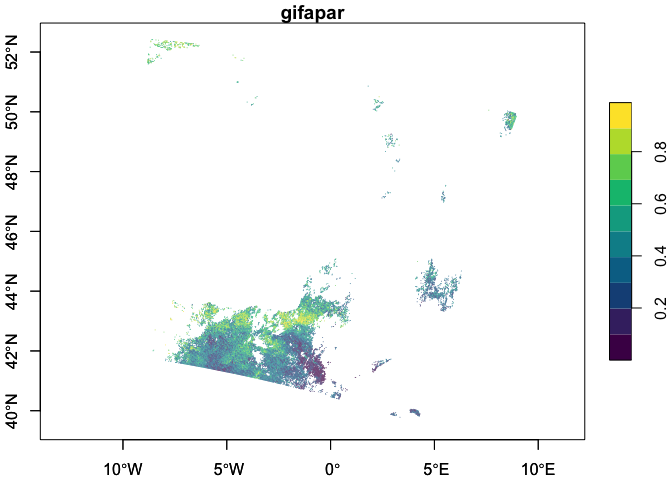

# Access and analyse EOPF STAC Zarr data with R


# Table of Contents

-   [Introduction](#introduction)
-   [Prerequisites](#prerequisites)
    -   [Dependencies](#dependencies)
-   [Access Zarr data from the STAC
    catalog](#access-zarr-data-from-the-stac-catalog)
-   [Read Zarr data](#read-zarr-data)
    -   [Coordinates](#coordinates)
    -   [Different resolutions](#different-resolutions)
-   [Examples](#examples)
    -   [Sentinel-1](#sentinel-1)
    -   [Sentinel-2](#sentinel-2)
    -   [Sentinel-3](#sentinel-3)
-   [The benefits of EOPF Zarr over
    SAFE](#the-benefits-of-eopf-zarr-over-safe)
    -   [Zarr example](#zarr-example)
    -   [Safe example](#safe-example)
    -   [Comparisons](#comparisons)

# Introduction

This tutorial will explore how to access and analyse Zarr data from the
[EOPF Sample Service STAC
catalog](https://stac.browser.user.eopf.eodc.eu/) programmatically using
R. It follows the [first tutorial](./eopf_stac_access.md), which goes
into more detail on accessing and searching within the STAC catalog.

# Prerequisites

An R environment is required to follow this tutorial, with R version \>=
4.5.0. We recommend using either
[RStudio](https://posit.co/download/rstudio-desktop/) or
[Positron](https://posit.co/products/ide/positron/) (or a cloud
computing environment) and making use of [RStudio
projects](https://support.posit.co/hc/en-us/articles/200526207-Using-RStudio-Projects)
for a self-contained coding environment.

## Dependencies

We will use the following packages in this tutorial:
[`rstac`](https://brazil-data-cube.github.io/rstac/) (for accessing the
STAC catalog), [`tidyverse`](https://tidyverse.tidyverse.org/) (for data
manipulation), [`stars`](https://r-spatial.github.io/stars/)) (for
working with spatiotemporal data), and
[`terra`](https://rspatial.github.io/terra/index.html) (for working with
spatial data in raster format). You can install them directly from CRAN:

``` r
install.packages("rstac")
install.packages("tidyverse")
install.packages("stars")
install.packages("terra")
```

We will also use the `Rarr` package (version \>= 1.10.1) to read Zarr
data. It must be installed from Bioconductor, so first install the
`BiocManager` package:

``` r
install.packages("BiocManager")
```

Then, use this package to install `Rarr`:

``` r
BiocManager::install("Rarr")
```

Finally, load the packages into your environment:

``` r
library(rstac)
library(tidyverse)
library(Rarr)
library(stars)
library(terra)
```

# Access Zarr data from the STAC Catalog

The first step of accessing Zarr data is to understand the assets within
the EOPF Sample Service STAC catalog. The [first
tutorial](./eopf_stac_access.md) goes into detail on this, so we
recommend reviewing it if you have not already.

For the first part of this tutorial, we will be using data from the
[Sentinel-2 Level-2A
Collection](https://stac.browser.user.eopf.eodc.eu/collections/sentinel-2-l2a).
We fetch the “product” asset under a given item, and can look at its
URL:

``` r
s2_l2a_item <- stac("https://stac.core.eopf.eodc.eu/") |>
  collections(collection_id = "sentinel-2-l2a") |>
  items(feature_id = "S2B_MSIL2A_20250530T101559_N0511_R065_T32TPT_20250530T130924") |>
  get_request()

s2_l2a_product <- s2_l2a_item |>
  assets_select(asset_names = "product")

s2_l2a_product_url <- s2_l2a_product |>
  assets_url()

s2_l2a_product_url
```

    [1] "https://objects.eodc.eu:443/e05ab01a9d56408d82ac32d69a5aae2a:202505-s02msil2a/30/products/cpm_v256/S2B_MSIL2A_20250530T101559_N0511_R065_T32TPT_20250530T130924.zarr"

The product is the “top level” Zarr asset, which contains the full Zarr
product hierarchy. We can use `zarr_overview()` to get an overview of
it, setting `as_data_frame` to `TRUE` so that we can see the entries in
a data frame instead of printed directly to the console. Each entry is a
Zarr array; we remove `product_url` from the path to get a better idea
of what each array is. Since this is something we will want to do
multiple times throughout the tutorial, we create a helper function for
this.

``` r
derive_store_array <- function(store, product_url) {
  store |>
    mutate(array = str_remove(path, product_url)) |>
    relocate(array, .before = path)
}

zarr_store <- s2_l2a_product_url |>
  zarr_overview(as_data_frame = TRUE) |>
  derive_store_array(s2_l2a_product_url)

zarr_store
```

    # A tibble: 149 × 8
       array           path  data_type endianness compressor dim   chunk_dim nchunks
       <chr>           <chr> <chr>     <chr>      <chr>      <lis> <list>    <list> 
     1 /conditions/ge… http… unicode2… little     blosc      <int> <int [1]> <dbl>  
     2 /conditions/ge… http… unicode96 little     blosc      <int> <int [1]> <dbl>  
     3 /conditions/ge… http… int64     little     blosc      <int> <int [1]> <dbl>  
     4 /conditions/ge… http… float64   little     blosc      <int> <int [1]> <dbl>  
     5 /conditions/ge… http… float64   little     blosc      <int> <int [2]> <dbl>  
     6 /conditions/ge… http… float64   little     blosc      <int> <int [3]> <dbl>  
     7 /conditions/ge… http… float64   little     blosc      <int> <int [5]> <dbl>  
     8 /conditions/ge… http… int64     little     blosc      <int> <int [1]> <dbl>  
     9 /conditions/ge… http… int64     little     blosc      <int> <int [1]> <dbl>  
    10 /conditions/ma… http… uint8     <NA>       blosc      <int> <int [2]> <dbl>  
    # ℹ 139 more rows

This shows us the path to access the Zarr array, the number of chunks it
contains, the type of data, as well as its dimensions and chunking
structure.

We can also look at overviews of individual arrays. First, let’s narrow
down to measurements taken at 20-metre resolution:

``` r
r20m <- zarr_store |>
  filter(str_starts(array, "/measurements/reflectance/r20m/"))

r20m
```

    # A tibble: 12 × 8
       array           path  data_type endianness compressor dim   chunk_dim nchunks
       <chr>           <chr> <chr>     <chr>      <chr>      <lis> <list>    <list> 
     1 /measurements/… http… uint16    little     blosc      <int> <int [2]> <dbl>  
     2 /measurements/… http… uint16    little     blosc      <int> <int [2]> <dbl>  
     3 /measurements/… http… uint16    little     blosc      <int> <int [2]> <dbl>  
     4 /measurements/… http… uint16    little     blosc      <int> <int [2]> <dbl>  
     5 /measurements/… http… uint16    little     blosc      <int> <int [2]> <dbl>  
     6 /measurements/… http… uint16    little     blosc      <int> <int [2]> <dbl>  
     7 /measurements/… http… uint16    little     blosc      <int> <int [2]> <dbl>  
     8 /measurements/… http… uint16    little     blosc      <int> <int [2]> <dbl>  
     9 /measurements/… http… uint16    little     blosc      <int> <int [2]> <dbl>  
    10 /measurements/… http… uint16    little     blosc      <int> <int [2]> <dbl>  
    11 /measurements/… http… int64     little     blosc      <int> <int [1]> <dbl>  
    12 /measurements/… http… int64     little     blosc      <int> <int [1]> <dbl>  

Then, we select the B02 array and examine its dimensions and chunking:

``` r
r20m |>
  filter(str_ends(array, "b02")) |>
  select(path, nchunks, dim, chunk_dim) |>
  as.list()
```

    $path
    [1] "https://objects.eodc.eu:443/e05ab01a9d56408d82ac32d69a5aae2a:202505-s02msil2a/30/products/cpm_v256/S2B_MSIL2A_20250530T101559_N0511_R065_T32TPT_20250530T130924.zarr/measurements/reflectance/r20m/b02"

    $nchunks
    $nchunks[[1]]
    [1] 6 6


    $dim
    $dim[[1]]
    [1] 5490 5490


    $chunk_dim
    $chunk_dim[[1]]
    [1] 915 915

We can also see an overview of individual arrays using
`zarr_overview()`. With the default setting (where `as_data_frame` is
`FALSE`), this prints information on the array directly to the console,
in a more digestible way:

``` r
r20m_b02 <- r20m |>
  filter(str_ends(array, "b02")) |>
  pull(path)

r20m_b02 |>
  zarr_overview()
```

    Type: Array
    Path: https://objects.eodc.eu:443/e05ab01a9d56408d82ac32d69a5aae2a:202505-s02msil2a/30/products/cpm_v256/S2B_MSIL2A_20250530T101559_N0511_R065_T32TPT_20250530T130924.zarr/measurements/reflectance/r20m/b02
    Shape: 5490 x 5490
    Chunk Shape: 915 x 915
    No. of Chunks: 36 (6 x 6)
    Data Type: uint16
    Endianness: little
    Compressor: blosc

The above overview tells us that the data is two-dimensional, with
dimensions 5490 x 5490. Zarr data is split up into **chunks**, which are
smaller, independent piece of the larger array. Chunks can be accessed
individually, without loading the entire array. In this case, there are
36 chunks in total, with 6 along each of the dimensions, each of size
915 x 915.

# Read Zarr data

To read in Zarr data, we use `read_zarr_array()`, and can pass a list to
the `index` argument, describing which elements we want to extract along
each dimension. Since this array is two-dimensional, we can think of the
dimensions as rows and columns of the data. For example, to select the
first 10 rows and the first 5 columns:

``` r
r20m_b02 |>
  read_zarr_array(index = list(1:10, 1:5))
```

          [,1] [,2] [,3] [,4] [,5]
     [1,] 1156 1134 1142 1137 1141
     [2,] 1210 1178 1246 1165 1143
     [3,] 1134 1167 1195 1164 1139
     [4,] 1158 1136 1133 1130 1128
     [5,] 1141 1131 1127 1153 1143
     [6,] 1167 1141 1143 1141 1187
     [7,] 1173 1140 1126 1131 1267
     [8,] 1146 1141 1129 1187 1321
     [9,] 1138 1151 1149 1312 1340
    [10,] 1152 1157 1227 1393 1340

## Coordinates

Similarly, we can read in the `x` and `y` coordinates corresponding to
data at 10m resolution. These `x` and `y` coordinates do not correspond
to latitude and longitude—to understand the coordinate reference system
used in each data set, we access the `proj:code` property of the STAC
item. In this case, the coordinate reference system is
[EPSG:32626](https://epsg.io/32626), which represents metres from the
UTM zone’s origin.

``` r
s2_l2a_item[["properties"]][["proj:code"]]
```

    [1] "EPSG:32632"

We can see that `x` and `y` are one dimensional:

``` r
r20m_x <- r20m |>
  filter(str_ends(array, "x")) |>
  pull(path)

r20m_x |>
  zarr_overview()
```

    Type: Array
    Path: https://objects.eodc.eu:443/e05ab01a9d56408d82ac32d69a5aae2a:202505-s02msil2a/30/products/cpm_v256/S2B_MSIL2A_20250530T101559_N0511_R065_T32TPT_20250530T130924.zarr/measurements/reflectance/r20m/x
    Shape: 5490
    Chunk Shape: 5490
    No. of Chunks: 1 (1)
    Data Type: int64
    Endianness: little
    Compressor: blosc

``` r
r20m_y <- r20m |>
  filter(str_ends(array, "y")) |>
  pull(path)

r20m_y |>
  zarr_overview()
```

    Type: Array
    Path: https://objects.eodc.eu:443/e05ab01a9d56408d82ac32d69a5aae2a:202505-s02msil2a/30/products/cpm_v256/S2B_MSIL2A_20250530T101559_N0511_R065_T32TPT_20250530T130924.zarr/measurements/reflectance/r20m/y
    Shape: 5490
    Chunk Shape: 5490
    No. of Chunks: 1 (1)
    Data Type: int64
    Endianness: little
    Compressor: blosc

Which means that, when combined, they form a grid that describes the
location of each point in the 2-dimensional measurements, such as B02.
We will go into this more in the examples below.

The `x` and `y` dimensions can be read in using the same logic: by
describing which elements we want to extract. Since there is only one
dimension, we only need to supply one entry in the indexing list:

``` r
r20m_x |>
  read_zarr_array(list(1:5))
```

    [1] 600010 600030 600050 600070 600090

Or, we can read in the whole array (by not providing any elements to
`index`) and view its first few values with `head()`. Of course, reading
in the whole array, rather than a small section of it, will take longer.

``` r
r20m_x |>
  read_zarr_array() |>
  head(5)
```

    [1] 600010 600030 600050 600070 600090

``` r
r20m_y |>
  read_zarr_array() |>
  head(5)
```

    [1] 5300030 5300010 5299990 5299970 5299950

## Different resolutions

With EOPF data, some measurements are available at multiple resolutions.
For example, we can see that the B02 spectral band is available at 10m,
20m, and 60m resolution:

``` r
b02 <- zarr_store |>
  filter(str_starts(array, "/measurements/reflectance"), str_ends(array, "b02"))

b02 |>
  select(array)
```

    # A tibble: 3 × 1
      array                             
      <chr>                             
    1 /measurements/reflectance/r10m/b02
    2 /measurements/reflectance/r20m/b02
    3 /measurements/reflectance/r60m/b02

The resolution affects the dimensions of the data: when measurements are
taken at a higher resolution, there will be more data. We can see here
that there is more data for the 10m resolution than the 20m resolution
(recall, its dimensions are 5490 x 5490), and less for the 60m
resolution:

``` r
b02 |>
  filter(array == "/measurements/reflectance/r10m/b02") |>
  pull(dim)
```

    [[1]]
    [1] 10980 10980

``` r
b02 |>
  filter(array == "/measurements/reflectance/r60m/b02") |>
  pull(dim)
```

    [[1]]
    [1] 1830 1830

# Examples

The following sections show examples from each of the Sentinel missions.

## Sentinel-1

The first example looks at [Sentinel-1 Level 2 Ocean (OCN)
data](https://stac.browser.user.eopf.eodc.eu/collections/sentinel-1-l2-ocn),
which consists of data for oceanographic study, such as monitoring sea
surface conditions, detecting oil spills, and studying ocean currents.
This example will show how to access and plot Wind Direction data.

First, select the relevant collection and item from STAC:

``` r
l2_ocn <- stac("https://stac.core.eopf.eodc.eu/") |>
  collections(collection_id = "sentinel-1-l2-ocn") |>
  items(feature_id = "S1C_IW_OCN__2SDV_20251015T065428_20251015T065453_004569_009091_AB3E") |>
  get_request()

l2_ocn
```

    ###Item
    - id: S1C_IW_OCN__2SDV_20251015T065428_20251015T065453_004569_009091_AB3E
    - collection: sentinel-1-l2-ocn
    - bbox: xmin: -16.26193, ymin: 23.83777, xmax: -13.37396, ymax: 25.77964
    - datetime: 2025-10-15T06:54:41.026338Z
    - assets: osw, owi, rvl, product, product_metadata
    - item's fields: 
    assets, bbox, collection, geometry, id, links, properties, stac_extensions, stac_version, type

We can look at each of the assets’ titles to understand what the item
contains:

``` r
l2_ocn |>
  pluck("assets") |>
  map("title")
```

    $osw
    [1] "Ocean Swell spectra"

    $owi
    [1] "Ocean Wind field"

    $rvl
    [1] "Surface Radial Velocity"

    $product
    [1] "EOPF Product"

    $product_metadata
    [1] "Consolidated Metadata"

We are interested in the “Ocean Wind field” data, and will hold onto the
`owi` key for now.

To access all of the `owi` data, we get the “product” asset and then the
full Zarr store, again using our helper function to extract array
information from the full array path:

``` r
l2_ocn_url <- l2_ocn |>
  assets_select(asset_names = "product") |>
  assets_url()

l2_ocn_store <- l2_ocn_url |>
  zarr_overview(as_data_frame = TRUE) |>
  derive_store_array(l2_ocn_url)

l2_ocn_store
```

    # A tibble: 114 × 8
       array           path  data_type endianness compressor dim   chunk_dim nchunks
       <chr>           <chr> <chr>     <chr>      <chr>      <lis> <list>    <list> 
     1 /osw/S01SIWOCN… http… float32   little     blosc      <int> <int [3]> <dbl>  
     2 /osw/S01SIWOCN… http… float32   little     blosc      <int> <int [2]> <dbl>  
     3 /osw/S01SIWOCN… http… float32   little     blosc      <int> <int [2]> <dbl>  
     4 /osw/S01SIWOCN… http… float32   little     blosc      <int> <int [2]> <dbl>  
     5 /osw/S01SIWOCN… http… float32   little     blosc      <int> <int [2]> <dbl>  
     6 /osw/S01SIWOCN… http… float32   little     blosc      <int> <int [2]> <dbl>  
     7 /osw/S01SIWOCN… http… float32   little     blosc      <int> <int [5]> <dbl>  
     8 /osw/S01SIWOCN… http… float32   little     blosc      <int> <int [5]> <dbl>  
     9 /osw/S01SIWOCN… http… float32   little     blosc      <int> <int [3]> <dbl>  
    10 /osw/S01SIWOCN… http… float32   little     blosc      <int> <int [3]> <dbl>  
    # ℹ 104 more rows

Next, we filter to access `owi` measurement data only:

``` r
l2_ocn_store |>
  filter(str_starts(array, "/owi"), str_detect(array, "measurements"))
```

    # A tibble: 4 × 8
      array            path  data_type endianness compressor dim   chunk_dim nchunks
      <chr>            <chr> <chr>     <chr>      <chr>      <lis> <list>    <list> 
    1 /owi/S01SIWOCN_… http… float32   little     blosc      <int> <int [2]> <dbl>  
    2 /owi/S01SIWOCN_… http… float32   little     blosc      <int> <int [2]> <dbl>  
    3 /owi/S01SIWOCN_… http… float32   little     blosc      <int> <int [2]> <dbl>  
    4 /owi/S01SIWOCN_… http… float32   little     blosc      <int> <int [2]> <dbl>  

Since all of these arrays start with
`/owi/S01SIWOCN_20251015T065428_0025_C026_AB3E_009091_VV/measurements/`,
we can remove that to get a clearer idea of what each array is:

``` r
owi <- l2_ocn_store |>
  filter(str_starts(array, "/owi"), str_detect(array, "measurements")) |>
  mutate(array = str_remove(array, "/owi/S01SIWOCN_20251015T065428_0025_C026_AB3E_009091_VV/measurements/"))

owi
```

    # A tibble: 4 × 8
      array          path    data_type endianness compressor dim   chunk_dim nchunks
      <chr>          <chr>   <chr>     <chr>      <chr>      <lis> <list>    <list> 
    1 latitude       https:… float32   little     blosc      <int> <int [2]> <dbl>  
    2 longitude      https:… float32   little     blosc      <int> <int [2]> <dbl>  
    3 wind_direction https:… float32   little     blosc      <int> <int [2]> <dbl>  
    4 wind_speed     https:… float32   little     blosc      <int> <int [2]> <dbl>  

We are interested in `wind_direction`, as well as the coordinate arrays
(`latitude` and `longitude`). We can get an overview of the arrays’
dimensions and structures:

``` r
owi |>
  filter(array == "wind_direction") |>
  pull(path) |>
  zarr_overview()
```

    Type: Array
    Path: https://objects.eodc.eu:443/e05ab01a9d56408d82ac32d69a5aae2a:202510-s01siwocn-global/15/products/cpm_v256/S1C_IW_OCN__2SDV_20251015T065428_20251015T065453_004569_009091_AB3E.zarr/owi/S01SIWOCN_20251015T065428_0025_C026_AB3E_009091_VV/measurements/wind_direction
    Shape: 166 x 265
    Chunk Shape: 166 x 265
    No. of Chunks: 1 (1 x 1)
    Data Type: float32
    Endianness: little
    Compressor: blosc

``` r
owi |>
  filter(array == "latitude") |>
  pull(path) |>
  zarr_overview()
```

    Type: Array
    Path: https://objects.eodc.eu:443/e05ab01a9d56408d82ac32d69a5aae2a:202510-s01siwocn-global/15/products/cpm_v256/S1C_IW_OCN__2SDV_20251015T065428_20251015T065453_004569_009091_AB3E.zarr/owi/S01SIWOCN_20251015T065428_0025_C026_AB3E_009091_VV/measurements/latitude
    Shape: 166 x 265
    Chunk Shape: 166 x 265
    No. of Chunks: 1 (1 x 1)
    Data Type: float32
    Endianness: little
    Compressor: blosc

``` r
owi |>
  filter(array == "longitude") |>
  pull(path) |>
  zarr_overview()
```

    Type: Array
    Path: https://objects.eodc.eu:443/e05ab01a9d56408d82ac32d69a5aae2a:202510-s01siwocn-global/15/products/cpm_v256/S1C_IW_OCN__2SDV_20251015T065428_20251015T065453_004569_009091_AB3E.zarr/owi/S01SIWOCN_20251015T065428_0025_C026_AB3E_009091_VV/measurements/longitude
    Shape: 166 x 265
    Chunk Shape: 166 x 265
    No. of Chunks: 1 (1 x 1)
    Data Type: float32
    Endianness: little
    Compressor: blosc

Here, we can see that all of the arrays are of the same shape: 167 x
255, with only one chunk. Since these are small, we can read all of the
data in at once.

``` r
owi_wind_direction <- owi |>
  filter(array == "wind_direction") |>
  pull(path) |>
  read_zarr_array()

owi_wind_direction[1:5, 1:5]
```

         [,1] [,2] [,3] [,4] [,5]
    [1,]  NaN  NaN  NaN  NaN  NaN
    [2,]  NaN  NaN  NaN  NaN  NaN
    [3,]  NaN  NaN  NaN  NaN  NaN
    [4,]  NaN  NaN  NaN  NaN  NaN
    [5,]  NaN  NaN  NaN  NaN  NaN

``` r
owi_lat <- owi |>
  filter(array == "latitude") |>
  pull(path) |>
  read_zarr_array()

owi_lat[1:5, 1:5]
```

             [,1]     [,2]     [,3]     [,4]     [,5]
    [1,] 25.34297 25.34469 25.34641 25.34813 25.34985
    [2,] 25.33393 25.33565 25.33737 25.33909 25.34081
    [3,] 25.32489 25.32661 25.32833 25.33006 25.33177
    [4,] 25.31585 25.31758 25.31930 25.32101 25.32273
    [5,] 25.30681 25.30853 25.31026 25.31198 25.31369

``` r
owi_long <- owi |>
  filter(array == "longitude") |>
  pull(path) |>
  read_zarr_array()

owi_lat[1:5, 1:5]
```

             [,1]     [,2]     [,3]     [,4]     [,5]
    [1,] 25.34297 25.34469 25.34641 25.34813 25.34985
    [2,] 25.33393 25.33565 25.33737 25.33909 25.34081
    [3,] 25.32489 25.32661 25.32833 25.33006 25.33177
    [4,] 25.31585 25.31758 25.31930 25.32101 25.32273
    [5,] 25.30681 25.30853 25.31026 25.31198 25.31369

Note that both `longitude` and `latitude` are 2-dimensional arrays, and
they are not evenly spaced. Rather, the data grid is **curvilinear** —
it has grid lines that are not straight, and there is a longitude and
latitude for every pixel of the other layers (i.e., `wind_direction`).
This format is very common in satellite data.

We use functions from the `stars` package, loaded earlier, to format the
data for visualisation. `stars` is specifically designed for reading,
manipulating, and plotting spatiotemporal data, such as satellite data.

The function `st_as_stars()` is used to get our data into the correct
format for visualisation:

``` r
owi_stars <- st_as_stars(wind_direction = owi_wind_direction) |>
  st_as_stars(curvilinear = list(X1 = owi_long, X2 = owi_lat))
```

Getting the data into this format is also beneficial because it allows
for a quick summary of the data and its attributes, providing
information such as the median and mean `wind_direction`, the number of
`NA`s, and information on the grid:

``` r
owi_stars
```

    stars object with 2 dimensions and 1 attribute
    attribute(s):
                          Min.  1st Qu.   Median     Mean  3rd Qu.     Max.  NA's
    wind_direction  0.08305743 5.195442 14.39284 126.2376 345.2434 359.5977 26913
    dimension(s):
       from  to         refsys point                      values x/y
    X1    1 166 WGS 84 (CRS84) FALSE [166x265] -16.25,...,-13.38 [x]
    X2    1 265 WGS 84 (CRS84) FALSE   [166x265] 23.85,...,25.77 [y]
    curvilinear grid

Finally, we can plot this object:

``` r
plot(owi_stars, main = "Wind Direction", as_points = FALSE, axes = TRUE, breaks = "equal", col = hcl.colors)
```


## Sentinel-2

For this example, we return to the [Sentinel-2 Level-2A
Collection](https://stac.browser.user.eopf.eodc.eu/collections/sentinel-2-l2a).
The Sentinel-2 mission is based on two satellites with 13 spectral
bands, with four bands at 10-metre resolution, six bands at 20-metres
resolution, and three bands at 60-metre resolution. The mission supports
applications for land services, including the monitoring of vegetation,
soil and water cover, as well as the observation of inland waterways and
coastal areas.

For Sentinel-2, we will calculate the Normalized Difference Vegetation
Index (NDVI).

First, we access the *Red* (B04) and *Near-InfraRed* (B08A) bands, which
are needed for calculation of the NDVI, at 20m resolution:

``` r
r20m_b04 <- r20m |>
  filter(str_ends(array, "b04")) |>
  pull(path) |>
  read_zarr_array()

r20m_b04[1:5, 1:5]
```

         [,1] [,2] [,3] [,4] [,5]
    [1,] 1160 1149 1135 1131 1129
    [2,] 1228 1184 1306 1182 1132
    [3,] 1130 1170 1234 1163 1138
    [4,] 1154 1134 1122 1134 1128
    [5,] 1145 1127 1126 1139 1154

``` r
r20m_b8a <- r20m |>
  filter(str_ends(array, "b8a")) |>
  pull(path) |>
  read_zarr_array()

r20m_b8a[1:5, 1:5]
```

         [,1] [,2] [,3] [,4] [,5]
    [1,] 3018 2849 2954 2821 2833
    [2,] 3354 3105 3767 3393 2787
    [3,] 3130 3039 3649 3219 2517
    [4,] 2970 2865 2897 2810 2583
    [5,] 2923 2744 2729 2731 2806

``` r
r20m_x <- r20m_x |>
  read_zarr_array()

r20m_x[1:5]
```

    [1] 600010 600030 600050 600070 600090

``` r
r20m_y <- r20m_y |>
  read_zarr_array()

r20m_y[1:5]
```

    [1] 5300030 5300010 5299990 5299970 5299950

The function `st_as_stars()` is again used to get our data into a format
allowing for data manipulation and visualisation.

``` r
ndvi_data <- st_as_stars(B04 = r20m_b04, B08A = r20m_b8a) |>
  st_set_dimensions(1, names = "X", values = r20m_x) |>
  st_set_dimensions(2, names = "Y", values = r20m_y)

ndvi_data
```

    stars object with 2 dimensions and 2 attributes
    attribute(s), summary of first 1e+05 cells:
          Min. 1st Qu. Median     Mean 3rd Qu.  Max.
    B04   1035    1309   1629 2296.687    2211 14363
    B08A   869    3802   4551 4728.603    5516 11794
    dimension(s):
      from   to  offset delta point x/y
    X    1 5490  600010    20 FALSE [x]
    Y    1 5490 5300030   -20 FALSE [y]

Now, we perform the initial steps for NDVI calculation:

-   `sum_bands`: Calculates the sum of the Near-Infrared and Red bands.
-   `diff_bands`: Calculates the difference between the Near-Infrared
    and Red bands.

``` r
ndvi_data <- ndvi_data |>
  mutate(
    sum_bands = B04 + B08A,
    diff_bands = B04 - B08A
  )
```

Then, we calculate the NDVI, which is `diff_bands` / `sum_bands`. To
prevent division by zero errors in areas where both red and NIR bands
might be zero (e.g., water bodies or clouds), we also replace any `NaN`
values resulting from division by zero with 0. This ensures a clean and
robust NDVI product.

``` r
ndvi_data <- ndvi_data |>
  mutate(
    ndvi = diff_bands / sum_bands,
    ndvi = ifelse(sum_bands == 0, 0, ndvi)
  )
```

In a final step, we can visualise the calculated NDVI.

``` r
plot(ndvi_data, as_points = FALSE, axes = TRUE, breaks = "equal", col = hcl.colors)
```


## Sentinel-3

Finally, we look at an example from the Sentinel-3 mission. The
Sentinel-3 mission measures sea-surface topography and land- and
sea-surface temperature and colour, in support of environmental and
climate monitoring. The [Sentinel-3 OLCI L2
LFR](https://stac.browser.user.eopf.eodc.eu/collections/sentinel-3-olci-l2-lfr?.language=en)
product provides this data, computed for full resolution.

Again, we will access a specific item from this collection:

``` r
l2_lfr <- stac("https://stac.core.eopf.eodc.eu/") |>
  collections(collection_id = "sentinel-3-olci-l2-lfr") |>
  items(feature_id = "S3A_OL_2_LFR____20250605T102430_20250605T102730_20250605T122455_0179_126_336_2160_PS1_O_NR_003") |>
  get_request()

l2_lfr
```

    ###Item
    - id: 
    S3A_OL_2_LFR____20250605T102430_20250605T102730_20250605T122455_0179_126_336_2160_PS1_O_NR_003
    - collection: sentinel-3-olci-l2-lfr
    - bbox: xmin: -10.86330, ymin: 39.54440, xmax: 9.13909, ymax: 52.45360
    - datetime: 2025-06-05T10:24:30.251369Z
    - assets: 
    iwv, lagp, lqsf, otci, rc681, rc865, gifapar, product, product_metadata
    - item's fields: 
    assets, bbox, collection, geometry, id, links, properties, stac_extensions, stac_version, type

To access all of the data, we get the “product” asset and then the full
Zarr store, again using our helper function to extract array information
from the full array path:

``` r
l2_lfr_url <- l2_lfr |>
  assets_select(asset_names = "product") |>
  assets_url()

l2_lfr_store <- l2_lfr_url |>
  zarr_overview(as_data_frame = TRUE) |>
  derive_store_array(l2_lfr_url)

l2_lfr_store
```

    # A tibble: 38 × 8
       array           path  data_type endianness compressor dim   chunk_dim nchunks
       <chr>           <chr> <chr>     <chr>      <chr>      <lis> <list>    <list> 
     1 /conditions/ge… http… float64   little     blosc      <int> <int [2]> <dbl>  
     2 /conditions/ge… http… float64   little     blosc      <int> <int [2]> <dbl>  
     3 /conditions/ge… http… float64   little     blosc      <int> <int [2]> <dbl>  
     4 /conditions/ge… http… float64   little     blosc      <int> <int [2]> <dbl>  
     5 /conditions/ge… http… float64   little     blosc      <int> <int [2]> <dbl>  
     6 /conditions/ge… http… float64   little     blosc      <int> <int [2]> <dbl>  
     7 /conditions/im… http… float32   little     blosc      <int> <int [2]> <dbl>  
     8 /conditions/im… http… float32   little     blosc      <int> <int [2]> <dbl>  
     9 /conditions/im… http… float32   little     blosc      <int> <int [2]> <dbl>  
    10 /conditions/im… http… float64   little     blosc      <int> <int [2]> <dbl>  
    # ℹ 28 more rows

Next, we filter to access measurement data only:

``` r
l2_lfr_measurements <- l2_lfr_store |>
  filter(str_starts(array, "/measurements")) |>
  mutate(array = str_remove(array, "/measurements/"))

l2_lfr_measurements
```

    # A tibble: 7 × 8
      array     path         data_type endianness compressor dim   chunk_dim nchunks
      <chr>     <chr>        <chr>     <chr>      <chr>      <lis> <list>    <list> 
    1 gifapar   https://obj… float32   little     blosc      <int> <int [2]> <dbl>  
    2 iwv       https://obj… float32   little     blosc      <int> <int [2]> <dbl>  
    3 latitude  https://obj… float64   little     blosc      <int> <int [2]> <dbl>  
    4 longitude https://obj… float64   little     blosc      <int> <int [2]> <dbl>  
    5 otci      https://obj… float32   little     blosc      <int> <int [2]> <dbl>  
    6 rc681     https://obj… float32   little     blosc      <int> <int [2]> <dbl>  
    7 rc865     https://obj… float32   little     blosc      <int> <int [2]> <dbl>  

Of these, we are interested in `gifapar` as well as `longitude` and
`latitude`. We can get an overview of the arrays’ dimensions and
structures:

``` r
l2_lfr_measurements |>
  filter(array == "gifapar") |>
  pull(path) |>
  zarr_overview()
```

    Type: Array
    Path: https://objects.eodc.eu:443/e05ab01a9d56408d82ac32d69a5aae2a:202506-s03olclfr/05/products/cpm_v256/S3A_OL_2_LFR____20250605T102430_20250605T102730_20250605T122455_0179_126_336_2160_PS1_O_NR_003.zarr/measurements/gifapar
    Shape: 4091 x 4865
    Chunk Shape: 1024 x 1024
    No. of Chunks: 20 (4 x 5)
    Data Type: float32
    Endianness: little
    Compressor: blosc

``` r
l2_lfr_measurements |>
  filter(array == "longitude") |>
  pull(path) |>
  zarr_overview()
```

    Type: Array
    Path: https://objects.eodc.eu:443/e05ab01a9d56408d82ac32d69a5aae2a:202506-s03olclfr/05/products/cpm_v256/S3A_OL_2_LFR____20250605T102430_20250605T102730_20250605T122455_0179_126_336_2160_PS1_O_NR_003.zarr/measurements/longitude
    Shape: 4091 x 4865
    Chunk Shape: 1024 x 1024
    No. of Chunks: 20 (4 x 5)
    Data Type: float64
    Endianness: little
    Compressor: blosc

``` r
l2_lfr_measurements |>
  filter(array == "latitude") |>
  pull(path) |>
  zarr_overview()
```

    Type: Array
    Path: https://objects.eodc.eu:443/e05ab01a9d56408d82ac32d69a5aae2a:202506-s03olclfr/05/products/cpm_v256/S3A_OL_2_LFR____20250605T102430_20250605T102730_20250605T122455_0179_126_336_2160_PS1_O_NR_003.zarr/measurements/latitude
    Shape: 4091 x 4865
    Chunk Shape: 1024 x 1024
    No. of Chunks: 20 (4 x 5)
    Data Type: float64
    Endianness: little
    Compressor: blosc

Similar to the previous example, we can see that all of the arrays are
of the same shape: 4091 x 4865. We read in all of the arrays:

``` r
gifapar <- l2_lfr_measurements |>
  filter(array == "gifapar") |>
  pull(path) |>
  read_zarr_array()

gifapar_long <- l2_lfr_measurements |>
  filter(array == "longitude") |>
  pull(path) |>
  read_zarr_array()

gifapar_long[1:5, 1:5]
```

              [,1]      [,2]      [,3]      [,4]      [,5]
    [1,] -9.244943 -9.240988 -9.237033 -9.233078 -9.229123
    [2,] -9.245328 -9.241373 -9.237418 -9.233464 -9.229509
    [3,] -9.245713 -9.241758 -9.237804 -9.233849 -9.229895
    [4,] -9.246098 -9.242143 -9.238189 -9.234235 -9.230281
    [5,] -9.246483 -9.242529 -9.238575 -9.234620 -9.230666

``` r
gifapar_lat <- l2_lfr_measurements |>
  filter(array == "latitude") |>
  pull(path) |>
  read_zarr_array()

gifapar_lat[1:5, 1:5]
```

             [,1]     [,2]     [,3]     [,4]     [,5]
    [1,] 52.45365 52.45342 52.45320 52.45298 52.45276
    [2,] 52.45109 52.45087 52.45064 52.45042 52.45020
    [3,] 52.44853 52.44831 52.44808 52.44786 52.44764
    [4,] 52.44597 52.44575 52.44553 52.44530 52.44508
    [5,] 52.44341 52.44319 52.44297 52.44274 52.44252

Again, both `longitude` and `latitude` are unevenly spaced 2-dimensional
arrays. This tells us that the data grid is curvilinear, and we use
`st_as_stars()` to get our data into the correct format for
visualisation:

``` r
gifapar_stars <- st_as_stars(gifapar = gifapar) |>
  st_as_stars(curvilinear = list(X1 = gifapar_long, X2 = gifapar_lat))

gifapar_stars
```

    stars object with 2 dimensions and 1 attribute
    attribute(s), summary of first 1e+05 cells:
             Min. 1st Qu. Median Mean 3rd Qu. Max.  NA's
    gifapar    NA      NA     NA  NaN      NA   NA 1e+05
    dimension(s):
       from   to         refsys point                       values x/y
    X1    1 4091 WGS 84 (CRS84) FALSE [4091x4865] -10.86,...,9.139 [x]
    X2    1 4865 WGS 84 (CRS84) FALSE  [4091x4865] 39.54,...,52.45 [y]
    curvilinear grid

Finally, we plot the GIFAPAR:

``` r
plot(gifapar_stars, as_points = FALSE, axes = TRUE, breaks = "equal", col = hcl.colors)
```



# The benefits of EOPF Zarr over SAFE

Prior to the introduction of EOPF’s Zarr, the ESA’s Copernicus data was
published and distributed using the [Standard Archive Format for Europe
(SAFE)](https://earth.esa.int/eogateway/activities/safe-the-standard-archive-format-for-europe).
Sentinel scenes were downloaded as zip archives, containing several
files as well as an XML manifest. In order to access any scene data, the
entire zip archive had to be downloaded, which could be quite
inefficient.

Zarr is optimised for efficient data retrieval—arrays are segmented into
one or more chunks, and a single Sentinel scene could potentially be
across several chunks. A data consumer can choose to download only the
chunks required for their use case, rather than the entire zip archive.
There is no need to download all data before processing it, and data can
be **lazy-loaded** so that it is only downloaded when required. The
[Comparisons](#comparisons) section shows how this is more efficient in
terms of both network bandwidth and compute resources.

The following section will contrast the processes for working with EOPF
Zarr versus the SAFE format, showing that Zarr takes less code, time,
and downloads less data.

## Zarr example

This example how to access the 60-metre resolution quicklook of a
Sentinel-2 mission, explored in more detail [above](#sentinel-2). We set
up `zarr_start` and `zarr_end` to time the data retrieval and
visualisation process, for comparison to the SAFE process later on.

``` r
zarr_start <- Sys.time()

item_id <- "S2B_MSIL2A_20250530T101559_N0511_R065_T32TPT_20250530T130924"

s2_l2a_item <- stac("https://stac.core.eopf.eodc.eu/") |>
  collections(collection_id = "sentinel-2-l2a") |>
  items(feature_id = item_id) |>
  get_request()

s2_l2a_product <- s2_l2a_item |>
  assets_select(asset_names = "product")

s2_l2a_product_url <- s2_l2a_product |>
  assets_url()

zarr_store <- s2_l2a_product_url |>
  zarr_overview(as_data_frame = TRUE) |>
  mutate(array = str_remove(path, s2_l2a_product_url)) |>
  relocate(array, .before = path)

r60m_tci <- zarr_store |>
  filter(array == "/quality/l2a_quicklook/r60m/tci") |>
  pull(path) |>
  read_zarr_array()

r60m_tci <- r60m_tci |>
  aperm(c(2, 3, 1)) |>
  rast()

r60m_tci |>
  plotRGB()
```


``` r
zarr_end <- Sys.time()
```

## SAFE example

The following example accesses the same 60-metre quicklook image as the
example above, using SAFE instead of EOPF Zarr.

For this portion of the tutorial, we also require
[`httr2`](https://httr2.r-lib.org/) (for working with APIs),
[`xml2`](https://xml2.r-lib.org) (for accessing metadata from SAFE
files), [`fs`](https://fs.r-lib.org/) (for accessing file locations and
sizes), and [`lobstr`](https://lobstr.r-lib.org) (for calculating the
size of objects within R). You can install them directly from CRAN. Note
that `xml2` is a part of `tidyverse`, so it does not need to be
installed separately, but it will be loaded separately.

``` r
install.packages("httr2")
install.packages("fs")
install.packages("lobstr")
```

``` r
library(httr2)
library(xml2)
library(fs)
library(lobstr)
```

This example also requires authentication to the SAFE STAC API. You need
a [Copernicus Dataspace](https://dataspace.copernicus.eu/) account, and
to register an OAuth 2.0 client, as described in [this
article](https://documentation.dataspace.copernicus.eu/APIs/SentinelHub/Overview/Authentication.html).
The resulting Client Credentials should be stored in the environment
variables `CDSE_ID` and `CDSE_SECRET` (using
e.g. `usethis::edit_r_environ()` to set these).

We then use this to generate a *token*:

``` r
token <- oauth_client("https://identity.dataspace.copernicus.eu/auth/realms/CDSE/protocol/openid-connect/token",
  id = Sys.getenv("CDSE_ID"),
  secret = Sys.getenv("CDSE_SECRET")
) |>
  oauth_flow_client_credentials()

token
```

    <httr2_token>
    * token_type        : "Bearer"
    * access_token      : <REDACTED>
    * expires_at        : "2025-12-15 11:45:41"
    * refresh_expires_in: 0
    * not-before-policy : 0
    * scope             : "email profile user-context"

which will be used for accessing SAFE data. The `token` object contains
the token itself and, as you can see, when it expires (10 minutes after
generation).

To access the SAFE data, we first get the STAC item from the Sentinel-2
collection. Its ID is the same as in the EOPF Sample Service STAC
catalog example, with the suffix `.SAFE`. We’ll also set up timing how
long this process takes, in `safe_start`.

``` r
safe_start <- Sys.time()

safe_item <- stac("https://stac.dataspace.copernicus.eu/v1") |>
  collections(collection_id = "sentinel-2-l2a") |>
  items(feature_id = item_id) |>
  get_request()

safe_item
```

    ###Item
    - id: S2B_MSIL2A_20250530T101559_N0511_R065_T32TPT_20250530T130924
    - collection: sentinel-2-l2a
    - bbox: xmin: 10.31189, ymin: 46.83277, xmax: 11.80285, ymax: 47.84592
    - datetime: 2025-05-30T10:15:59.024Z
    - assets: 
    AOT_10m, AOT_20m, AOT_60m, B01_20m, B01_60m, B02_10m, B02_20m, B02_60m, B03_10m, B03_20m, B03_60m, B04_10m, B04_20m, B04_60m, B05_20m, B05_60m, B06_20m, B06_60m, B07_20m, B07_60m, B08_10m, B09_60m, B11_20m, B11_60m, B12_20m, B12_60m, B8A_20m, B8A_60m, Product, SCL_20m, SCL_60m, TCI_10m, TCI_20m, TCI_60m, WVP_10m, WVP_20m, WVP_60m, thumbnail, safe_manifest, granule_metadata, inspire_metadata, product_metadata, datastrip_metadata
    - item's fields: 
    assets, bbox, collection, geometry, id, links, properties, stac_extensions, stac_version, type

The relevant asset is “Product”:

``` r
safe_item |>
  items_assets()
```

     [1] "AOT_10m"            "AOT_20m"            "AOT_60m"           
     [4] "B01_20m"            "B01_60m"            "B02_10m"           
     [7] "B02_20m"            "B02_60m"            "B03_10m"           
    [10] "B03_20m"            "B03_60m"            "B04_10m"           
    [13] "B04_20m"            "B04_60m"            "B05_20m"           
    [16] "B05_60m"            "B06_20m"            "B06_60m"           
    [19] "B07_20m"            "B07_60m"            "B08_10m"           
    [22] "B09_60m"            "B11_20m"            "B11_60m"           
    [25] "B12_20m"            "B12_60m"            "B8A_20m"           
    [28] "B8A_60m"            "Product"            "SCL_20m"           
    [31] "SCL_60m"            "TCI_10m"            "TCI_20m"           
    [34] "TCI_60m"            "WVP_10m"            "WVP_20m"           
    [37] "WVP_60m"            "thumbnail"          "safe_manifest"     
    [40] "granule_metadata"   "inspire_metadata"   "product_metadata"  
    [43] "datastrip_metadata"

We can select its URL for accessing the data:

``` r
safe_url <- safe_item |>
  assets_select(asset_names = "Product") |>
  assets_url()

safe_url
```

    [1] "https://download.dataspace.copernicus.eu/odata/v1/Products(fa3a0848-1568-4dc4-9ecb-dabecf23bd4b)/$value"

The following code sets up the API request via `httr2`’s `request()`,
adding in the token as a Bearer token so that we are authenticated and
have permission to access the data. Then, we add error handling, which
is informative in case the token has expired; in which case, the above
OAuth token generation code should be rerun. Then, we perform the
request (via `req_perform()`) and save it to a ZIP file, stored in
`safe_zip`.

``` r
safe_dir <- tempdir()
safe_zip <- paste0(safe_dir, "/", item_id, ".zip")

request(safe_url) |>
  req_auth_bearer_token(token$access_token) |>
  req_error(body = \(x) resp_body_json(x)[["message"]]) |>
  req_perform(path = safe_zip)
```

    <httr2_response>
    GET https://download.dataspace.copernicus.eu/odata/v1/Products(fa3a0848-1568-4dc4-9ecb-dabecf23bd4b)/$value
    Status: 200 OK
    Content-Type: application/zip
    Body: On disk 
    
    <httr2_response>

    GET
    https://download.dataspace.copernicus.eu/odata/v1/Products(fa3a0848-1568-4dc4-9ecb-dabecf23bd4b)/$value 

    Status: 200 OK

    Content-Type: application/zip

    Body: On disk
    (1259528508 bytes)

We need to unzip the file and find the manifest file, which contains
information on where different data sets are.

``` r
unzip(safe_zip, exdir = safe_dir)

safe_unzip_dir <- paste0(safe_dir, "/", item_id, ".SAFE")

safe_files <- tibble(path = dir_ls(safe_unzip_dir)) |>
  mutate(file = basename(path)) |>
  relocate(file, .before = path)

safe_files
```

    # A tibble: 8 × 2
      file                                                                path      
      <chr>                                                               <fs::path>
    1 DATASTRIP                                                           …DATASTRIP
    2 GRANULE                                                             …E/GRANULE
    3 HTML                                                                …SAFE/HTML
    4 INSPIRE.xml                                                         …SPIRE.xml
    5 MTD_MSIL2A.xml                                                      …SIL2A.xml
    6 S2B_MSIL2A_20250530T101559_N0511_R065_T32TPT_20250530T130924-ql.jpg …24-ql.jpg
    7 manifest.safe                                                       …fest.safe
    8 rep_info                                                            …/rep_info

``` r
manifest_location <- safe_files |>
  filter(file == "manifest.safe") |>
  pull(path)
```

We then read in the manifest file, and find the location of the 60-metre
resolution data.

``` r
manifest <- read_xml(manifest_location)

safe_r60m_quicklook_location <- manifest |>
  xml_find_first(".//dataObject[@ID='IMG_DATA_Band_TCI_60m_Tile1_Data']/byteStream/fileLocation") |>
  xml_attr("href")

safe_r60m_quicklook_location
```

    [1] "./GRANULE/L2A_T32TPT_A042991_20250530T101708/IMG_DATA/R60m/T32TPT_20250530T101559_TCI_60m.jp2"

Which we can then read in and visualize:

``` r
safe_r60m_quicklook_location <- paste0(safe_unzip_dir, str_remove(safe_r60m_quicklook_location, "\\."))

r60m_tci_safe <- read_stars(safe_r60m_quicklook_location) |>
  st_rgb()

r60m_tci_safe |>
  plot()
```


``` r
safe_end <- Sys.time()
```

## Comparisons

To contrast with the Zarr example, we’ll look at how long the processes
took, how large the objects are, and how much data was saved to disk.

First, to compare the time:

``` r
zarr_end - zarr_start
```

    Time difference of 33.8 secs

``` r
safe_end - safe_start
```

    Time difference of 5.26 mins

``` r
time_diff <- (safe_time_numeric * 60) - zarr_time_numeric
time_diff_min <- round(time_diff / 60, 2)
```

“The EOPF Zarr example took 35.24 seconds, while the SAFE example took
5.5 minutes—a difference of over 5 minutes.

We can also compare the size of the objects in R:

``` r
obj_size(r60m_tci)
```

    9.77 MB

``` r
obj_size(r60m_tci_safe)
```

    45.99 MB

The object from the SAFE example is nearly 5 times larger than the EOPF
Zarr object.

Finally, the SAFE example requires saving the entire archive to disk,
while nothing is saved to disk in the Zarr example. The size of the full
archive is:

``` r
file_size(safe_zip)
```

    1.17G

while the size of the manifest file and the 60-metre resolution
quicklook file are:

``` r
file_size(manifest_location)
```

    67.3K

``` r
file_size(safe_r60m_quicklook_location)
```

    3.57M

So, of the 1.17 GB saved to disk, only 0.3% was actually used.

To summarise:

<table>
<thead>
<tr>
<th style="text-align: left;">Format</th>
<th style="text-align: left;">Time</th>
<th style="text-align: left;">Downloaded to disk</th>
<th style="text-align: left;">Download used</th>
<th style="text-align: right;">Object size</th>
</tr>
</thead>
<tbody>
<tr>
<td style="text-align: left;">EOPF Zarr</td>
<td style="text-align: left;">33.8 secs</td>
<td style="text-align: left;">—</td>
<td style="text-align: left;">—</td>
<td style="text-align: right;">9.77 MB</td>
</tr>
<tr>
<td style="text-align: left;">SAFE</td>
<td style="text-align: left;">315.6 secs</td>
<td style="text-align: left;">1.17G</td>
<td style="text-align: left;">0.3%</td>
<td style="text-align: right;">45.99 MB</td>
</tr>
</tbody>
</table>

## Optimisations

The transition from SAFE to EOPF Zarr presents opportunities for
optimisations that may affect the data provider (ESA), the data
consumer, or both.

### Chunk Size

Zarr supports configurable chunk sizes for array data. A Zarr store may
contain many n-dimensional arrays and each can support a unique chunk
size. Each array will comprise one or more chunks of this size.

Chunk size is determined by the data provider and, ideally, is
configured such that the chunks downloaded by a data consumer to satisfy
a given use-case include minimal extraneous data.

### STAC Metadata and Zarr

The relationship between STAC metadata and Zarr stores is a source of
discussion and a number of different strategies are available, each with
differing advantages and disadvantages. Additional context on this
subject can be found in the [Cloud-Optimized Geospatial Formats
Guide](https://guide.cloudnativegeo.org/cookbooks/zarr-stac-report/#new-approaches).

The approach adopted for STAC metadata in the EOPF Sample STAC Service
most closely aligns to the [many smaller Zarr
stores](https://guide.cloudnativegeo.org/cookbooks/zarr-stac-report/#many-smaller-zarr-stores)
approach.

### Memory Limitations

If a use case requires more memory than the data consumer can support,
even after optimisation efforts, it may be necessary to use a
cloud-hosted compute environment with access to a larger pool of compute
resources.
