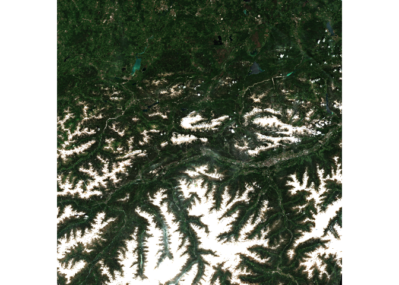

# The Benefits of EOPF Zarr over SAFE


# Table of Contents

# TODO

# Introduction

This tutorial will explore the benefits of EOPF Zarr over the prior
format, SAFE (Standard Archive Format for Europe). It is the third in a
series of working with EOPF Zarr data in R, and follows the [first
tutorial](./eopf_stac_access.md), which goes into more detail on
accessing and searching within the STAC catalog, and the
[second](./eopf_zarr.md), which shows how to access and analyse Zarr
data from the catalog.

# Prerequisites

An R environment is required to follow this tutorial, with R version \>=
4.1.0. We recommend using either
[RStudio](https://posit.co/download/rstudio-desktop/) or
[Positron](https://posit.co/products/ide/positron/) (or a cloud
computing environment) and making use of [RStudio
projects](https://support.posit.co/hc/en-us/articles/200526207-Using-RStudio-Projects)
for a self-contained coding environment.

## Dependencies

We will use the following packages in this tutorial:
[`rstac`](https://brazil-data-cube.github.io/rstac/) (for accessing the
STAC catalog), [`tidyverse`](https://tidyverse.tidyverse.org/) (for data
manipulation), [`stars`](https://r-spatial.github.io/stars/)) (for
working with spatiotemporal data),
[`terra`](https://rspatial.github.io/terra/index.html) (for working with
spatial data in raster format), [`httr2`](https://httr2.r-lib.org/) (for
working with APIs), [`xml2`](https://xml2.r-lib.org) (for accessing
metadata from SAFE files), [`fs`](https://fs.r-lib.org/) (for accessing
file locations and sizes), and [`lobstr`](https://lobstr.r-lib.org) (for
calculating the size of objects within R). You can install them directly
from CRAN. Note that `xml2` is a part of `tidyverse`, so it does not
need ot be installed separately, but it will be loaded separately.

``` r
install.packages("rstac")
install.packages("tidyverse")
install.packages("stars")
install.packages("terra")
install.packages("httr2")
install.packages("fs")
```

We will also use the `Rarr` package to read Zarr data. It must be
installed from Bioconductor, so first install the `BiocManager` package:

``` r
install.packages("BiocManager")
```

Then, use this package to install `Rarr`:

``` r
BiocManager::install("Rarr")
```

Finally, load the packages into your environment:

``` r
library(rstac)
library(tidyverse)
library(stars)
library(terra)
library(xml2)
library(httr2)
library(fs)
library(lobstr)
library(Rarr)
```

## Fixes to the `Rarr` package

We will use functions from the `Rarr` package to read and analyse Zarr
data. Unfortunately, there is currently a bug in this package, causing
it to parse the EOPF Sample Service data URLs incorrectly – it has been
fixed and will be updated in the next release of `Rarr`. In the
meantime, we will write our own version of this URL parsing function and
use it instead of the one in `Rarr`.

``` r
.url_parse_other <- function(url) {
  parsed_url <- httr::parse_url(url)
  bucket <- gsub(
    x = parsed_url$path, pattern = "^/?([[a-z0-9\\:\\.-]*)/.*",
    replacement = "\\1", ignore.case = TRUE
  )
  object <- gsub(
    x = parsed_url$path, pattern = "^/?([a-z0-9\\:\\.-]*)/(.*)",
    replacement = "\\2", ignore.case = TRUE
  )
  hostname <- paste0(parsed_url$scheme, "://", parsed_url$hostname)

  if (!is.null(parsed_url$port)) {
    hostname <- paste0(hostname, ":", parsed_url$port)
  }

  res <- list(
    bucket = bucket,
    object = object,
    region = "auto",
    hostname = hostname
  )
  return(res)
}

assignInNamespace(".url_parse_other", .url_parse_other, ns = "Rarr")
```

This function overwrites the existing one in `Rarr`, and allows us to
continue with the analysis.

If you try to run some of the examples below and receive a timeout
error, please ensure that you have run the above code block.

# The Benefits of EOPF Zarr over SAFE

Prior to the introduction of EOPF’s Zarr, the ESA’s Copernicus data was
published and distributed using SAFE (TODO). Setinel scenes were
downloaded as zip archives, containing several files as well as an XML
manifest. In order to access any scene data, the entire zip archive had
to be downloaded, which could be quite inefficient.

Zarr is optimised for efficient data retrieval—arrays are segmented into
one or more chunks, and a single Sentinel scene could potentially be
across several chunks. A data consumer can choose to download only the
chunks required for their use case, rather than the entire zip archive.
There is no need to download all data before processing it, and data can
be **lazy-loaded** so that it is only downloaded when required. The
[Data Retrieval and Efficiency](TODO) section shows how this is more
efficient in terms of both network bandwidth and compute resources.

## Zarr example

The following example is explored in more detail in the [previous
tutorial](./eopf_zarr.md). In short, the code to access the correct STAC
item and visualize the quicklook is:

TODO, note about timing this process?

``` r
zarr_start <- Sys.time()

s2_l2a_item <- stac("https://stac.core.eopf.eodc.eu/") |>
  collections(collection_id = "sentinel-2-l2a") |>
  items(feature_id = "S2B_MSIL2A_20250530T101559_N0511_R065_T32TPT_20250530T130924") |>
  get_request()

s2_l2a_product <- s2_l2a_item |>
  assets_select(asset_names = "product")

s2_l2a_product_url <- s2_l2a_product |>
  assets_url()

zarr_store <- s2_l2a_product_url |>
  zarr_overview(as_data_frame = TRUE) |>
    mutate(array = str_remove(path, s2_l2a_product_url)) |>
    relocate(array, .before = path)

r60m_tci <- zarr_store |>
  filter(array == "/quality/l2a_quicklook/r60m/tci") |>
  pull(path) |>
  read_zarr_array()

r60m_tci <- r60m_tci |>
  aperm(c(2, 3, 1)) |>
  rast() 

r60m_tci |>
  plotRGB()
```



``` r
zarr_end <- Sys.time()
```

We can see how long this whole process took:

``` r
zarr_time <- zarr_end - zarr_start

zarr_time
```

    Time difference of 41.35876 secs

We can look at the size of the `r60m_tci` object using `lobstr`’s
`obj_size()`

``` r
zarr_size <- r60m_tci %>%
  obj_size()

zarr_size
```

    9.75 MB

And see the memory currently used by R:

``` r
zarr_memory <- mem_used()

zarr_memory
```

    435.63 MB

## Comparable SAFE example

The following example accesses the same 60-metre quicklook image as the
[Sentinel-2 mission example above]()TODO), using SAFE instead of EOPF
Zarr. We will show how using Zarr downloads less data.

This example also requires authentication to the SAFE STAC API. You need
a [Copernicus Dataspace](https://dataspace.copernicus.eu/) account, and
to register an OAuth 2.0 client as described in [this
article](https://documentation.dataspace.copernicus.eu/APIs/SentinelHub/Overview/Authentication.html).
The resulting Client Credentials should be stored in the environment
variables `CDSE_ID` and `CDSE_SECRET` (using
e.g. `usethis::edit_r_environ()` to set these).

We then use this to generate a **token**:

``` r
token <- oauth_client("https://identity.dataspace.copernicus.eu/auth/realms/CDSE/protocol/openid-connect/token",
  id = "sh-62112dad-7f8c-4e1f-abc1-16cf93519302",
  secret = "YrdqqqigqQ7630Ql6Ef6gxjU683j9M06",
) |>
  oauth_flow_client_credentials()

token
```

    <httr2_token>

    • token_type        : "Bearer"

    • access_token      : <REDACTED>

    • expires_at        : "2025-07-07 12:15:47"

    • refresh_expires_in: 0

    • not-before-policy : 0

    • scope             : "email profile user-context"

which will be used for accessing SAFE data. The `token` object contains
the token itself and, as you can see, when it expires; 10 minutes after
generation.

To access the SAFE data, we first get the STAC item from the Sentinel-2
collection. Its ID is the same as in the EOPF Sample Service STAC
catalog example, with the suffix `.SAFE`. We’ll also set up timing how
long this process takes.

``` r
safe_start <- Sys.time()

safe_id <- "S2B_MSIL2A_20250530T101559_N0511_R065_T32TPT_20250530T130924.SAFE"

safe_item <- stac("https://catalogue.dataspace.copernicus.eu/stac/") |>
  collections(collection_id = "SENTINEL-2") |>
  items(feature_id = safe_id) |>
  get_request()

safe_item
```

    ###Item
    - id: S2B_MSIL2A_20250530T101559_N0511_R065_T32TPT_20250530T130924.SAFE
    - collection: SENTINEL-2
    - bbox: xmin: 10.31189, ymin: 46.83277, xmax: 11.80285, ymax: 47.84592
    - datetime: 2025-05-30T10:15:59.024000Z
    - assets: QUICKLOOK, PRODUCT
    - item's fields: 
    assets, bbox, collection, geometry, id, links, properties, stac_extensions, stac_version, type

The relevant asset is the “PRODUCT” one:

``` r
safe_item |>
  items_assets()
```

    [1] "QUICKLOOK" "PRODUCT"  

We can select its URL for accessing the data:

``` r
safe_url <- safe_item |>
  assets_select(asset_names = "PRODUCT") |>
  assets_url()

safe_url
```

    [1] "https://catalogue.dataspace.copernicus.eu/odata/v1/Products(fa3a0848-1568-4dc4-9ecb-dabecf23bd4b)/$value"

However, this URL actually redirects if we try to download the data, and
the token is not properly passed. We must then first access the
redirected URL. The following code sets up the API request via `httr2`’s
`request()`, sets an option not to follow the redirect (so we can access
the redirect URL manually), performs the request (via `req_perform()`),
then accesses the new location from the header:

``` r
safe_redirect_url <- request(safe_url) |>
  req_options(followlocation = FALSE) |>
  req_perform() |>
  resp_header("location")

safe_redirect_url
```

    [1] "https://download.dataspace.copernicus.eu/odata/v1/Products(fa3a0848-1568-4dc4-9ecb-dabecf23bd4b)/$value"

The difference in the URL is that it is prefixed with `download` instead
of `catalogue`. Now, we can use this new URL to actually get the data.
Again, we set up the request, this time adding in the token as a [Bearer
token](TODO) so that we are authenticated and have permission to access
the data. There is also error handling, which is informative in case the
token has expired; in which case, the above OAuth token generation code
should be rerun. Finally, we perform the request and safe it to a ZIP
file, stored in `safe_zip`.

    <httr2_response>

    GET
    https://download.dataspace.copernicus.eu/odata/v1/Products(fa3a0848-1568-4dc4-9ecb-dabecf23bd4b)/$value

    Status: 200 OK

    Content-Type: application/zip

    Body: On disk
    '/var/folders/j5/d1hztrys1xzg_8557yh176300000gn/T//RtmpOkSX4g/file9db35b1cd3db.zip'
    (1259528508 bytes)

``` r
safe_dir <- tempdir()
safe_zip_new <- paste0(safe_dir, "/", safe_id, ".zip")
safe_zip <- tempfile(fileext = ".zip")

request(safe_redirect_url) |>
  req_auth_bearer_token(token$access_token) |>
  req_error(body = \(x) resp_body_json(x)[["message"]]) |>
  req_perform(path = safe_zip) 
```

We need to unzip the file to access the relevant data:

``` r
safe_unzip_dir <- paste0(safe_dir, "/", safe_id)
unzip(safe_zip)

safe_unzip_dir |>
  dir_ls()
```

    /Users/sharla/Documents/Consulting/Sparkgeo/EOPF/eopf-tooling-guide/docs/tutorials/stac_zarr/R/scratch/safe/S2B_MSIL2A_20250530T101559_N0511_R065_T32TPT_20250530T130924.SAFE/S2B_MSIL2A_20250530T101559_N0511_R065_T32TPT_20250530T130924.SAFE

``` r
safe_dir <- safe_unzip_dir |>
  dir_ls()

safe_files <- tibble(path = dir_ls(safe_dir)) |>
  mutate(file = basename(path)) |>
  relocate(file, .before = path)

safe_files
```

    # A tibble: 8 × 2
      file                                                                path      
      <chr>                                                               <fs::path>
    1 DATASTRIP                                                           …DATASTRIP
    2 GRANULE                                                             …E/GRANULE
    3 HTML                                                                …SAFE/HTML
    4 INSPIRE.xml                                                         …SPIRE.xml
    5 MTD_MSIL2A.xml                                                      …SIL2A.xml
    6 S2B_MSIL2A_20250530T101559_N0511_R065_T32TPT_20250530T130924-ql.jpg …24-ql.jpg
    7 manifest.safe                                                       …fest.safe
    8 rep_info                                                            …/rep_info

``` r
manifest_location <- safe_files |>
  filter(file == "manifest.safe") |>
  pull(path)

manifest_location
```

    /Users/sharla/Documents/Consulting/Sparkgeo/EOPF/eopf-tooling-guide/docs/tutorials/stac_zarr/R/scratch/safe/S2B_MSIL2A_20250530T101559_N0511_R065_T32TPT_20250530T130924.SAFE/S2B_MSIL2A_20250530T101559_N0511_R065_T32TPT_20250530T130924.SAFE/manifest.safe

``` r
manifest <- read_xml(manifest_location)

file_loc <- manifest |>
  xml_find_first(".//dataObject[@ID='IMG_DATA_Band_TCI_60m_Tile1_Data']/byteStream/fileLocation") |>
  xml_attr("href")

# TODO -> should not unzip to /id/id
file_loc <- paste0(safe_unzip_dir, "/", safe_id, "/", str_remove(file_loc, "\\."))
```

The actual file is only 3.57 MB, versus the 1.26 GB of the whole zip

``` r
r60m_tci_safe <- stars::read_stars(file_loc) |>
  stars::st_rgb()

r60m_tci_safe |>
  plot()
```

    downsample set to 3


``` r
safe_end <- Sys.time()
```

To contrast with the Zarr example, we’ll look at how long the process
took, how large the objects are, and how much memory R is using. Note
also that the SAFE example requires saving the entire archive to disk,
while nothing is saved to disk in the Zarr example.

``` r
safe_time <- safe_end - safe_start
```

``` r
safe_size <- r60m_tci_safe %>%
  obj_size()

safe_size
```

    45.99 MB

And see the memory currently used by R:

``` r
safe_memory <- mem_used()

safe_memory
```

    491.63 MB

``` r
file_size(safe_zip) / 10^9
```

    1.26

``` r
file_size(file_loc)
```

    3.57M

To summarise:

    # A tibble: 2 × 6
      Format    Time        `Disk size` `Disk size used` `Object size` `Memory used`
      <chr>     <drtn>      <glue>      <glue>           <lbstr_by>    <lbstr_by>   
    1 EOPF Zarr  41.35876 … ---         ---               9.75 MB      435.63 MB    
    2 SAFE      431.82684 … NA gb       3.744583 mb      45.99 MB      491.63 MB    
