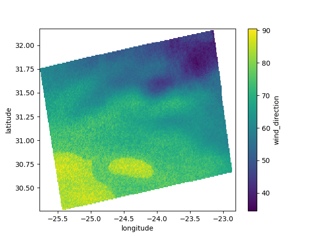
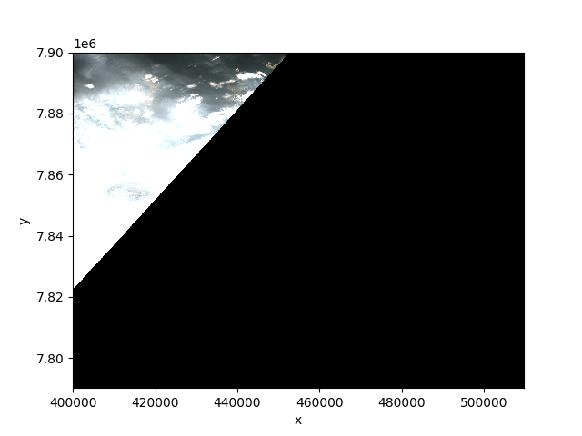
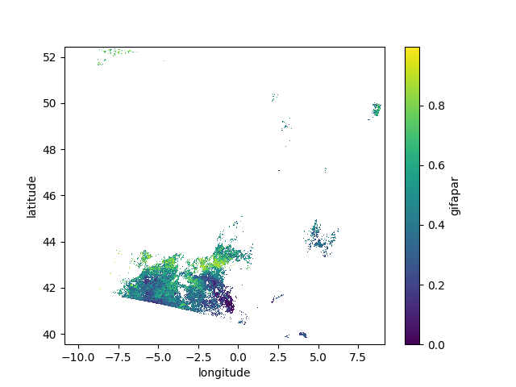

# EOPF STAC Zarr Asset Access with xarray

Previous tutorials:
- [STAC Metadata Access](./eopf_stac_access.md)

## Table of Contents

[Prerequisites](#prerequisites)<br />
[Dependencies](#dependencies)<br />
[Access Zarr Assets](#access-zarr-assets)<br />
[Imports](#imports)<br />
[Extracting Zarr Asset URLs from STAC Items](#extracting-zarr-asset-urls-from-stac-items)<br />
[Loading Zarr Datasets Using xarray](#loading-zarr-datasets-using-xarray)<br />
[Zarr Structure](#zarr-structure)<br />
[Array Chunk Sizes](#array-chunk-sizes)<br />
[Variables and Attributes](#variables-and-attributes)<br />
[Dimensions and Coordinates](#dimensions-and-coordinates)<br />
[Data Statistics](#data-statistics)<br />
[Sentinel Missions](#sentinel-missions)<br />
[Sentinel 1](#sentinel-1)<br />
[Sentinel 2](#sentinel-2)<br />
[Sentinel 3](#sentinel-3)<br />
[The Benefits of EOPF Zarr Over SAFE](#the-benefits-of-eopf-zarr)<br />
[Comparable SAFE Example](#comparable-safe-example)<br />
[Optimisations](#optimisations)<br />
[Chunk Size](#chunk-size)<br />
[STAC Metadata and Zarr](#stac-metadata-and-zarr)<br />
[Memory Utilisation](#memory-utilisation)<br />
[Memory Limitations](#memory-limitations)<br />

## Prerequisites

A Python environment is required to follow this tutorial. This tutorial's dependencies require Python >= 3.10. A virtual environment is recommended.

### Dependencies

The following dependencies are required to follow this tutorial.

```sh
pip install "matplotlib>=3.10.3,<4.0" "pystac-client>=0.8.6,<1.0" "xarray==2025.4.0" "xarray-eopf==0.1.0"
```

## Access Zarr Assets

The following demonstrates Zarr asset access with Sentinel 2 data. This document also includes examples for [Sentinel 1](#sentinel-1) and [Sentinel 3](#sentinel-3).

### Imports

The following imports are required to complete all following steps. Not all imports are required by all steps.

```python
import itertools
from typing import Optional

import xarray as xr
from pystac import Asset, MediaType
from pystac_client import Client
```

### Extracting Zarr Asset URLs from STAC Items

Access a single Sentinel 2 STAC item and iterate through its Zarr assets. Identify the "product" asset representing the top-level Zarr store.

See [STAC Item Zarr Assets](../eopf_stac_item_zarr_assets.md) for STAC item Zarr asset structures and conventions.

```python
client = Client.open("https://stac.core.eopf.eodc.eu/")
collection = client.get_collection(collection_id="sentinel-2-l2a")
item = collection.get_item(
    id="S2B_MSIL2A_20250522T125039_N0511_R095_T26TML_20250522T133252"
)
assert item is not None, "Expected item does not exist"
print(
    "Fetched collection/item {collection}/{id}".format(
        collection=collection.id, id=item.id
    )
)
# Fetched collection/item sentinel-2-l2a/S2B_MSIL2A_20250522T125039_N0511_R095_T26TML_20250522T133252

# Describe all Zarr assets. Sort by asset href to demonstrate the
# hierarchical relationsips between assets.
top_level_zarr_group_asset: Optional[Asset] = None
for asset_name, asset in sorted(
    item.get_assets(media_type=MediaType.ZARR).items(), key=lambda item: item[1].href
):
    roles = asset.roles or []
    print(
        "Zarr asset {group_path} ({title}) has roles {roles}".format(
            group_path="".join(asset.href.split(".zarr")[-1:]) or "/",
            title=asset.title,
            roles=roles,
        )
    )
    # Identify the top-level Zarr group asset. This is what we will access with xarray.
    if "data" in roles and "metadata" in roles:
        top_level_zarr_group_asset = asset
# Zarr asset / (EOPF Product) has roles ['data', 'metadata']
# Zarr asset /conditions/mask/l2a_classification/r20m/scl (Scene classification map (SCL)) has roles ['data']
# Zarr asset /measurements/reflectance/r10m (Surface Reflectance - 10m) has roles ['data', 'reflectance', 'dataset']
# ...

assert (
    top_level_zarr_group_asset is not None
), "Unable to find top-level Zarr group asset"
print(
    "Asset {name} is the top-level Zarr group asset".format(
        name=top_level_zarr_group_asset.title
    )
)
# Asset EOPF Product is the top-level Zarr group asset
```

### Loading Zarr Datasets Using xarray

Access the top-level Zarr group using xarray. xarray uses lazy-loading to avoid loading the entire 9GB data structure into memory at once and only fetches relevant array chunks when necessary. See [Optimisations](#optimisations) for more information.

```python
# The same asset can also be opened as a xarray.Dataset using the same kwargs.
# The same variables will be available in xarray.Dataset but in a flat non-nested structure.
dt = xr.open_datatree(
    top_level_zarr_group_asset.href,
    **top_level_zarr_group_asset.extra_fields["xarray:open_datatree_kwargs"],
)
for dt_group in sorted(dt.groups):
    print("DataTree group {group_name}".format(group_name=dt_group))
# DataTree group /
# DataTree group /conditions
# DataTree group /conditions/geometry
# ...
```

### Zarr Structure

Here we demonstrate some of the DataTree's characteristics.

#### Array Chunk Sizes

Analyse chunk sizes in Datasets at three different spatial resolutions to demonstrate how these properties are related.

```python
dataset_by_resolution = {
    10: dt["/measurements/reflectance/r10m"].to_dataset(),
    20: dt["/measurements/reflectance/r20m"].to_dataset(),
    60: dt["/measurements/reflectance/r60m"].to_dataset(),
}
for resolution, dataset in dataset_by_resolution.items():
    print(
        "Chunk size(s) for {resolution}m resolution dataset: {chunk_sizes}".format(
            resolution=resolution,
            chunk_sizes=set(itertools.chain.from_iterable(dataset.chunksizes.values())),
        )
    )
# Chunk size(s) for 10m resolution dataset: {1830}
# Chunk size(s) for 20m resolution dataset: {915}
# Chunk size(s) for 60m resolution dataset: {305}
```

#### Variables and Attributes

Analyse variables within the `/measurements/reflectance/r10m` Dataset.

```python
ds_sr10m = dataset_by_resolution[10]
for variable_name, variable in ds_sr10m.data_vars.items():
    print(
        "{asset_name} has variable {variable_name} ({variable_units}): {variable_title}".format(
            asset_name="SR_10m",
            variable_name=variable_name,
            variable_units=variable.attrs["units"],
            variable_title=variable.attrs["long_name"],
        )
    )
# SR_10m has variable b02 (digital_counts): BOA reflectance from MSI acquisition at spectral band b02 492.3 nm
# SR_10m has variable b03 (digital_counts): BOA reflectance from MSI acquisition at spectral band b03 559.0 nm
# SR_10m has variable b04 (digital_counts): BOA reflectance from MSI acquisition at spectral band b04 665.0 nm
# SR_10m has variable b08 (digital_counts): BOA reflectance from MSI acquisition at spectral band b08 833.0 nm
```

#### Dimensions and Coordinates

Analyse dimensions and coordinates within the `/measurements/reflectance/r10m` Dataset.

The following demonstrates that each variable is provided in a 2-dimensional array with x and y dimensions in the [EPSG:32626](https://epsg.io/32626) spatial reference system. x and y values represent metres from the UTM zone's origin.

```python
print(
    "All spatial data for this STAC item is in EPSG:{epsg_code} https://epsg.io/{epsg_code}".format(
        epsg_code=dt.attrs["stac_discovery"]["properties"]["proj:epsg"]
    )
)
# All spatial data for this STAC item is in EPSG:32626 https://epsg.io/32626
for dimension_name in ds_sr10m.dims:
    print(
        "Dimension {name} has coordinates {coordinates}".format(
            name=dimension_name, coordinates=ds_sr10m.coords[dimension_name]
        )
    )
# Dimension y has coordinates <xarray.DataArray 'y' (y: 10980)> Size: 88kB
# array([4600015, 4600005, 4599995, ..., 4490245, 4490235, 4490225],
#       shape=(10980,))
# Coordinates:
#   * y        (y) int64 88kB 4600015 4600005 4599995 ... 4490245 4490235 4490225
# Dimension x has coordinates <xarray.DataArray 'x' (x: 10980)> Size: 88kB
# array([399965, 399975, 399985, ..., 509735, 509745, 509755], shape=(10980,))
# Coordinates:
#   * x        (x) int64 88kB 399965 399975 399985 399995 ... 509735 509745 509755
```

#### Data Statistics

Extract data statistics for the `/measurements/reflectance/r10m` dataset `b08` variable within this scene.

```python
# Access a single xarray DataArray from the Dataset.
da_b08 = ds_sr10m["b08"]
print(
    "Mean {value_name} for scene: {mean_nir}".format(
        value_name=da_b08.attrs["long_name"],
        mean_nir=da_b08.mean().compute().item(),
    )
)
# Mean BOA reflectance from MSI acquisition at spectral band b08 833.0 nm for scene: 0.5606077588815395
```

## Sentinel Missions

This section provides short and complete examples referencing data from each of the Sentinel missions.

### Sentinel 1

The following example shows a Wind Direction plot derived from Sentinel 1 data. It is necessary to interpolate data to a spatial grid prior to rendering.

```python
import matplotlib.pyplot as plt
import numpy as np
import xarray as xr
from pystac import Asset
from pystac_client import Client
from scipy.interpolate import griddata

# The sample EOPF STAC API does not currently require authentication but
# this is expected to be a future requirement.

client = Client.open("https://stac.core.eopf.eodc.eu/")
collection = client.get_collection(collection_id="sentinel-1-l2-ocn")
item = collection.get_item(
    id="S1A_IW_OCN__2SDV_20250604T193923_20250604T193948_059501_0762FA_C971"
)
product_asset: Asset = item.assets["product"]
dt = xr.open_datatree(
    product_asset.href, **product_asset.extra_fields["xarray:open_datatree_kwargs"]
)
ds = dt[
    "/owi/S01SIWOCN_20250604T193923_0025_A340_C971_0762FA_VV/measurements"
].to_dataset()
# Measurements DataArrays do not have (latitude, longitude) dimensions and
# instead use (azimuth, range) dimensions to record data positions.
# Latitude and longitude are available as coordinates, and are functions of
# (azimuth, range), but this configuration is not compatible with matplotlib.
# To plot measurements with a 2D chart we first must interpolate values to
# a 2D grid. For simplicity in this example we use unprojected latitude and
# longitude values rather than projecting to a more suitable projected
# spatial reference system.
latitudes_np = np.array(ds.latitude.values)
longitudes_np = np.array(ds.longitude.values)
lat_min, lat_max = np.nanmin(latitudes_np), np.nanmax(latitudes_np)
lon_min, lon_max = np.nanmin(longitudes_np), np.nanmax(longitudes_np)
grid_resolution = 0.01
lat_grid = np.arange(lat_min, lat_max + grid_resolution, grid_resolution)
lon_grid = np.arange(lon_min, lon_max + grid_resolution, grid_resolution)
lon_mesh, lat_mesh = np.meshgrid(lon_grid, lat_grid)
measurement_name = "wind_direction"
latitude_dim_name = "latitude"
longitude_dim_name = "longitude"
gridded_interpolated_values = griddata(
    np.column_stack((latitudes_np.flatten(), longitudes_np.flatten())),
    np.array(ds[measurement_name].values).flatten(),
    (lat_mesh, lon_mesh),
    method="linear",
)
gridded_dataarray = xr.Dataset(
    data_vars={
        measurement_name: (
            [latitude_dim_name, longitude_dim_name],
            gridded_interpolated_values,
        )
    },
    coords={latitude_dim_name: lat_grid, longitude_dim_name: lon_grid},
)[measurement_name]

gridded_dataarray.plot(x=longitude_dim_name, y=latitude_dim_name)
plt.show()
```

#### Result



### Sentinel 2

The [Access Zarr Assets](#access-zarr-assets) section addresses Sentinel 2 data but does not result in a plot. This section provides an additional example consistent with the examples for Sentinel 1 and Sentinel 3.

The following example shows a TCI (True Colour Image) plot derived from Sentinel 2 data.

```python
import matplotlib.pyplot as plt
import xarray as xr
from pystac import Asset
from pystac_client import Client

# The sample EOPF STAC API does not currently require authentication but
# this is expected to be a future requirement.

client = Client.open("https://stac.core.eopf.eodc.eu/")
collection = client.get_collection(collection_id="sentinel-2-l2a")
item = collection.get_item(
    id="S2A_MSIL2A_20250605T104701_N0511_R051_T35WMU_20250605T125416"
)
product_asset: Asset = item.assets["product"]
dt = xr.open_datatree(
    product_asset.href, **product_asset.extra_fields["xarray:open_datatree_kwargs"]
)
ds = dt["/quality/l2a_quicklook/r60m"].to_dataset()
da = ds["tci"]
da.plot.imshow(rgb="band")
plt.show()
```

#### Result



### Sentinel 3

The following example shows a GIFAPAR (Green Instantaneous Fraction of Absorbed Photosynthetically Active Radiation) plot from Sentinel 3 data. It is necessary to interpolate data to a spatial grid prior to rendering.

```python
import matplotlib.pyplot as plt
import numpy as np
import xarray as xr
from pystac import Asset
from pystac_client import Client
from scipy.interpolate import griddata

# The sample EOPF STAC API does not currently require authentication but
# this is expected to be a future requirement.

client = Client.open("https://stac.core.eopf.eodc.eu/")
collection = client.get_collection(collection_id="sentinel-3-olci-l2-lfr")
item = collection.get_item(
    id="S3A_OL_2_LFR____20250605T102430_20250605T102730_20250605T122455_0179_126_336_2160_PS1_O_NR_003"
)
product_asset: Asset = item.assets["product"]
dt = xr.open_datatree(
    product_asset.href, **product_asset.extra_fields["xarray:open_datatree_kwargs"]
)
ds = dt["/measurements"]
# Measurements DataArrays do not have (latitude, longitude) dimensions and
# instead use (rows, columns) dimensions to record data positions.
# Latitude and longitude are available as coordinates, and are functions of
# (rows, columns), but this configuration is not compatible with matplotlib.
# To plot measurements with a 2D chart we first must interpolate values to
# a 2D grid. For simplicity in this example we use unprojected latitude and
# longitude values rather than projecting to a more suitable projected
# spatial reference system.
latitudes_np = np.array(ds.latitude.values)
longitudes_np = np.array(ds.longitude.values)
lat_min, lat_max = np.nanmin(latitudes_np), np.nanmax(latitudes_np)
lon_min, lon_max = np.nanmin(longitudes_np), np.nanmax(longitudes_np)
grid_resolution = 0.01
lat_grid = np.arange(lat_min, lat_max + grid_resolution, grid_resolution)
lon_grid = np.arange(lon_min, lon_max + grid_resolution, grid_resolution)
lon_mesh, lat_mesh = np.meshgrid(lon_grid, lat_grid)
measurement_name = "gifapar"
latitude_dim_name = "latitude"
longitude_dim_name = "longitude"
gridded_interpolated_values = griddata(
    np.column_stack((latitudes_np.flatten(), longitudes_np.flatten())),
    np.array(ds[measurement_name].values).flatten(),
    (lat_mesh, lon_mesh),
    method="linear",
)
gridded_dataarray = xr.Dataset(
    data_vars={
        measurement_name: (
            [latitude_dim_name, longitude_dim_name],
            gridded_interpolated_values,
        )
    },
    coords={latitude_dim_name: lat_grid, longitude_dim_name: lon_grid},
)[measurement_name]

gridded_dataarray.plot(x=longitude_dim_name, y=latitude_dim_name)
plt.show()
```

#### Result



## The Benefits of EOPF Zarr Over SAFE

Prior to the introduction of EOPF Zarr ESA's Copernicus data were published and distributed using the [Standard Archive Format for Europe (SAFE)](https://earth.esa.int/eogateway/activities/safe-the-standard-archive-format-for-europe). Sentinel scenes could be downloaded as zip archives containing several data files and an XML manifest. The entire archive had to be downloaded before any scene data could be accessed, and in some scenarios this approach could be inefficient. 

The Zarr data format is optimised for efficient data retrieval. Array data are segmented into one or more chunks, with a single Sentinel scene potentially comprising a large number of these chunks. Zarr can support more efficient data retrieval and processing. By using Zarr metadata, a data consumer can download only the chunks required for their use-case. With SAFE the minimum downloadable unit of data was the zip archive. With Zarr the minimum downloadable unit of data is a single chunk. There is no need to download all of a scene's data before processing work can begin and any required data can be lazy-loaded, i.e. only downloaded if and when required. Lazy-loading of data is more efficient both in terms of network bandwidth and compute resources. See [Data Retrieval and Network Efficiency](#data-retrieval-and-network-efficiency) for more information.

### Comparable SAFE Example

The following example accesses the same 60 metre True Colour Image via SAFE as is accessed via EOPF Zarr with xarray in the [Sentinel 2 mission example](#sentinel-2). The EOPF Zarr example downloads fewer bytes and requires fewer lines of code.

> [!NOTE]
> This example requires authentication via credentials stored in environment variables.

```python
import os
import tempfile
import xml.etree.ElementTree as ET
import zipfile

import matplotlib.image as mpimg
import matplotlib.pyplot as plt
import requests
from pystac_client import Client

# Create an authentication token to use with the SAFE STAC API.
# Requires the following environment variables to be set:
# - CDSE_USERNAME: username for a valid Copernicus Dataspace account.
# - CDSE_PASSWORD: password for the account.
auth_response = requests.post(
    "https://identity.dataspace.copernicus.eu/auth/realms/CDSE/protocol/openid-connect/token",
    data={
        "client_id": "cdse-public",
        "username": os.environ["CDSE_USERNAME"],
        "password": os.environ["CDSE_PASSWORD"],
        "grant_type": "password",
    },
)
assert auth_response.ok, f"auth failure {auth_response.text}"
auth_token = auth_response.json()["access_token"]
headers = {
    "Authorization": f"Bearer {auth_token}",
}

client = Client.open("https://catalogue.dataspace.copernicus.eu/stac/")
collection = client.get_collection(collection_id="SENTINEL-2")
item = collection.get_item(
    id="S2A_MSIL2A_20250605T104701_N0511_R051_T35WMU_20250605T125416.SAFE"
)
assert item is not None, "failed to fetch item"
# The asset's href redirects to a download location. Determine this location manually
# so that the "Authorization: Bearer ..." header is not stripped from the redirected request.
target_href = requests.get(
    item.assets["PRODUCT"].href, headers=headers, allow_redirects=False
).headers["Location"]
# Download the entire zip archive for the scene.
tmp_dir_path = tempfile.mkdtemp()
zip_path = os.path.join(tmp_dir_path, f"{item.id}.zip")
print(f"Downloading {target_href}")
# Downloading https://download.dataspace.copernicus.eu/odata/v1/Products(74252cb9-3567-4a49-8892-40f3a80ac52e)/$value
with open(zip_path, "wb") as f:
    for chunk in requests.get(target_href, headers=headers, stream=True).iter_content(
        chunk_size=1000000
    ):
        print(".", end="")
        f.write(chunk)
print(" complete")
# ........................................................................................................................................................................... complete
archive = zipfile.ZipFile(zip_path)
for entry in archive.namelist():
    archive.extract(entry, tmp_dir_path)

# Determine the file path to the TCI 60m data using the XML manifest and open that file.
xml_manifest_path = os.path.join(tmp_dir_path, item.id, "manifest.safe")
xml_tree = ET.parse(xml_manifest_path)
file_location_element = xml_tree.getroot().find(
    ".//dataObject[@ID='IMG_DATA_Band_TCI_60m_Tile1_Data']/byteStream/fileLocation"
)
assert file_location_element is not None, "failed to find TCI 60m data"
tci_60m_file_path = os.path.join(
    tmp_dir_path, item.id, file_location_element.get("href")
)

# Show data on screen.
plt.imshow(mpimg.imread(tci_60m_file_path))
plt.show()
```

### Data Retrieval and Network Efficiency

The [SAFE example](#comparable-safe-example) downloads a 170 MB zip archive file, extracts it to a temporary location, and ultimately only accesses 0.45 MB of that data. 99.7% of fetched data are unused in this example. Other use-cases may download smaller archives, or use more of the archive's data, but in many use-cases it is likely that significant network bandwidth and storage are wasted.

The EOPF Zarr [Sentinel 2 mission example](#sentinel-2) is more efficient. When accessing the EOPF Product asset as a `xarray.DataTree` type, xarray requests the asset's `.zmetadata` consolidated metadata file and the first compressed chunk of each array. This process downloads 0.61 MB. When the TCI plot is shown, xarray lazy-loads a further 0.63 MB of array data. In total only 1.24 MB of data are downloaded. If TCI array data were loaded directly from the relevant STAC item asset href as a `xarray.DataArray` type, and not from a larger `xarray.DataTree` type, the initial 0.61 MB would not be required. This comparison demonstrates the innate network and storage efficiencies of cloud-native data structures.

### Optimisations

The transition from SAFE to EOPF Zarr presents opportunities for optimisations that may affect the data provider (ESA), the data consumer, or both.

#### Chunk Size

Zarr supports configurable chunk sizes for array data. A Zarr store may contain many n-dimensional arrays and each can support a unique chunk size. Each array will comprise one or more chunks of this size.

Chunk size is determined by the data provider and, ideally, is configured such that the chunks downloaded by a data consumer to satisfy a given use-case include minimal data extraneous to that use-case.

#### STAC Metadata and Zarr

The relationship between STAC metadata and Zarr stores is a source of discussion and a number of different strategies are available, each with differing advantages and disadvantages. Additional context on this subject can be found in the [Cloud-Optimized Geospatial Formats Guide](https://guide.cloudnativegeo.org/cookbooks/zarr-stac-report/#new-approaches).

The approach adopted for STAC metadata in the EOPF Sample STAC Service most closely aligns to the [many smaller Zarr stores](https://guide.cloudnativegeo.org/cookbooks/zarr-stac-report/#many-smaller-zarr-stores) approach.

#### Memory Utilisation

Zarr's support for lazy-loading array chunks carries opportunities for more efficient memory utilisation at the data consumer, and xarray supports this.

Data consumers can help minimise memory usage by ensuring that when array values are accessed the array has been sliced as much as possible, for example using [`xarray.DataArray.sel`](https://docs.xarray.dev/en/stable/generated/xarray.DataArray.sel.html), to ensure no unncessary chunks are loaded into memory. In the case of Dask data structures data may not be loaded into memory until values are computed.

If applicable for a given use-case, data references can be nullified (or dereferenced) after use, or otherwise allowed to go out of scope, so that Python's Garbage Collector can reclaim available memory.

##### Memory Limitations

If a use-case requires more memory than the data consumer can support, even after optimisation efforts, it may be necessary to use a cloud-hosted compute environment with access to a larger pool of compute resources.
