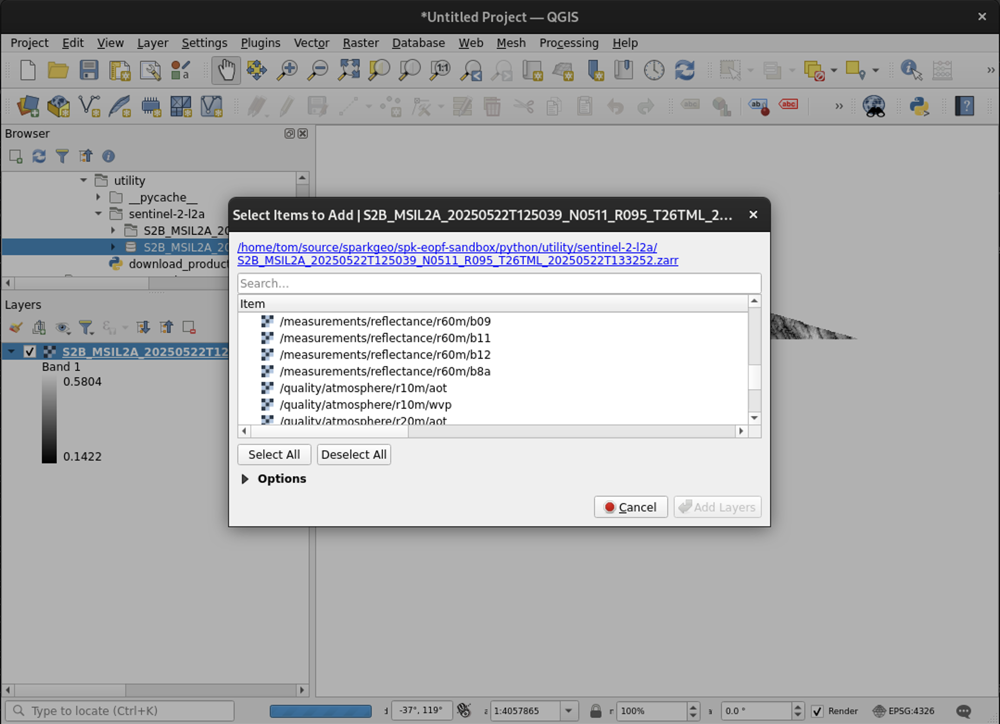
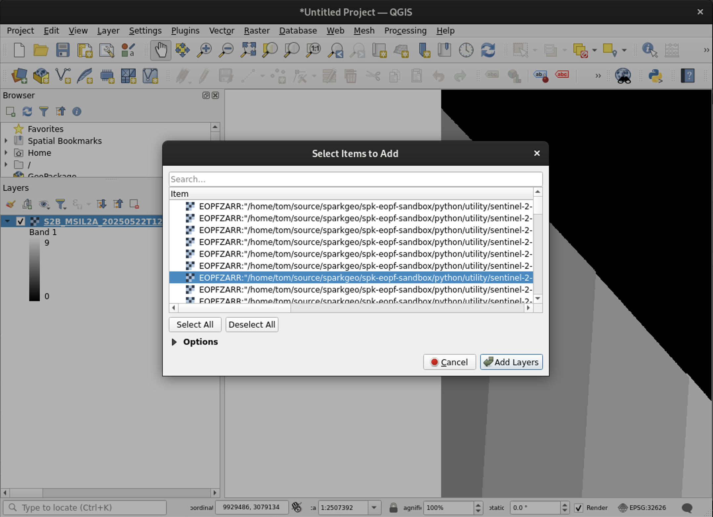
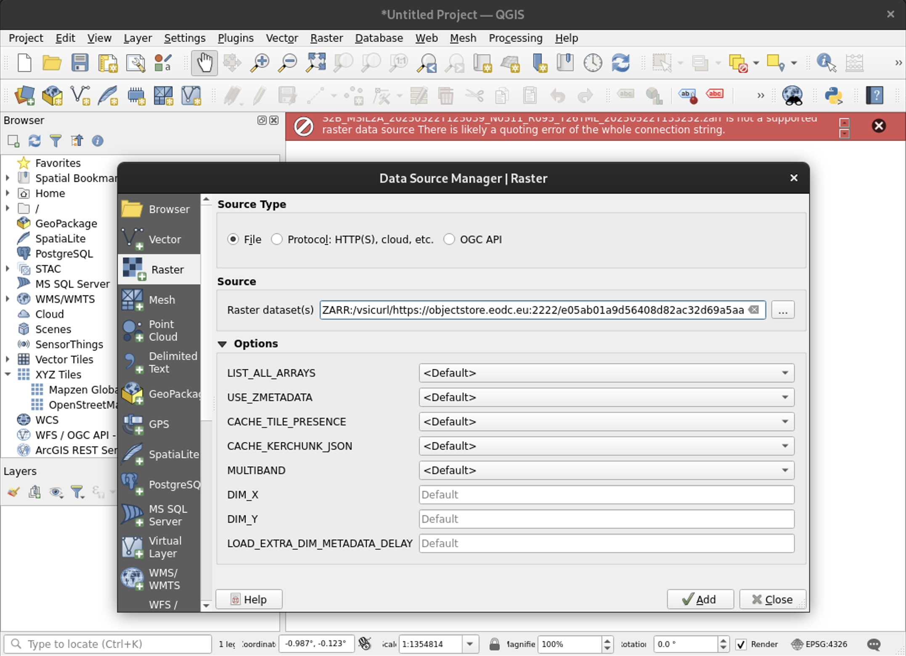
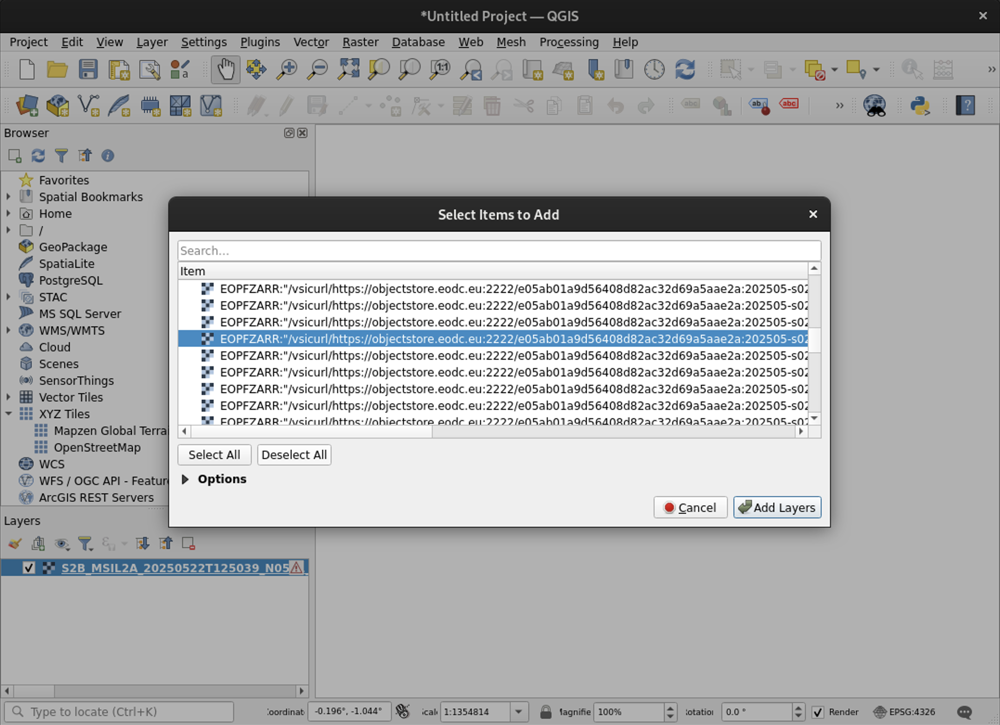
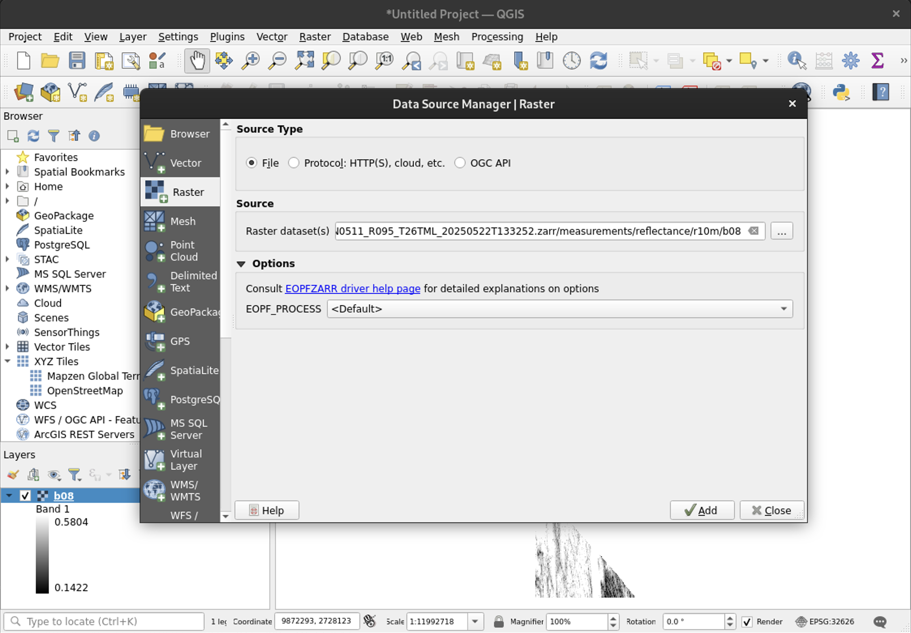
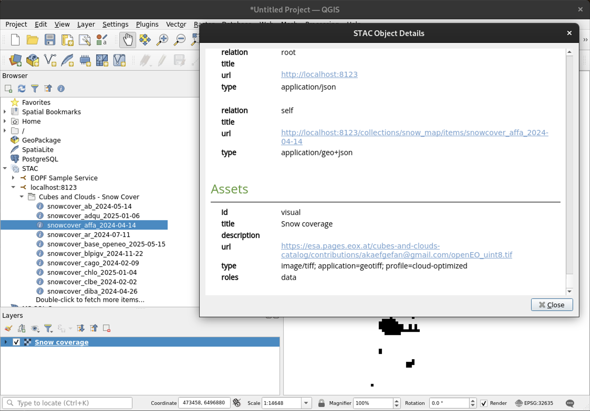
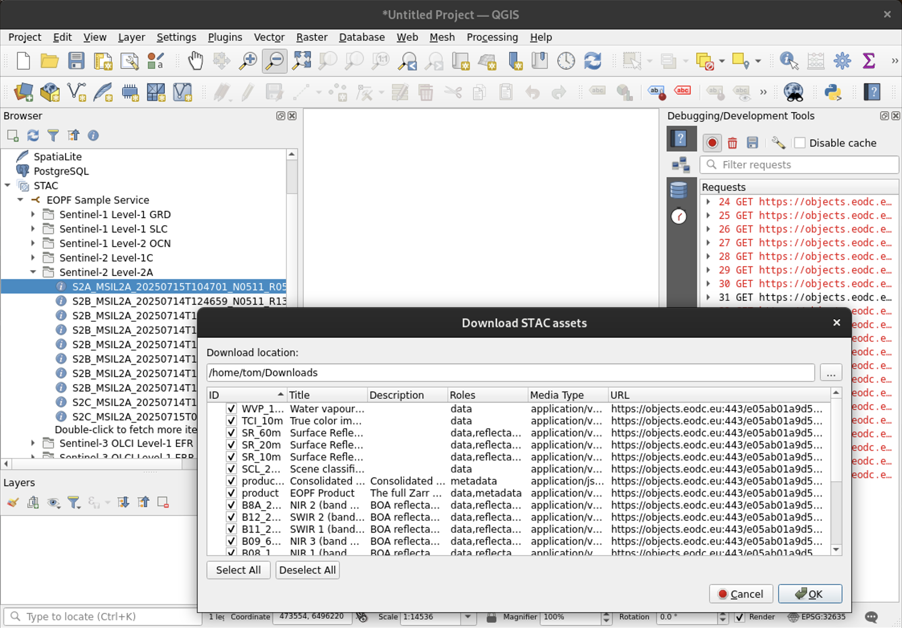

# QGIS STAC Zarr Approach

This document describes research outcomes and presumed development requirements to support EOPF Zarr data loaded in QGIS via STAC.

An [earlier version](https://github.com/eopf-toolkit/eopf-tooling-guide/blob/ccda97d22435e8d2872558b4e4c5e2c893b37490/research/qgis-stac-eopf-integration/summary.md) of this document focused on the [QGIS STAC Browser Plugin](https://plugins.qgis.org/plugins/qgis_stac/). This plugin is no longer considered part of a viable approach.

-----

## Overview / TL;DR

This document can be summarised as follows.

> [!NOTE]
> "Standard QGIS" refers to a recent release of QGIS, without any non-standard QGIS or GDAL plugins, and using the GUI only (no pyQGIS).

A number of obstacles prevent integration of EOPF Zarr in standard QGIS via EOPF STAC metadata:

1. Standard QGIS cannot successfully load Zarr data from a hosted location such as `https://...`
2. EOPF Zarr spatial reference metadata is not directly compatible with GDAL and therefore QGIS. If EOPF Zarr data can be loaded it will have an invalid spatial reference.
3. QGIS STAC functionality does not recognise Zarr as a cloud-optimised format and therefore does not support adding Zarr assets from STAC items. Also QGIS STAC functionality fails to download Zarr assets.

Additional factors might limit how well EOPF Zarr in QGIS via EOPF STAC is received by the community:

4. EOPF STAC metadata promotes _some_ arrays as STAC item assets unintuitively. Users require a base level of expertise in EOPF Zarr store structure to work well with this data.
5. GDAL appears to have limited lazy-loading support for Zarr data and may exhibit poor performance with larger Zarr stores.

The GDAL EOPF plugin (in development) addresses obstacle 2 and partially addresses obstacle 1. A planned change in the plugin aims to address obstacle 5. The plugin's roadmap and potential are not currently well understood. If this plugin cannot be used as part of a standard EOPF Zarr workflow then changes may be required in QGIS, GDAL, or both to address obstacles 1, 2, and 5.

Changes will be required in QGIS to address obstacle 3.

Changes will be required in EOPF STAC metadata to address obstacle 4.

-----

## GDAL EOPF Plugin

This document makes several references to the [GDAL EOPF plugin](https://github.com/EOPF-Sample-Service/GDAL-ZARR-EOPF). This plugin is under active development and appears to be changing rapidly. It is possible that this plugin will be central to integration of EOPF Zarr data in QGIS via STAC. Due to this plugin's ongoing development the content of this document may quickly become outdated and key concerns may be presented or addressed unexpectedly. An [earlier version](https://github.com/eopf-toolkit/eopf-tooling-guide/blob/ccda97d22435e8d2872558b4e4c5e2c893b37490/research/qgis-stac-eopf-integration/summary.md) of this document dismissed the plugin as being immature, but the project has since advanced significantly. 

## Zarr Support in QGIS

QGIS provides some level of support for Zarr data via GDAL. GDAL supports Zarr from v3.4+, and v3.8+ supports the current Zarr V3 specification. At the time of writing the QGIS Long Term Release (LTR) version is v3.40 and the official build includes GDAL v3.3, which does not support Zarr. QGIS can be installed via Conda with a more recent version of GDAL (e.g. 3.10.2) if Zarr support is required.

This document works with more recent versions of QGIS, including 3.42 (on macOS) and 3.44 Release Candidate (on Debian Linux).

### Performance

As noted in [this QGIS issue](https://github.com/qgis/QGIS/issues/54240#issuecomment-1854618963) GDAL's Zarr support can present performance problems that may adversely impact QGIS integration. Anecdotal evidence during research for this document suggests that - when presented with a path to a Zarr store or a directory within a store representing a group - GDAL (without the EOPF plugin) enumerates all arrays within the group to:
1. locate metadata describing the array, and
2. download the first chunk of the array to validate array data against metadata.

When accessing hosted Zarr data via a HTTP(S) endpoint GDAL issues HTTP HEAD and GET requests sequentially during this enumeration phase.

It is possible that issue [#65](https://github.com/EOPF-Sample-Service/GDAL-ZARR-EOPF/issues/65) in the GDAL EOPF plugin will help to address performance concerns in future.

### GUI

As noted in [this QGIS issue](https://github.com/qgis/QGIS/issues/54240#issuecomment-1854618963) and [this zarr-developers issue](https://github.com/zarr-developers/geozarr-spec/issues/36#issuecomment-1934953474) it is possible to load some Zarr data via the QGIS "Add Raster Layer" dialog.

#### Data on Local Disk

Zarr data on local disk can be added as layers either by dragging & dropping from the Browser panel or via the Add Raster Layer dialog. 

##### Sample Dataset

The following screenshot shows the sample Zarr dataset referenced [here](https://github.com/zarr-developers/geozarr-spec/issues/36#issuecomment-1934953474) loaded in QGIS from local disk.


In this example QGIS correctly identifies the dataset's spatial reference. This behaviour is discussed in [Spatial Reference Metadata](#spatial-reference-metadata).

##### EOPF Dataset

The following screenshot shows Zarr data downloaded from the "product" asset's `href` in [this](https://stac.core.eopf.eodc.eu/collections/sentinel-2-l2a/items/S2B_MSIL2A_20250522T125039_N0511_R095_T26TML_20250522T133252) STAC item loaded in QGIS from local disk.



In this example QGIS fails to identify the dataset's spatial reference. This behaviour is discussed in [Spatial Reference Metadata](#spatial-reference-metadata).

This behaviour represents QGIS 3.44.0's default handling of EOPF Zarr data, without use of the GDAL EOPF plugin. The following screenshot shows the same EOPF Zarr data loaded from local disk with a `EOPFZARR:` prefix on the file path, which invokes the GDAL EOPF plugin. When using the plugin, QGIS (via GDAL) correctly identifies the dataset's spatial reference. This behaviour is discussed in [Spatial Reference Metadata](#spatial-reference-metadata).



## Spatial Reference Metadata

As described in the GDAL Zarr driver [documentation](https://gdal.org/en/stable/drivers/raster/zarr.html#srs-encoding) GDAL expects a `_CRS` attribute which uses one of a number of approaches to define a Zarr dataset's spatial referencing.

The [Sample Dataset](#sample-dataset) example's Zarr store includes a consolidated metadata `.zmetadata` file with the following property, which is the reason QGIS can correctly identify the dataset's spatial reference.

```JSON
"_CRS": {
    "url": "http://www.opengis.net/def/crs/EPSG/0/6933"
}
```

EOPF Zarr consolidated metadata, including that in the [EOPF Dataset](#eopf-dataset) example, does not provide a `_CRS` property. Instead it provides a collection of properties in different locations.

### other_metadata

`metadata..zattrs.other_metadata` provides some spatial reference information across all members of the Zarr store.

```JSON
{
  "metadata": {
    ".zattrs": {
      "other_metadata": {
        ...
        "horizontal_CRS_code": "EPSG:32633",
        "horizontal_CRS_name": "WGS84 / UTM zone 33N",
        ...
      }
    }
  }
}
```

### stac_discovery

`metadata..zattrs.stac_discovery.properties` provides STAC item properties supported by the [proj](https://stac-extensions.github.io/projection/v2.0.0/schema.json) extension.

```JSON
{
  "metadata": {
    ".zattrs": {
      "stac_discovery": {
        "properties": {
          ...
          "proj:bbox": [...],
          "proj:epsg": 32633,
          ...
        }
      }
    }
  }
}
```

### Array .zattrs

`metadata.*..zattrs`, which is repeated for each array in the store, provides similar proj-style attributes.

```JSON
{
  "metadata": {
    ...
    "conditions/mask/detector_footprint/r10m/b03/.zattrs": {
      "proj:bbox": [...],
      "proj:epsg": 32633,
      "proj:shape": [...],
      "proj:transform": [...],
      "proj:wkt2": "PROJCS[...]"
    }
    ...
  }
}
```

### Discussion

There is active discussion as part of ongoing GeoZarr specification development on how spatial reference metadata should be handled in Zarr.

### GDAL EOPF Plugin and Spatial Reference Metadata

The GDAL EOPF plugin successfully identifies spatial reference metadata within EOPF Zarr stores and does not require any changes to EOPF metadata structure. The GDAL EOPF plugin has been written specifically to work with EOPF's spatial reference metadata, and at this time no other software is known to correctly interpret this metadata.

## Hosted Data

As discussed in [Data on Local Disk](#data-on-local-disk) QGIS can work with locally hosted Zarr data, including EOPF Zarr data both with and without the use of GDAL plugins or special path prefixes.

Support for remotely hosted Zarr data in QGIS is less mature, including in 3.44.0 (Release Candidate).

### Without Plugin

Attempts to add hosted Zarr data to QGIS without the GDAL EOPF plugin have been unsuccessful. For this investigation the Zarr store at [https://objectstore.eodc.eu:2222/e05ab01a9d56408d82ac32d69a5aae2a:202505-s02msil2a/22/products/cpm_v256/S2B_MSIL2A_20250522T125039_N0511_R095_T26TML_20250522T133252.zarr](https://objectstore.eodc.eu:2222/e05ab01a9d56408d82ac32d69a5aae2a:202505-s02msil2a/22/products/cpm_v256/S2B_MSIL2A_20250522T125039_N0511_R095_T26TML_20250522T133252.zarr) was used.

Attempts to add the Zarr store using the raw URL failed due to an HTTP 404 response, i.e. QGIS did not understand that the referenced URL was a Zarr store. QGIS offered to switch to "streaming" mode - which means prefixing the raw URL with `/vsicurl/` so that GDAL better understands how to access the dataset. With the `/vsicurl/` prefix QGIS failed to add the Zarr store due to it not being "a supported raster data source". Prefixing the `vsicurl`-prefixed URL with `ZARR:` helps QGIS understand that it is working with Zarr data, but QGIS then fails due to a reported quoting error.



The following path / quoting approaches were tested in QGIS and all were unsuccessful. 
- https://objectstore.eodc.eu:2222/e05ab01a9d56408d82ac32d69a5aae2a:202505-s02msil2a/22/products/cpm_v256/S2B_MSIL2A_20250522T125039_N0511_R095_T26TML_20250522T133252.zarr
- ZARR:https://objectstore.eodc.eu:2222/e05ab01a9d56408d82ac32d69a5aae2a:202505-s02msil2a/22/products/cpm_v256/S2B_MSIL2A_20250522T125039_N0511_R095_T26TML_20250522T133252.zarr
- /vsicurl/https://objectstore.eodc.eu:2222/e05ab01a9d56408d82ac32d69a5aae2a:202505-s02msil2a/22/products/cpm_v256/S2B_MSIL2A_20250522T125039_N0511_R095_T26TML_20250522T133252.zarr
- ZARR:/vsicurl/https://objectstore.eodc.eu:2222/e05ab01a9d56408d82ac32d69a5aae2a:202505-s02msil2a/22/products/cpm_v256/S2B_MSIL2A_20250522T125039_N0511_R095_T26TML_20250522T133252.zarr
- ZARR:"/vsicurl/https://objectstore.eodc.eu:2222/e05ab01a9d56408d82ac32d69a5aae2a:202505-s02msil2a/22/products/cpm_v256/S2B_MSIL2A_20250522T125039_N0511_R095_T26TML_20250522T133252.zarr"
- 'ZARR:"/vsicurl/https://objectstore.eodc.eu:2222/e05ab01a9d56408d82ac32d69a5aae2a:202505-s02msil2a/22/products/cpm_v256/S2B_MSIL2A_20250522T125039_N0511_R095_T26TML_20250522T133252.zarr"'
- ZARR:'/vsicurl/https://objectstore.eodc.eu:2222/e05ab01a9d56408d82ac32d69a5aae2a:202505-s02msil2a/22/products/cpm_v256/S2B_MSIL2A_20250522T125039_N0511_R095_T26TML_20250522T133252.zarr'
- "ZARR:'/vsicurl/https://objectstore.eodc.eu:2222/e05ab01a9d56408d82ac32d69a5aae2a:202505-s02msil2a/22/products/cpm_v256/S2B_MSIL2A_20250522T125039_N0511_R095_T26TML_20250522T133252.zarr'"

[GDAL documentation](https://gdal.org/en/stable/drivers/raster/zarr.html#dataset-name) notes some quoting requirements for paths on file systems without reliable file listing, and specifically mentions the need for path quoting with HTTP(S) paths requiring GDAL's `/vsicurl/` prefix. With proper shell quote handling we can observe `gdalinfo` successfully interacting with a hosted data store using `/vsicurl/` .

```sh
gdalinfo 'ZARR:"/vsicurl/https://objects.eodc.eu/e05ab01a9d56408d82ac32d69a5aae2a:202506-s02msil2a/11/products/cpm_v256/S2B_MSIL2A_20250611T005649_N0511_R088_T58WEB_20250611T010925.zarr"'

Driver: Zarr/Zarr
Files: none associated
Size is 512, 512
Subdatasets:
  SUBDATASET_1_NAME=ZARR:"/vsicurl/https://objects.eodc.eu/e05ab01a9d56408d82ac32d69a5aae2a:202506-s02msil2a/11/products/cpm_v256/S2B_MSIL2A_20250611T005649_N0511_R088_T58WEB_20250611T010925.zarr":/conditions/geometry/mean_viewing_incidence_angles
...
```

This example shows that the version of GDAL included with QGIS 3.44.0 can handle hosted Zarr data. Failure to achieve a working example in the QGIS GUI suggests that the "Add Raster Layer" dialog itself, or the interaction of the dialog and GDAL, may interfere with path handling and may not provide properly quoted paths to GDAL. Zarr path quoting issues, though different, have also been noted [elsewhere](https://github.com/zarr-developers/geozarr-spec/issues/36#issuecomment-2707876257).

### With Plugin

Attempts to add hosted Zarr data to QGIS with the GDAL EOPF plugin were more successful. Prefixing the hosted Zarr store URL with both `EOPFZARR:` and `/vsicurl/` does not report errors and lists arrays available for adding to QGIS as layers.



While layers can be added to QGIS from the layer list dialog they cannot be displayed due to a broken data source error. This is believed to be related to [issue #71](https://github.com/EOPF-Sample-Service/GDAL-ZARR-EOPF/issues/71), which describes the GDAL EOPF plugin intentionally disabling Zarr store subdatasets from the Zarr store top-level dataset.

However individual Zarr arrays *can* be added directly in this way, as shown in the screenshot below. QGIS correctly identified the layer's spatial reference.

At the time of writing this approach - directly adding individual Zarr arrays using the GDAL EOPF plugin - represents the only approach that is able to successfully load EOPF Zarr in QGIS and correctly identify its spatial reference.



#### Plugin Data Retrieval

This section documents how the GDAL EOPF plugin manages data retrieval for hosted Zarr data when presented with URLs for single arrays, groups, and the root store.

##### Zarr Array

HTTP traffic was monitored when executing the following command.

```sh
gdalinfo EOPFZARR:"/vsicurl/https://objects.eodc.eu/e05ab01a9d56408d82ac32d69a5aae2a:202506-s02msil2a/11/products/cpm_v256/S2B_MSIL2A_20250611T005649_N0511_R088_T58WEB_20250611T010925.zarr/measurements/reflectance/r10m/b08"
```

`gdalinfo` correctly reports metadata about the array including its spatial reference and data type.

GDAL tests for the existence of, and in some cases fetches, `.zarray` `.zattrs` and related files using HTTP HEAD requests with the array's directory (the provided URL) and relative paths representing the array's dimensions (e.g. `.../measurements/reflectance/r10m/x/.zattrs`). It also fetches first chunks for relevant dimensions to validate against metadata. At no point does it request the root `.zmetadata` consolidated metadata, nor does it attempt to fetch any group-level metadata.

##### Zarr Group

```sh
gdalinfo EOPFZARR:"/vsicurl/https://objects.eodc.eu/e05ab01a9d56408d82ac32d69a5aae2a:202506-s02msil2a/11/products/cpm_v256/S2B_MSIL2A_20250611T005649_N0511_R088_T58WEB_20250611T010925.zarr/measurements/reflectance/r10m" 
```

`gdalinfo` fails with a non-zero (`1`) exit code and reports errors the following errors

> ERROR 4: ZARR:"/vsicurl/https://objects.eodc.eu/e05ab01a9d56408d82ac32d69a5aae2a:202506-s02msil2a/11/products/cpm_v256/S2B_MSIL2A_20250611T005649_N0511_R088_T58WEB_20250611T010925.zarr/measurements/reflectance/r10m": No such file or directory
> ERROR 11: HTTP response code: 404
> ERROR 1: The filename should likely be prefixed with /vsicurl/
> ERROR 4: Zarr driver could not open /vsicurl/https://objects.eodc.eu/e05ab01a9d56408d82ac32d69a5aae2a:202506-s02msil2a/11/products/cpm_v256/S2B_MSIL2A_20250611T005649_N0511_R088_T58WEB_20250611T010925.zarr/measurements/reflectance/r10m
> gdalinfo failed - unable to open 'EOPFZARR:/vsicurl/https://objects.eodc.eu/e05ab01a9d56408d82ac32d69a5aae2a:202506-s02msil2a/11/products/cpm_v256/S2B_MSIL2A_20250611T005649_N0511_R088_T58WEB_20250611T010925.zarr/measurements/reflectance/r10m'.

GDAL successfully HTTP GETs `.../measurements/reflectance/r10m/.zgroup` but stops issuing HTTP requests after receiving 404 responses from both `.../measurements/reflectance/r10m/` and `.../measurements/reflectance/r10m`.

##### Zarr Store

```sh
gdalinfo EOPFZARR:"/vsicurl/https://objects.eodc.eu/e05ab01a9d56408d82ac32d69a5aae2a:202506-s02msil2a/11/products/cpm_v256/S2B_MSIL2A_20250611T005649_N0511_R088_T58WEB_20250611T010925.zarr"
```

`gdalinfo` correctly reports metadata about the store including its spatial reference and all subdatasets. All information is derived from an HTTP GET request to `.../.zmetadata` after GDAL determines that `.../.zarray` does not exist with an HTTP HEAD request that returns 404.

##### TL;DR

The GDAL EOPF plugin cannot successfully work with EOPF Zarr groups and does not (currently) defer to consolidated metadata when interrogating them.

### pyQGIS

An [earlier version](https://github.com/eopf-toolkit/eopf-tooling-guide/blob/ccda97d22435e8d2872558b4e4c5e2c893b37490/research/qgis-stac-eopf-integration/summary.md) of this document included a number of Python scripts to demonstrate attempts to load EOPF Zarr in QGIS without the apparent path quoting challenges referenced in [Without Plugin](#without-plugin). Now that the GDAL EOPF plugin has progressed, and the plugin has been shown to support some successful GUI-based access of EOPF Zarr in QGIS, the pyQGIS examples do not appear necessary. Consult the earlier document for pyQGIS workflows if necessary.

## GDAL EOPF Plugin and Future Prospects

As noted in [With Plugin](#with-plugin) the GDAL EOPF plugin is currently necessary for successful integration of EOPF Zarr in QGIS. However, the future of the plugin itself is unknown. It is unclear if or when the plugin might become part of standard GDAL deployments, and if it might one day ship with a stable version of QGIS. Without such progress QGIS EOPF Zarr users may be required to clone the plugin's GitHub repo, compile the software, and copy it to the GDAL plugins directory of their QGIS installation. The contents of this directory may later be overwritten by QGIS updates. For some users this may be an acceptable workflow, however other users might struggle to overcome any challenges in this approach.

## STAC

An [earlier version](https://github.com/eopf-toolkit/eopf-tooling-guide/blob/ccda97d22435e8d2872558b4e4c5e2c893b37490/research/qgis-stac-eopf-integration/summary.md) of this document focused on the [QGIS STAC API Browser plugin](https://plugins.qgis.org/plugins/qgis_stac/) and changes that could be applied in that project to better support EOPF STAC in QGIS. At the time of writing it appears that this plugin does not have a maintenance strategy and is unlikely to progress beyond its current state or address outstanding issues.

Since version 3.40 QGIS has included basic native STAC support. As of QGIS 3.44.0 native STAC capabilities are largely comparable to the plugin's capabilities. It appears that any further work to better support STAC in QGIS should be applied to the native STAC integration and not the plugin.

Similar to the plugin, native STAC support limits which asset types can be added as layers. The following quote from Lutra Consulting's [blog post](https://www.lutraconsulting.co.uk/blogs/stac-in-qgis) (supported by [this function in the QGIS source code](https://github.com/qgis/QGIS/blob/4d06cb8c8ea32df13cadd8576da9101e4aaa1517/src/core/stac/qgsstacasset.cpp#L61) suggests only recognised cloud-optimised assets can be added as (streaming) layers and all other asset types must be downloaded before use.

> If the item is a Cloud Optimized format (e.g. COG), you can simply drag and drop it in QGIS canvas to view it. If it is a flat file, you need to first download the item.

Based on this wording it is unclear how multiple cloud-optimised assets within a single item, or assets of varying types within an item, will be handled. STAC items with COG assets can be dragged and dropped into the Layers pane, while items without cloud-optimised assets cannot.

The following screenshot shows a STAC item's `visual` asset added as a layer.



The EOPF Sample STAC service's `sentinel-2-l2a` collection's items do not include any COG assets. QGIS native STAC integration offers to download all of the item's assets, but all downloads except the `product-metadata` asset fail with 404 responses. `product-metadata` succeeds because it is the only asset whose `href` references a file rather than a directory. Similar to the STAC plugin, native STAC does not elegantly handle directory-based assets like Zarr stores.



-----

## Recommended Approach

### EOPF Zarr Metadata

#### Spatial Reference Metadata

EOPF Zarr metadata should be updated to include the `_CRS` attribute to better support GDAL integration. All EOPF Zarr data should reliably include spatial reference metadata, including non-projected data that can be represented in geographic coordinate reference systems. This approach will duplicate spatial reference metadata, and this is considered an acceptable trade-off for better support within GDAL even when the GDAL EOPF plugin is not available. This approach does not imply reduced support in existing compatible tooling.

Changes should be applied in:
1) `.zmetadata` consolidated metadata at the root of the Zarr store, and
2) `.zattrs` array metadata files associated with each Zarr array

These changes are tested in [EOPF Extended Metadata](./eopf_extended_metadata.md).

#### STAC Item Assets for Layers

STAC item assets should be provided for all Zarr arrays that can be spatially represented. This will increase the size of STAC items and place additional overhead on EOPF data providers. These impacts are justified by removing the need for data consumers to correctly interpret EOPF's unique Zarr store structures.

These STAC item assets could be identified by unique and suitable roles that meaningfully describe their purpose, and communicate to a STAC consumer (such as the QGIS native STAC implementation) that these assets can be rendered as layers. It is unclear whether there is precedent for this approach within the STAC community, and community engagement may be advisable to validate the approach and define suitable roles.

Changes to STAC item assets should be reflected in [STAC Item Zarr Assets](https://github.com/eopf-toolkit/eopf-tooling-guide/blob/main/docs/tutorials/stac_zarr/eopf_stac_item_zarr_assets.md) documentation.

### QGIS STAC Asset Handling

This section describes changes that would be required within QGIS's native STAC implementation. It presents one approach that assumes end-users will enable the GDAL EOPF plugin and another that does not.

#### Cloud-Optimised Asset Types

QGIS's native STAC implementation must be modified to regognise additional formats as cloud-optimised. Zarr is a cloud-optimised format, and therefore should reasonably be included in this list of asset types. It is possible that the QGIS maintainers had valid reasons for excluding it, and some discussion with QGIS maintainers is likely required on this subject.

#### Downloads

QGIS's native STAC implementation must be modified to support alternate download logic for directory-type assets such as Zarr stores. Given the presumed challenges in a generic approach for all directory-type assets it is expected that QGIS would offer a unique approach for assets with the Zarr asset type.

#### With GDAL EOPF Plugin

The following describes the changes required for QGIS native STAC to work with the GDAL EOPF plugin. This work is currently better understood than [Without GDAL EOPF Plugin](#without-gdal-eopf-plugin). This approach would likely be conditional on answering questions raised in [GDAL EOPF Plugin and Future Prospects](#gdal-eopf-plugin-and-future-prospects).

The plugin is enabled for use with a Zarr store URL by either prefixing the URL with `EOPFZARR:` or including the GDAL "open option" `-oo EOPF_PROCESS=YES`.  The plugin is not automatically enabled by GDAL interrogating a Zarr dataset and it must always be explicitly invoked. This requirement impacts QGIS's use of the GDAL EOPF plugin.

##### STAC GDAL-Asset Extension

For QGIS's native STAC implementation to successfully load EOPF Zarr data from an EOPF STAC item asset the asset needs to tell QGIS how to enable the plugin. It is assumed that there is no precedent within QGIS for this requirement, however there is a precdent within STAC. The [xarray-assets extension](https://github.com/stac-extensions/xarray-assets) is designed to instruct xarray how to open datasets from STAC item assets. A similar `gdal-assets` extension may be required. The extension would need to communicate any arguments required for GDAL to access an asset. QGIS's native STAC implementation would require knowledge of this extension and the ability to work with it.

##### GDAL EOPF Development

A number of outstanding issues would need to be addressed in the GDAL EOPF plugin repo, especially [issue #71](https://github.com/EOPF-Sample-Service/GDAL-ZARR-EOPF/issues/71) which concerns subdataset loading (loading arrays from the root Zarr store URL).

There are possible performance benefits in implementing [issue #65](https://github.com/EOPF-Sample-Service/GDAL-ZARR-EOPF/issues/65) as this is focused on making GDAL's Zarr data retrieval more efficient. These benefits should also be realised by QGIS using GDAL with the plugin to access hosted Zarr data.

It would also be valuable to better understand the intent behind [issue #66](https://github.com/EOPF-Sample-Service/GDAL-ZARR-EOPF/issues/66), which proposes adding STAC parsing to the plugin such that a Zarr store can be loaded directly from an EOPF STAC API URL. This is believed to be unusual behaviour for a GDAL plugin and could represent redundant effort given the wealth of available STAC tooling.

#### Without GDAL EOPF Plugin

The following describes the changes required for QGIS native STAC with EOPF Zarr without the GDAL EOPF plugin. This work is less well understood than [With GDAL EOPF Plugin](#with-gdal-eopf-plugin) and would require further research if this approach is selected.

##### QGIS Add Raster Layer Hosted Data Handling

Research would be required to understand why QGIS's Add Raster Layer dialog is unable to handle hosted (e.g. via https://) Zarr stores. Error messages provided by the QGIS GUI may not accurately represent underlying data access issues. The GDAL EOPF plugin could be used as a reference point as it has apparently addressed this issue. It is currently unclear if this would require changes to QGIS or GDAL (or both) if the plugin is not used.

##### Efficient Data Retrieval

This is not essential, but it may be wise to address the issue described in GDAL EOPF plugin [issue #65](https://github.com/EOPF-Sample-Service/GDAL-ZARR-EOPF/issues/65) to support faster and more efficient Zarr data retrieval.
