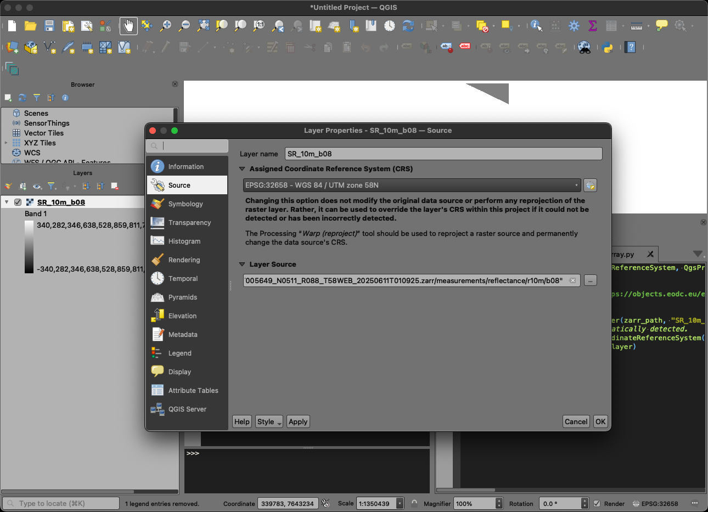

# QGIS STAC Plugin Approach

This document describes research outcomes and presumed development requirements in pursuit of EOPF Zarr data loaded in QGIS via the [QGIS STAC Plugin](https://plugins.qgis.org/plugins/qgis_stac/).

-----

## Zarr Support in QGIS

QGIS provides some level of support for Zarr data via GDAL. GDAL supports Zarr from v3.4+, and v3.8+ supports the current Zarr V3 specification. At the time of writing the QGIS Long Term Release (LTR) version is v3.40 and the official build includes GDAL v3.3, which does not support Zarr. QGIS can be installed via Conda with a more recent version of GDAL (e.g. 3.10.2) if Zarr support is required.

### Performance

As noted in [this QGIS issue](https://github.com/qgis/QGIS/issues/54240#issuecomment-1854618963) GDAL's Zarr support can present performance problems that may adversely impact QGIS integration. Anecdotal evidence during research for this document suggests that - when presented with a path to a Zarr store or a directory within a store representing a group - GDAL will enumerate all arrays within the group to:
1. locate metadata describing the array, and
2. download the first chunk of the array to validate array data against metadata.

When accessing hosted Zarr data via a HTTP(S) endpoint GDAL issues HTTP HEAD and GET requests sequentially during this enumeration phase. This behaviour is discussed in more detail in [pyQGIS](#pyqgis).

### GUI

As noted in [this QGIS issue](https://github.com/qgis/QGIS/issues/54240#issuecomment-1854618963) and [this zarr-developers issue](https://github.com/zarr-developers/geozarr-spec/issues/36#issuecomment-1934953474) it is possible to load some Zarr data via the QGIS "Add Raster Layer" dialog.

#### Data on Local Disk

The following screenshot shows the Zarr dataset referenced [here](https://github.com/zarr-developers/geozarr-spec/issues/36#issuecomment-1934953474) loaded in QGIS from a location on disk. Here the path is `/.../some.zarr` (with no `ZARR:` prefix).


In this example QGIS correctly identifies the dataset's spatial referencing. This behaviour is discussed in [Metadata CRS](#metadata-crs).

#### Hosted Data

To date it has not been possible to replicate the [Data on Local Disk](#data-on-local-disk) example (i.e. via interaction with the QGIS GUI) using Zarr data hosted remotely and accessed via a network connection. This appears to be the result of at least two separate issues:
1. Accessing hosted data via the QGIS GUI, and
2. Structural aspects of EOPF Zarr data.

The impact of the QGIS GUI is discussed in [QGIS GUI](#qgis-gui). Due to these impacts, structural aspects of EOPF Zarr data - and how these affect QGIS integration - can only be explored by circumventing the GUI as described in [pyQGIS](#pyqgis).

##### QGIS GUI

[GDAL documentation](https://gdal.org/en/stable/drivers/raster/zarr.html#dataset-name) notes some quoting requirements for paths on file systems without reliable file listing, and specifically mentions the need for path quoting with HTTP(S) paths requiring GDAL's `/vsicurl` prefix. With proper shell quote handling we can observe GDAL successfully interacting with a hosted data store using `/vsicurl`.

```sh
gdalinfo 'ZARR:"/vsicurl/https://objects.eodc.eu/e05ab01a9d56408d82ac32d69a5aae2a:202506-s02msil2a/11/products/cpm_v256/S2B_MSIL2A_20250611T005649_N0511_R088_T58WEB_20250611T010925.zarr"'

Driver: Zarr/Zarr
Files: none associated
Size is 512, 512
Subdatasets:
  SUBDATASET_1_NAME=ZARR:"/vsicurl/https://objects.eodc.eu/e05ab01a9d56408d82ac32d69a5aae2a:202506-s02msil2a/11/products/cpm_v256/S2B_MSIL2A_20250611T005649_N0511_R088_T58WEB_20250611T010925.zarr":/conditions/geometry/mean_viewing_incidence_angles
...
```

This example shows that the version of GDAL included with QGIS can handle hosted Zarr data. Failure to achieve a working example in the QGIS GUI suggests that the "Add Raster Layer" dialog itself, or the interaction of the dialog and GDAL, may interfere with path handling and may not provide properly quoted paths to GDAL. Zarr path quoting issues, though different, have also been noted [elsewhere](https://github.com/zarr-developers/geozarr-spec/issues/36#issuecomment-2707876257).

We can better understand QGIS support for hosted Zarr data by circumventing the "Add Raster Layer" dialog and using [pyQGIS](#pyqgis) instead.

-----

### GDAL Zarr EOPF Plugin

The [GDAL Zarr EOPF plugin](https://github.com/EOPF-Sample-Service/GDAL-ZARR-EOPF) is currently in development and could potentially impact QGIS and EOPF Zarr behaviour. At the time of writing the plugin only supports Zarr data on a local drive and limited testing indicates a number of problems are yet to be resolved. Due to its current condition this plugin is not a primary focus throughout this document.

The following quote from the project's README describes compatibility with hosted data.

> Cloud Compatibility
Leverages GDAL’s virtual file I/O to access data hosted on local storage or cloud object stores **(future enhancement: S3, /vsicurl/)** \[emphasis added\].

#### QGIS GDAL Errors

Attempts to load EOPF Zarr data from a local drive in QGIS using the GDAL Zarr EOPF plugin enabled failed in the following ways. The same errors occurred with GDAL's `USE_ZMETADATA` configuration value set to `Yes` and `No`.

This experience may not be universal, but it does suggest a lack of maturity in the plugin at this time. Outcomes were similar on macOS Sequoia and Debian Linux 12 platforms.

##### Load Full Zarr Store

> <pre>ERROR 6: Only arrays with numeric data types can be exposed as classic GDALDataset
> ERROR 4: EOPFZARR driver: Core Zarr driver could not open /.../eopf-sample-service/S2A_MSIL2A_20250618T105651_N0511_R094_T33WXR_20250618T125715-product.zarr or subdataset /conditions/geometry/angle
> ERROR 6: Only arrays with numeric data types can be exposed as classic GDALDataset
> ERROR 4: EOPFZARR driver: Core Zarr driver could not open /.../eopf-sample-service/S2A_MSIL2A_20250618T105651_N0511_R094_T33WXR_20250618T125715-product.zarr or subdataset /conditions/geometry/band
> ERROR 3: Cannot open file '/.../eopf-sample-service/S2A_MSIL2A_20250618T105651_N0511_R094_T33WXR_20250618T125715-product.zarr//conditions/geometry/detector/.zmetadata'
> ERROR 3: Load json file /...a/eopf-sample-service/S2A_MSIL2A_20250618T105651_N0511_R094_T33WXR_20250618T125715-product.zarr//conditions/geometry/detector/.zmetadata failed
> ...</pre>

##### Load a Single Zarr Array

> <pre>ERROR 3: Cannot open file '/.../eopf-sample-service/S2A_MSIL2A_20250618T105651_N0511_R094_T33WXR_20250618T125715-product.zarr/measurements/reflectance/r10m/b08/.zmetadata'
> ERROR 3: Load json file /.../eopf-sample-service/S2A_MSIL2A_20250618T105651_N0511_R094_T33WXR_20250618T125715-product.zarr/measurements/reflectance/r10m/b08/.zmetadata failed
> ...</pre>

#### gdalinfo

The GDAL Zarr EOPF plugin can be observed working correctly as part of a `gdalinfo` command, which suggests that other issues may be unique to QGIS integration.

> <pre>gdalinfo -oo EOPF_PROCESS=YES /Users/tom/data/eopf-sample-service/S2A_MSIL2A_20250618T105651_N0511_R094_T33WXR_20250618T125715-product.zarr
> Driver: EOPFZARR/EOPF Zarr Wrapper Driver
> Files: /Users/tom/data/eopf-sample-service/S2A_MSIL2A_20250618T105651_N0511_R094_T33WXR_20250618T125715-product.zarr
> Size is 512, 512
> Coordinate System is:
> GEOGCRS["WGS 84",
>     DATUM["World Geodetic System 1984",
>         ...
> Data axis to CRS axis mapping: 1,2
> Origin = (10.000000000000000,45.000000000000000)
> Pixel Size = (0.009765625000000,-0.009765625000000)
> Metadata:
>   EOPF_PRODUCT=YES
>   EPSG=4326
>   proj:epsg=4326
>   spatial_ref=GEOGCS["WGS 84",DATUM["WGS_1984",SPHEROID["WGS 84",6378137,298.257223563,AUTHORITY["EPSG","7030"]],AUTHORITY["EPSG","6326"]],PRIMEM["Greenwich",0,AUTHORITY["EPSG","8901"]],UNIT["degree",0.0174532925199433,AUTHORITY["EPSG","9122"]],AXIS["Latitude",NORTH],AXIS["Longitude",EAST],AUTHORITY["EPSG","4326"]]
>   ...
>   geo_transform=10.000000000000,0.009765625000,0.000000000000,45.000000000000,0.000000000000,-0.009765625000
> Subdatasets:
>   SUBDATASET_1_NAME=EOPFZARR:"/Users/tom/data/eopf-sample-service/S2A_MSIL2A_20250618T105651_N0511_R094_T33WXR_20250618T125715-product.zarr":/conditions/geometry/angle
>   SUBDATASET_1_DESC=Array /conditions/geometry/angle
>   ...
>   SUBDATASET_149_NAME=EOPFZARR:"/Users/tom/data/eopf-sample-service/S2A_MSIL2A_20250618T105651_N0511_R094_T33WXR_20250618T125715-product.zarr":/quality/probability/r20m/snw
>   SUBDATASET_149_DESC=Array /quality/probability/r20m/snw
> Corner Coordinates:
> Upper Left  (  10.0000000,  45.0000000) ( 45d 0' 0.00"E, 10d 0' 0.00"N)
> Lower Left  (  10.0000000,  40.0000000) ( 40d 0' 0.00"E, 10d 0' 0.00"N)
> Upper Right (  15.0000000,  45.0000000) ( 45d 0' 0.00"E, 15d 0' 0.00"N)
> Lower Right (  15.0000000,  40.0000000) ( 40d 0' 0.00"E, 15d 0' 0.00"N)
> Center      (  12.5000000,  42.5000000) ( 42d30' 0.00"E, 12d30' 0.00"N)</pre>

-----

### pyQGIS

It has been possible to load _some_ EOPF Zarr data in QGIS via pyQGIS, with limitations.

Some EOPF STAC item assets identify individual Zarr arrays. Other assets identify Zarr groups or the Zarr store itself.

#### Zarr Arrays

Zarr arrays can be loaded into QGIS as layers via pyQGIS, though metadata describing their spatial referencing is not recognised by QGIS (or GDAL, which reads the data for QGIS). See [Metadata CRS](#metadata-crs) for more information. Spatial referencing can be explicitly configured to address this issue, using metadata that is available via EOPF STAC items with the [proj](https://stac-extensions.github.io/projection/v2.0.0/schema.json) extension. The following simplified example, when executed within QGIS's Python console, adds a hosted EOPF Zarr array in QGIS.

```python
from qgis.core import QgsCoordinateReferenceSystem, QgsProject, QgsRasterLayer

zarr_path = 'ZARR:"/vsicurl/https://objects.eodc.eu/e05ab01a9d56408d82ac32d69a5aae2a:202506-s02msil2a/11/products/cpm_v256/S2B_MSIL2A_20250611T005649_N0511_R088_T58WEB_20250611T010925.zarr/measurements/reflectance/r10m/b08"'
project = QgsProject.instance()
if project is not None:
    raster_layer = QgsRasterLayer(zarr_path, "SR_10m_b08", "gdal")
    # CRS metadata is not automatically detected.
    raster_layer.setCrs(QgsCoordinateReferenceSystem("EPSG:32658"))
    project.addMapLayer(raster_layer)
```



This pyQGIS script executes reasonably quickly given suitable hardware. Prior to downloading array chunks for rendering, QGIS issues 30 HTTP GET and HEAD requests to identify and validate the array's metadata. This seems somewhat inefficient, but the overhead is not onerous. While this is true for Zarr arrays it is not necessarily true for Zarr stores.

#### Zarr Stores

Zarr stores can contain any number of groups and arrays. The time required for QGIS to load a Zarr store appears proportional to the number of arrays within the store. pyQGIS first enumerates all of the arrays in the store, locating metadata, reading metadata, and testing each array's first chunk against that metadata before arrays can be added as raster layers. This process generates a large number of HTTP requests and requires significant time. Loading [this](https://objects.eodc.eu/e05ab01a9d56408d82ac32d69a5aae2a:202506-s02msil2a/18/products/cpm_v256/S2A_MSIL2A_20250618T105651_N0511_R094_T33WXR_20250618T125715.zarr) Zarr store, which is the `product` asset of [this](https://stac.core.eopf.eodc.eu/collections/sentinel-2-l2a/items/S2A_MSIL2A_20250618T105651_N0511_R094_T33WXR_20250618T125715) STAC item, generates 1,129 HTTP GET and HEAD requests, requiring approximately 3 minutes within a test environment. This does not include any of the HTTP requests to fetch array chunks used to render data.

```python
from qgis.core import (
    QgsCoordinateReferenceSystem,
    QgsDataProvider,
    QgsProject,
    QgsProviderRegistry,
    QgsRasterLayer,
)

zarr_path = 'ZARR:"/vsicurl/https://objects.eodc.eu/e05ab01a9d56408d82ac32d69a5aae2a:202506-s02msil2a/18/products/cpm_v256/S2A_MSIL2A_20250618T105651_N0511_R094_T33WXR_20250618T125715.zarr"'
provider_registry = QgsProviderRegistry.instance()
assert provider_registry is not None, "failed to create provider registry"
gdal_provider = provider_registry.providerMetadata("gdal")
if not gdal_provider:
    raise Exception("no gdal provider")
provider_instance = gdal_provider.createProvider(
    zarr_path,
    options=QgsDataProvider.ProviderOptions(),
)
if not provider_instance:
    raise Exception("no provider instance")
if not provider_instance.isValid():
    print("invalid provider instance")
array_uris = provider_instance.subLayers()
print("found {} array URIs".format(len(array_uris)))
project = QgsProject.instance()
if project is not None:
    for array_uri in array_uris:
        uri_parts = array_uri.split("!!::!!Array ")
        raster_layer = QgsRasterLayer(
            uri_parts[0], uri_parts[1], "gdal"
        )
        raster_layer.setCrs(QgsCoordinateReferenceSystem("EPSG:32658"))
        project.addMapLayer(raster_layer)
```


The screenshot shows several layers reporting a data source error. The error affects 15 out of 149 added layers.

> Unavailable layer!
> Layer data source could not be found. Click to set a new data source

QGIS (or rather GDAL) appears to interpret all variables, dimensions, and labels ("coordinates" in xarray terminology) as arrays that can support raster layers. Ideally only variables with `x` and `y` dimensions (or `longitude` and `latitude`), and optionally also a `band` dimension, should be available as raster layers. However any business logic required within the pyQGIS code to support this behaviour may be complex and / or unique to EOPF Zarr data configurations. It is currently unclear whether there is any capability within GDAL or pyQGIS to identify only arrays that have spatial-like dimensions.

GDAL's handling of Zarr arrays with >2 dimensions is described [here](https://gdal.org/en/stable/drivers/raster/zarr.html#particularities-of-the-classic-raster-api) and indicates that multiple 2 dimensional slices will be created to represent >2-dimensional array data.

The `Unavailable layer!` errors appear to affect labels without corresponding dimensions, for example the single value label `band` in the `/quality/probability/r20m` array. Other layers added to QGIS without reported errors are also problematic. For example `/quality/probability/r20m/y`, which represents the `y` dimension of the `/quality/probability/r20m` array, does not provide clear value to a QGIS user.

#### Metadata CRS

As described in the GDAL Zarr driver [documentation](https://gdal.org/en/stable/drivers/raster/zarr.html#srs-encoding) GDAL expects a `_CRS` attribute which uses one of a number of approaches to define a Zarr dataset's spatial referencing.

The `some.zarr` dataset referenced [here](https://github.com/zarr-developers/geozarr-spec/issues/36#issuecomment-1934953474) and displayed in the [Data on Local Disk](#data-on-local-disk) example includes a consolidated metadata `.zmetadata` file with the following property, which is the reason QGIS can correctly identify the dataset's spatial reference.

```JSON
"_CRS": {
    "url": "http://www.opengis.net/def/crs/EPSG/0/6933"
}
```

EOPF Zarr consolidated metadata does not provide a `_CRS` property. Instead it provides a collection of properties in different locations.

##### other_metadata

`metadata..zattrs.other_metadata` provides some spatial reference information across all members of the Zarr store.

```JSON
{
  "metadata": {
    ".zattrs": {
      "other_metadata": {
        ...
        "horizontal_CRS_code": "EPSG:32633",
        "horizontal_CRS_name": "WGS84 / UTM zone 33N",
        ...
      }
    }
  }
}
```

##### stac_discovery

`metadata..zattrs.stac_discovery.properties` provides STAC item properties supported by the [proj](https://stac-extensions.github.io/projection/v2.0.0/schema.json) extension.

```JSON
{
  "metadata": {
    ".zattrs": {
      "stac_discovery": {
        "properties": {
          ...
          "proj:bbox": [...],
          "proj:epsg": 32633,
          ...
        }
      }
    }
  }
}
```

##### Array .zattrs

`metadata.*..zattrs`, which is repeated for each array in the store, provides similar proj-style attributes.

```JSON
{
  "metadata": {
    ...
    "conditions/mask/detector_footprint/r10m/b03/.zattrs": {
      "proj:bbox": [...],
      "proj:epsg": 32633,
      "proj:shape": [...],
      "proj:transform": [...],
      "proj:wkt2": "PROJCS[...]"
    }
    ...
  }
}
```

##### Discussion

There is active discussion as part of ongoing GeoZarr specification development on how spatial reference metadata should be handled in Zarr.

It is possible that use of the GDAL Zarr EOPF plugin will address discrepancies in how GDAL expects to find spatial reference metadata and how it is provided in EOPF metadata, as indicated by correct function of the [gdalinfo](#gdalinfo) example with that plugin.

-----

## QGIS STAC Browser Plugin

This section documents findings to date from working with the [QGIS STAC plugin](https://plugins.qgis.org/plugins/qgis_stac/).

### Maintenance

The QGIS STAC plugin is currently struggling for maintenance due to insufficient funding and resourcing. A [request for new maintainers](https://github.com/stac-utils/qgis-stac-plugin/issues/253) from 2024 remains unanswered (notably this request did not come from a current maintainer). There are two open Pull Requests from 2023. One issue was closed in 2024, and the next most recent issue closure was in 2022.

There is a risk that any changes required to the plugin to support better EOPF Zarr integration in QGIS could be blocked by slow Pull Request reviews or a lack of support from users with write access to the repository.

A simple issue will be created as part of this work, alongside a Pull Request demonstrating a working solution, to help evaluate the current maintenance state of the repository.

### Asset Types

The QGIS STAC plugin currently only supports adding STAC item assets as layers if they match a [short list](https://github.com/stac-utils/qgis-stac-plugin/blob/f07f89d452f81cbdf3b68d293908d338997f7547/src/qgis_stac/gui/asset_widget.py#L82) of approved asset types. Other asset types, including all Zarr-type assets, support a download option. All downloads for EOPF STAC item Zarr-type assets will fail because the asset `href` targets a directory within the Zarr store (which does not support directory listing) and not an accessible resource, causing the download to fail with a `404 Not Found` response.

### Array Assets vs Group Assets

The QGIS STAC plugin expects STAC item asset `href` properties to identify data sources that can be loaded as layers into QGIS. It cannot currently handle self-describing data stores that themselves support sub-datasets, such as Zarr stores and groups. GeoPackage handling supports multiple layers within a single asset (the GeoPackage) but does not support arbitrary nesting like Zarr as the GeoPackage can only contain layers.

As described in [STAC Item Zarr Assets](https://github.com/eopf-toolkit/eopf-tooling-guide/blob/main/docs/tutorials/stac_zarr/eopf_stac_item_zarr_assets.md) not all of a Zarr store's arrays are currently exposed as STAC item assets.

In order for the QGIS STAC plugin to work well with all Zarr arrays available via the EOPF sample STAC service, either the plugin will require modifications to better understand self-describing data stores (and potentially EOPF-specific customisations in this area) or STAC metadata would need to expose more of the Zarr arrays directly as assets. Given [performance considerations](#performance), using GDAL to enumerate Zarr arrays available from a Zarr store or group might create performance problems.

-----

## EOPF Zarr Development Requirements

This section discusses development approaches that could better support EOPF Zarr data in QGIS.

### GDAL Zarr EOPF Plugin

Changes to the [GDAL plugin](#gdal-zarr-eopf-plugin) could impact some of what follows. Better QGIS / GDAL support might potentially improve QGIS's ability to load the Zarr store (i.e. the STAC item's `product` asset) directly into QGIS, and help QGIS determine which sub-datasets might make suitable layers, though some changes would still be required in the QGIS STAC plugin.

At the time of writing the GDAL Zarr EOPF Plugin has a [single maintainer](https://github.com/EOPF-Sample-Service/GDAL-ZARR-EOPF/graphs/contributors). Significant time may pass before stable functionality is available within a GDAL release that can be used in combination with QGIS. The approaches described below assume that the GDAL Zarr EOPF plugin is not a significant factor within this project's timescales.

### Recommended Approach

The following outlines a number of development steps that could most efficiently realise the goal of displaying, styling, and exporting EOPF Zarr data within QGIS.

These changes are intended to benefit all consumers of EOPF STAC metadata and EOPF Zarr data, and not only QGIS STAC plugin users.

> [!NOTE]
> It is important to note that as progress is made toward implementing identified changes, other previously unknown requirements may become apparent.

#### Spatial Reference Metadata

EOPF Zarr metadata should be updated to include the `_CRS` attribute to better support GDAL integration. All EOPF Zarr data should reliably include spatial reference metadata, including non-projected data that can be represented in geographic coordinate reference systems. This approach will duplicate spatial reference metadata, and this is considered an acceptable trade-off for better support within GDAL. This approach does not imply reduced support in existing compatible tooling.

#### STAC Item Assets for Layers

STAC item assets should be provided for all Zarr arrays that can be spatially represented. This will increase the size of STAC items and place additional overhead on EOPF data providers. These impacts are justified by removing the need for data consumers to correctly evaluate EOPF's specific Zarr store structures and any performance overhead that may come with this work.

These STAC item assets should be identified by unique and suitable roles that meaningfully describe their purpose, and communicate to a STAC consumer (such as the QGIS STAC plugin) that these assets can be rendered as layers. It is unclear whether there is precedent for this approach within the STAC community, and community engagement may be advisable to validate the approach and define suitable roles.

Changes to STAC item assets should be reflected in [STAC Item Zarr Assets](https://github.com/eopf-toolkit/eopf-tooling-guide/blob/main/docs/tutorials/stac_zarr/eopf_stac_item_zarr_assets.md) documentation.

#### QGIS STAC Plugin

A number of changes are proposed within the QGIS STAC plugin.

##### Asset Types

As described [above](#asset-types) the QGIS STAC plugin supports a short list of assets types that can be added to QGIS as layers and this list does not include Zarr. This list should be expanded and may need to be augmented with Zarr-specific business logic, comparable to what currently exists for [GeoPackages](https://github.com/stac-utils/qgis-stac-plugin/blob/f07f89d452f81cbdf3b68d293908d338997f7547/src/qgis_stac/gui/assets_dialog.py#L685).

##### Roles for Spatial Representation

If Zarr arrays that can be spatially represented are provided as unique STAC item assets with specific roles, as described in [STAC Item Assets for Layers](#stac-item-assets-for-layers), the QGIS STAC plugin would require changes to recognise these roles and modify how layer-suitable assets are managed for Zarr data sources.

##### Downloads

As described [above](#asset-types) the QGIS STAC plugin currently offers downloads for Zarr-type STAC item assets that cannot be downloaded with the provided asset `href`. Either downloads should be disabled for Zarr-type assets or the plugin should be modified to download all individual resources that make up a Zarr array, group, or store - depending on what specifically the `href` represents.

##### Bugs / Support

In order to encourage adoption of EOPF-driven changes to the QGIS STAC plugin, and as a gesture of good will to the community, a reasonable amount of effort should ideally be committed to addressing existing issues affecting the QGIS STAC plugin. This may help reinvigorate interest in the plugin and initiate a greater maintenance effort moving forwards.

### Alternate Approach

The [Recommended Approach](#recommended-approach) reflects the preferred solution and incorporates changes to EOPF metadata in both EOPF Zarr stores and STAC items. If EOPF changes are not feasible then additional changes would be required in the QGIS STAC plugin to address current limitations.

These changes may only benefit QGIS STAC plugin users, and not other consumers of EOPF STAC metadata or EOPF Zarr data.

> [!NOTE]
> It is important to note that as progress is made toward implementing identified changes, other previously unknown requirements may become apparent.

#### QGIS STAC Plugin

The following QGIS STAC plugin changes from the recommended approach would be required in addition to other changes.
- [Asset Types](#asset-types-1)
- [Downloads](#downloads)
- [Bugs / Support](#bugs--support)

##### Spatial Referencing

Without the changes described in [Spatial Reference Metadata](#spatial-reference-metadata) the QGIS STAC plugin would be responsible for defining each Zarr array layer's spatial reference. In STAC items that implement the proj extension this metadata would be used. STAC items without the proj extension would be assumed to support [EPSG:4326](https://epsg.io/4326).

##### Data that can be Spatial Represented

Without [STAC Item Assets for Layers](#stac-item-assets-for-layers) the QGIS STAC plugin would be responsible for identifying which Zarr data can be spatially represented. This may be complex and require EOPF-specific business logic that does not translate easily to other Zarr-based formats. It may be difficult to justify EOPF-specific development within the QGIS STAC plugin if it is not more widely applicable.
