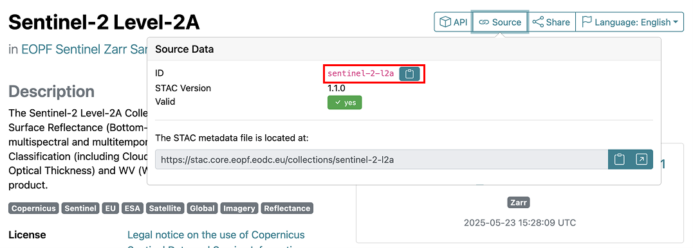

# How to for the EOPF Sample Service STAC catalog


## Table of Contents

## Introduction

This tutorial will explore how to access the [EOPF Sample Service STAC
catalog](https://stac.browser.user.eopf.eodc.eu/) programatically using
R.

## Prerequisites

An R environment is required to follow this tutorial, with R version \>=
4.1.0. We recommend using either
[RStudio](https://posit.co/download/rstudio-desktop/) or
[Positron](https://posit.co/products/ide/positron/), and making use of
[RStudio
projects](https://support.posit.co/hc/en-us/articles/200526207-Using-RStudio-Projects)
for a self-contained coding environment.

### Dependencies

The `rstatc` package is required to follow this toturial. You can
install it directly from CRAN:

``` r
install.packages("rstac")
```

Then load the package into your environment:

``` r
library(rstac)
```

## Exploring the EOPF Sample Service STAC catalog

### Setting up the API

To access the EOPF Sample Service STAC catalog in R, we need to give the
URL of the STAC API source (<https://stac.core.eopf.eodc.eu/>) using the
function `stac()`.

The object `stac_source` is a query containing information used *to*
connect to the API, but it does not actually make any requests. To make
requests to the API, we will always need to use `get_request()` or
`put_request()`, as appropriate. running `get_request()` on
`stac_source` actually retrieves the catalogue:

``` r
stac_source <- stac("https://stac.core.eopf.eodc.eu/")

stac_source |>
  get_request()
```

    ###Catalog
    - id: eopf-sample-service-stac-api
    - description: STAC catalog of the EOPF Sentinel Zarr Samples Service
    - field(s): 
    type, id, title, description, stac_version, conformsTo, links, stac_extensions

### Collections

A STAC *Collection* exists to relate similar datasets together through
space, time, and shared metadata. Each Sentinel mission and the
downstream analysis-ready data are examples of STAC Collections. To
browse STAC Collections, the `collections()` function is used. We can
see that there are 11 collections available in the API, as well as
information

``` r
stac_collections <- stac_source |>
  collections() |>
  get_request()

stac_collections
```

    ###Collections
    - collections (11 item(s)):
      - sentinel-2-l2a
      - sentinel-3-slstr-l1-rbt
      - sentinel-3-olci-l2-lfr
      - sentinel-2-l1c
      - sentinel-3-slstr-l2-lst
      - sentinel-1-l1-slc
      - sentinel-3-olci-l1-efr
      - sentinel-3-olci-l1-err
      - sentinel-1-l2-ocn
      - sentinel-1-l1-grd
      - sentinel-3-olci-l2-lrr
    - field(s): collections, links, numberMatched, numberReturned

The default printing of the `stac_collections()` object summarises
what’s been returned, but does not give all of the information. To see
more about what’s been returned, we can used `str()`.

``` r
stac_collections |>
  str(max.level = 1)
```

    List of 4
     $ collections   :List of 11
     $ links         :List of 3
      ..- attr(*, "class")= chr [1:2] "doc_links" "list"
     $ numberMatched : int 11
     $ numberReturned: int 11
     - attr(*, "class")= chr [1:3] "doc_collections" "rstac_doc" "list"

Here, we can see that there is an entry `"collections"` within
`stac_collections`, which we access to return the collections themselves
(using `head()` to only return a few). This shows additional details
about each collection, such as the collection id, title, description,
and additional fields in the collections.

``` r
stac_collections[["collections"]] |>
  head(n = 3)
```

    [[1]]
    ###Collection
    - id: sentinel-2-l2a
    - title: Sentinel-2 Level-2A
    - description: 
    The Sentinel-2 Level-2A Collection 1 product provides orthorectified Surface Reflectance (Bottom-Of-Atmosphere: BOA), with sub-pixel multispectral and multitemporal registration accuracy. Scene Classification (including Clouds and Cloud Shadows), AOT (Aerosol Optical Thickness) and WV (Water Vapour) maps are included in the product.
    - field(s): 
    id, type, links, title, assets, extent, license, keywords, providers, summaries, description, item_assets, stac_version, stac_extensions

    [[2]]
    ###Collection
    - id: sentinel-3-slstr-l1-rbt
    - title: Sentinel-3 SLSTR Level-1 RBT
    - description: 
    The Sentinel-3 SLSTR Level-1B RBT product provides radiances and brightness temperatures for each pixel in a regular image grid for each view and SLSTR channel. In addition, it also contains annotations data associated with each image pixels.
    - field(s): 
    id, type, links, title, assets, extent, license, keywords, providers, summaries, description, item_assets, stac_version, stac_extensions

    [[3]]
    ###Collection
    - id: sentinel-3-olci-l2-lfr
    - title: Sentinel-3 OLCI Level-2 LFR
    - description: 
    The Sentinel-3 OLCI L2 LFR product provides land and atmospheric geophysical parameters computed for full resolution.
    - field(s): 
    id, type, links, title, assets, extent, license, keywords, providers, summaries, description, item_assets, stac_version, stac_extensions

The Sentinel-2 Level-2A can be accessed by getting the first entry in
`stac_collections()[["collections"]]`

``` r
stac_collections[["collections"]][[1]]
```

    ###Collection
    - id: sentinel-2-l2a
    - title: Sentinel-2 Level-2A
    - description: 
    The Sentinel-2 Level-2A Collection 1 product provides orthorectified Surface Reflectance (Bottom-Of-Atmosphere: BOA), with sub-pixel multispectral and multitemporal registration accuracy. Scene Classification (including Clouds and Cloud Shadows), AOT (Aerosol Optical Thickness) and WV (Water Vapour) maps are included in the product.
    - field(s): 
    id, type, links, title, assets, extent, license, keywords, providers, summaries, description, item_assets, stac_version, stac_extensions

However, the best way to access a specific collection is to search for
it directly using the collection `id`. The `id`, “sentinel-2-l2a”, is
visible in the Collection output above. It is also accessible in the
browsable STAC catalog of the EOPF Sentinel Zarr Samples Service, on the
page for that collection
(<https://stac.browser.user.eopf.eodc.eu/collections/sentinel-2-l2a>)

<figure>

<figcaption aria-hidden="true">Finding the collection ID in the STAC
catalog</figcaption>
</figure>

(TODO -\> consistent way of “highlighting” sections of pages)

The collection ID can be supplied directly in the `collections()`
function. If we look at the query without getting the result, we can see
that it has been formed using the `collection_id`, “sentinel-2-l2a”, as
a filter parameter.

``` r
sentinel_2_l2a_query <- stac_source |>
  collections(collection_id = "sentinel-2-l2a")

sentinel_2_l2a_query
```

    ###rstac_query
    - url: https://stac.core.eopf.eodc.eu/
    - params:
      - collection_id: sentinel-2-l2a
    - field(s): version, base_url, endpoint, params, verb, encode

And that running `get_request()` will return the collection itself:

``` r
sentinel_2_l2a_query |>
  get_request()
```

    ###Collection
    - id: sentinel-2-l2a
    - title: Sentinel-2 Level-2A
    - description: 
    The Sentinel-2 Level-2A Collection 1 product provides orthorectified Surface Reflectance (Bottom-Of-Atmosphere: BOA), with sub-pixel multispectral and multitemporal registration accuracy. Scene Classification (including Clouds and Cloud Shadows), AOT (Aerosol Optical Thickness) and WV (Water Vapour) maps are included in the product.
    - field(s): 
    id, type, links, title, assets, extent, license, keywords, providers, summaries, description, item_assets, stac_version, stac_extensions

## Items

Within collections, there are *items*. Items are the building blocks for
STAC. At their core, they are GeoJSON data, along with additional
metadata which ensures data provenance is maintained and specific data
attributes are captured. A single capture from a Sentinel mission is an
example of a STAC item. To get an overview of items within a collection,
the `items()` function is used.

An important thing to note with `rstac` is that you cannot continue to
build queries on top of ones that have already had their results
returned (via `get_request()`). It may make sense for a typical workflow
in R to “get” the collection, then to try to get the items from it, but
this will produce an error:

``` r
sentinel_2_l2a_collection <- stac_source |>
  collections(collection_id = "sentinel-2-l2a") |>
  get_request()

sentinel_2_l2a_collection |>
  items()
```

    Error: Invalid rstac_query value.

If you see this error — `"Invalid rstac_query value"` — ensure that you
are running `get_request()` at the very end of your query building
functions. Using `items()` this way, we can see that it returns a
summary of the collection’s items:

``` r
sentinel_2_l2a_collection_items <- stac_source |>
  collections(collection_id = "sentinel-2-l2a") |>
  items() |>
  get_request()

sentinel_2_l2a_collection_items
```

    ###Items
    - features (10 item(s)):
      - S2B_MSIL2A_20250525T192909_N0511_R142_T09UXB_20250525T231223
      - S2B_MSIL2A_20250525T174909_N0511_R141_T15WVR_20250525T213946
      - S2B_MSIL2A_20250525T174909_N0511_R141_T13SDU_20250525T215302
      - S2A_MSIL2A_20250525T130311_N0511_R038_T27VXK_20250525T183014
      - S2B_MSIL2A_20250525T110619_N0511_R137_T30TTM_20250525T133604
      - S2C_MSIL2A_20250525T101621_N0511_R065_T36WVD_20250525T153015
      - S2C_MSIL2A_20250525T101621_N0511_R065_T34WDU_20250525T153015
      - S2C_MSIL2A_20250525T101621_N0511_R065_T32TLS_20250525T153015
      - S2A_MSIL2A_20250525T094051_N0511_R036_T32PQC_20250526T092812
      - S2B_MSIL2A_20250525T093039_N0511_R136_T35VNG_20250525T125314
    - assets: 
    AOT_10m, B01_20m, B02_10m, B03_10m, B04_10m, B05_20m, B06_20m, B07_20m, B08_10m, B09_60m, B11_20m, B12_20m, B8A_20m, product, product_metadata, SCL_20m, SR_10m, SR_20m, SR_60m, TCI_10m, WVP_10m
    - item's fields: 
    assets, bbox, collection, geometry, id, links, properties, stac_extensions, stac_version, type

------------------------------------------------------------------------

(wip after here)

``` r
# This just gets the first 10 items
sentinel_2_l2a_collection_items |>
  items_length()
```

    [1] 10

``` r
# This can be changed with the `limit` argument in `items()`, but better to just search
stac_source |>
  collections(collection_id = "sentinel-2-l2a") |>
  items(limit = 15) |>
  get_request()
```

    ###Items
    - features (15 item(s)):
      - S2B_MSIL2A_20250525T192909_N0511_R142_T09UXB_20250525T231223
      - S2B_MSIL2A_20250525T174909_N0511_R141_T15WVR_20250525T213946
      - S2B_MSIL2A_20250525T174909_N0511_R141_T13SDU_20250525T215302
      - S2A_MSIL2A_20250525T130311_N0511_R038_T27VXK_20250525T183014
      - S2B_MSIL2A_20250525T110619_N0511_R137_T30TTM_20250525T133604
      - S2C_MSIL2A_20250525T101621_N0511_R065_T36WVD_20250525T153015
      - S2C_MSIL2A_20250525T101621_N0511_R065_T34WDU_20250525T153015
      - S2C_MSIL2A_20250525T101621_N0511_R065_T32TLS_20250525T153015
      - S2A_MSIL2A_20250525T094051_N0511_R036_T32PQC_20250526T092812
      - S2B_MSIL2A_20250525T093039_N0511_R136_T35VNG_20250525T125314
      - S2C_MSIL2A_20250524T210941_N0511_R057_T04QHG_20250525T005113
      - S2C_MSIL2A_20250524T205041_N0511_R057_T09WWT_20250525T013812
      - S2B_MSIL2A_20250524T195859_N0511_R128_T08UNG_20250524T231252
      - S2B_MSIL2A_20250524T195859_N0511_R128_T08UNE_20250524T231252
      - S2C_MSIL2A_20250524T190931_N0511_R056_T13WDT_20250525T004619
    - assets: 
    AOT_10m, B01_20m, B02_10m, B03_10m, B04_10m, B05_20m, B06_20m, B07_20m, B08_10m, B09_60m, B11_20m, B12_20m, B8A_20m, product, product_metadata, SCL_20m, SR_10m, SR_20m, SR_60m, TCI_10m, WVP_10m
    - item's fields: 
    assets, bbox, collection, geometry, id, links, properties, stac_extensions, stac_version, type

``` r
# Use `stac_search()` to search for items in a collection based on a number of possible critera

# Bounding box - in WGS84 latitude/longitude -> minimum longitude, minimum latitude, maximum longitude, maximum latitude
stac_source |>
  stac_search(
    collections = "sentinel-2-l2a",
    bbox = c(-47.02148, -17.35063, -42.53906, -12.98314)
  ) |>
  get_request()
```

    ###Items
    - features (10 item(s)):
      - S2A_MSIL2A_20241204T132231_N0511_R038_T23LNF_20241204T160951
      - S2A_MSIL2A_20241204T132231_N0511_R038_T23LNE_20241204T160951
      - S2A_MSIL2A_20241204T132231_N0511_R038_T23LND_20241204T160951
      - S2A_MSIL2A_20241204T132231_N0511_R038_T23LME_20241204T160951
      - S2A_MSIL2A_20241204T132231_N0511_R038_T23LMD_20241204T160951
      - S2A_MSIL2A_20241204T132231_N0511_R038_T23LMC_20241204T180059
      - S2A_MSIL2A_20241204T132231_N0511_R038_T23LMC_20241204T160951
      - S2A_MSIL2A_20241204T132231_N0511_R038_T23LLD_20241204T180059
      - S2A_MSIL2A_20241204T132231_N0511_R038_T23LLC_20241204T180059
      - S2A_MSIL2A_20241204T132231_N0511_R038_T23LLC_20241204T160951
    - assets: 
    AOT_10m, B01_20m, B02_10m, B03_10m, B04_10m, B05_20m, B06_20m, B07_20m, B08_10m, B09_60m, B11_20m, B12_20m, B8A_20m, product, product_metadata, SCL_20m, SR_10m, SR_20m, SR_60m, TCI_10m, WVP_10m
    - item's fields: 
    assets, bbox, collection, geometry, id, links, properties, stac_extensions, stac_version, type

``` r
# In theory... we can use `items_matched()` to see how many match in a search:
stac_source |>
  stac_search(
    collections = "sentinel-2-l2a",
    bbox = c(-47.02148, -17.35063, -42.53906, -12.98314)
  ) |>
  get_request() |>
  items_matched()
```

    NULL

``` r
# But: returns an integer value if the STAC web server does support this extension. Otherwise returns NULL.
# Not supported here

# Time range: datetime filter
# From the docs:
# a character with a date-time or an interval. Date and time strings needs to conform to RFC 3339. Intervals are expressed # by separating two date-time strings by '/' character. Open intervals are expressed by using '..' in place of date-time.
#
# Examples:
# A date-time: "2018-02-12T23:20:50Z"
# A closed interval: "2018-02-12T00:00:00Z/2018-03-18T12:31:12Z"
# Open intervals: "2018-02-12T00:00:00Z/.." or "../2018-03-18T12:31:12Z"
# Only features that have a datetime property that intersects the interval or date-time informed in datetime are selected.

# 2024-01-01 to 2024-01-02
stac_source |>
  stac_search(
    collection = "sentinel-2-l2a",
    datetime = "2024-01-01T00:00:00Z/2024-01-02T00:00:00Z"
  ) |>
  get_request()
```

    ###Items
    - features (1 item(s)):
      - S2A_MSIL2A_20240101T102431_N0510_R065_T32TNT_20240101T144052
    - assets: 
    AOT_10m, B01_20m, B02_10m, B03_10m, B04_10m, B05_20m, B06_20m, B07_20m, B08_10m, B09_60m, B11_20m, B12_20m, B8A_20m, product, product_metadata, SCL_20m, SR_10m, SR_20m, SR_60m, TCI_10m, WVP_10m
    - item's fields: 
    assets, bbox, collection, geometry, id, links, properties, stac_extensions, stac_version, type

``` r
# Additional filters: instrument, platform
# stac_search does not support all filters -> we can also use `ext_filter()`
stac_source |>
  ext_filter(
    collection == "sentinel-2-l2a" && `eo:cloud_cover` <= 10
  ) |>
  get_request()
```

    ###Items
    - features (10 item(s)):
      - S2A_MSIL2A_20250525T094051_N0511_R036_T32PQC_20250526T092812
      - S2B_MSIL2A_20250524T115719_N0511_R123_T27PYT_20250524T151754
      - S2B_MSIL2A_20250524T115719_N0511_R123_T27PYR_20250524T151754
      - S2B_MSIL2A_20250524T115719_N0511_R123_T27PXT_20250524T151754
      - S2B_MSIL2A_20250524T115719_N0511_R123_T27PXS_20250524T151754
      - S2B_MSIL2A_20250524T115719_N0511_R123_T27PWT_20250524T151754
      - S2B_MSIL2A_20250524T115719_N0511_R123_T27PWS_20250524T151754
      - S2B_MSIL2A_20250524T115219_N0511_R123_T28SEB_20250524T152537
      - S2B_MSIL2A_20250524T115219_N0511_R123_T28RES_20250524T152537
      - S2B_MSIL2A_20250524T115219_N0511_R123_T28RER_20250524T152537
    - assets: 
    AOT_10m, B01_20m, B02_10m, B03_10m, B04_10m, B05_20m, B06_20m, B07_20m, B08_10m, B09_60m, B11_20m, B12_20m, B8A_20m, product, product_metadata, SCL_20m, SR_10m, SR_20m, SR_60m, TCI_10m, WVP_10m
    - item's fields: 
    assets, bbox, collection, geometry, id, links, properties, stac_extensions, stac_version, type

``` r
# This isn't working:
x <- stac_source |>
  ext_filter(
    collection == "sentinel-2-l2a" && instruments == "msi"
  ) |>
  get_request()

# I wonder if it's some sort of case sensitivity etc?
x
```

    ###Items
    - features (0 item(s)):
    - assets: 
    - item's fields: 

``` r
# Combining filters
# bbox and datetime
stac_source |>
  stac_search(
    collections = "sentinel-2-l2a",
    bbox = c(-47.02148, -17.35063, -42.53906, -12.98314),
    datetime = "2024-01-01T00:00:00Z/2024-01-02T00:00:00Z"
  ) |>
  get_request()
```

    ###Items
    - features (0 item(s)):
    - assets: 
    - item's fields: 

``` r
# bbox and cloud coverage -> combining stac_search() and ext_filter()
stac_source |>
  stac_search(
    collections = "sentinel-2-l2a",
    bbox = c(-47.02148, -17.35063, -42.53906, -12.98314)
  ) |>
  ext_filter(`eo:cloud_cover` <= 40) |>
  get_request()
```

    ###Items
    - features (3 item(s)):
      - S2A_MSIL2A_20241203T221941_N0511_R029_T01LAF_20241204T000925
      - S2A_MSIL2A_20241201T131241_N0511_R138_T23LQC_20241201T162047
      - S2A_MSIL2A_20241201T131241_N0511_R138_T23KQB_20241201T162047
    - assets: 
    AOT_10m, B01_20m, B02_10m, B03_10m, B04_10m, B05_20m, B06_20m, B07_20m, B08_10m, B09_60m, B11_20m, B12_20m, B8A_20m, product, product_metadata, SCL_20m, SR_10m, SR_20m, SR_60m, TCI_10m, WVP_10m
    - item's fields: 
    assets, bbox, collection, geometry, id, links, properties, stac_extensions, stac_version, type

``` r
# Access a specific item(s) by ID

# (ID is available from the browser, click "Source" and copy it)
# https://stac.browser.user.eopf.eodc.eu/collections/sentinel-2-l2a/items/S2A_MSIL2A_20250517T085541_N0511_R064_T35QKA_20250517T112203?.language=en
example_item <- stac_source |>
  stac_search(
    collections = "sentinel-2-l2a",
    ids = "S2A_MSIL2A_20250517T085541_N0511_R064_T35QKA_20250517T112203"
  ) |>
  get_request()

example_item
```

    ###Items
    - features (1 item(s)):
      - S2A_MSIL2A_20250517T085541_N0511_R064_T35QKA_20250517T112203
    - assets: 
    AOT_10m, B01_20m, B02_10m, B03_10m, B04_10m, B05_20m, B06_20m, B07_20m, B08_10m, B09_60m, B11_20m, B12_20m, B8A_20m, product, product_metadata, SCL_20m, SR_10m, SR_20m, SR_60m, TCI_10m, WVP_10m
    - item's fields: 
    assets, bbox, collection, geometry, id, links, properties, stac_extensions, stac_version, type

``` r
# List the assets in an item
example_item |>
  items_assets()
```

     [1] "AOT_10m"          "B01_20m"          "B02_10m"          "B03_10m"         
     [5] "B04_10m"          "B05_20m"          "B06_20m"          "B07_20m"         
     [9] "B08_10m"          "B09_60m"          "B11_20m"          "B12_20m"         
    [13] "B8A_20m"          "product"          "product_metadata" "SCL_20m"         
    [17] "SR_10m"           "SR_20m"           "SR_60m"           "TCI_10m"         
    [21] "WVP_10m"         

``` r
# Select specific assets
example_item |>
  assets_select(asset_names = "AOT_10m")
```

    ###Items
    - features (1 item(s)):
      - S2A_MSIL2A_20250517T085541_N0511_R064_T35QKA_20250517T112203
    - assets: AOT_10m
    - item's fields: 
    assets, bbox, collection, geometry, id, links, properties, stac_extensions, stac_version, type

``` r
# See its URL
asset_url <- example_item |>
  assets_select(asset_names = "AOT_10m") |>
  assets_url()

asset_url
```

    [1] "https://objectstore.eodc.eu:2222/e05ab01a9d56408d82ac32d69a5aae2a:202505-s02msil2a/17/products/cpm_v256/S2A_MSIL2A_20250517T085541_N0511_R064_T35QKA_20250517T112203.zarr/quality/atmosphere/r10m/aot"

``` r
# The "product" asset is what will be used in the Zarr tutorial
example_item |>
  assets_select(asset_names = "product") |>
  assets_url()
```

    [1] "https://objectstore.eodc.eu:2222/e05ab01a9d56408d82ac32d69a5aae2a:202505-s02msil2a/17/products/cpm_v256/S2A_MSIL2A_20250517T085541_N0511_R064_T35QKA_20250517T112203.zarr"
